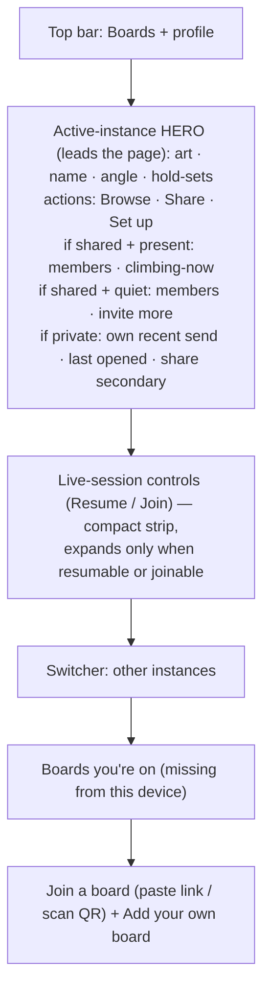
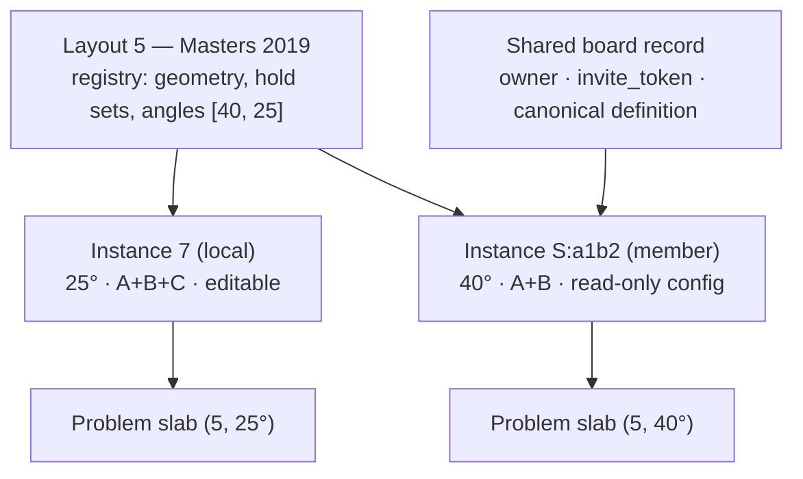
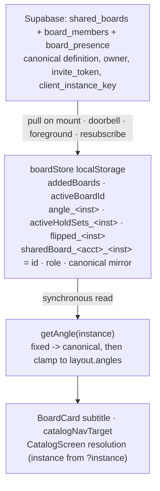
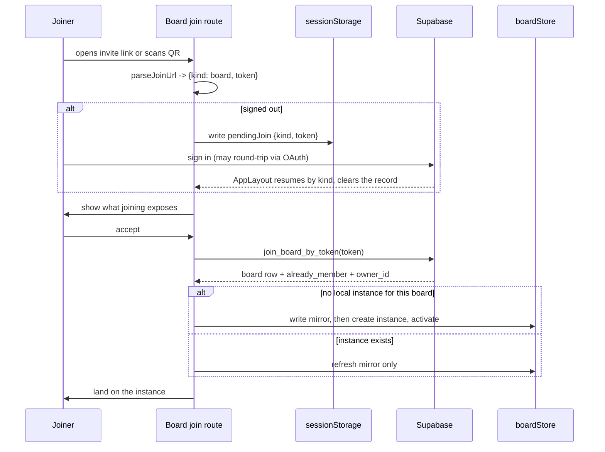
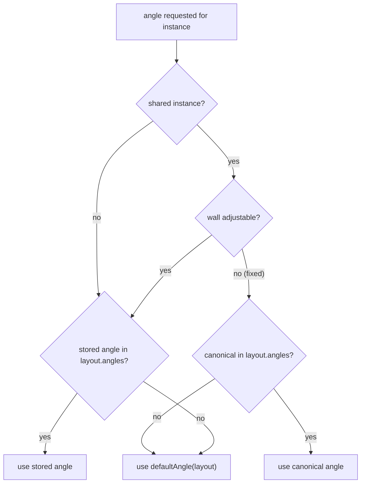

# Shared Boards & Boards-Page Redesign - Plan

## Goal Capsule

- **Objective:** Redesign the web app's Boards area and let any board be shared with an owner and an invite link, while keeping today's quick local board setup intact.
- **Product authority:** The user (product owner) — all product decisions in this doc are theirs and confirmed.
- **Open blockers:** None.
- **Execution profile:** Three phases in one plan. Phase A (U1–U3) is local-only, ships without a migration, and renders no share affordance. Phase B1 (U4, U5, U7–U10, U12) is the sharing loop. Phase B2 (U6, U11) is presence. `supabase/migrations/**` is safety-critical per [AGENTS.md](../../AGENTS.md) — plan those units test-first, run them at maximum reasoning effort, and treat review as mandatory.
- **Stop conditions:** Stop and surface rather than guess if the presence projection would need to return anything beyond member identity and a presence boolean, if a unit would require relaxing `ascents` RLS, or if the board-instance re-key cannot preserve existing users' local config.
- **Isolation:** Implementation happens in a separate git worktree, not on the main checkout.
- **Product Contract preservation:** Changed — R1–R4, R8, R10, R10a, AE1, AE2 and the board-identity and page-layout Key Decisions were revised; new R5a, R10c, AE1a, AE4's leave case, and F4 were added. Each change is a product decision the owner made explicitly or a gap review surfaced in the contract's own claims; see Key Decisions for the two structural ones (board instances, status-only social layer).

---

## Product Contract

### Summary

A board you hold is an *instance* of a MoonBoard layout: adding and configuring one stays quick and device-local, and a **Share** action promotes an instance into a server-backed board with an owner and an invite link/QR. Redesign the Boards page to split held boards into the user's own and the ones shared with them, make a shared board's row social when someone is climbing on it, offer a join-a-board entry, and fold add + configure + share into one guided flow.

**Primary value:** The social/shared-identity layer (R2, R6, R10) is the outcome this work is bought for; canonical definition-sync (R7) is the enabling mechanism, not the payoff. Observable success signal: the share of active boards that are shared and have ≥2 members within N days of launch.

### Problem Frame

Today the Boards page (`web/src/shell/MyBoards.tsx`) is a flat vertical stack: session controls sit at the very top, then look-alike text rows for owned boards, then an inline registry list to add more. Boards carry only a name plus an angle/hold-set summary and live entirely in device `localStorage` — there is no account-backed board, no ownership, and no way for people climbing the same physical board to share one definition. The app already runs accounts and an invite-link + membership sharing model for collaborative lists and live sessions, but boards don't use any of it. The result: the page reads as plumbing rather than boards, setup is disjoint (add, then hunt for a gear icon to configure), and a gym or crew on one wall each re-create the same board by hand with no shared source of truth.

### Key Decisions

- **A board is an instance of a layout.** What a user holds is a board *instance* — its own angle, hold-sets, and optional link to a shared board — not the registry layout itself. A local "my Masters 2019" and a joined shared Masters 2019 coexist as two instances of layout 5. This supersedes an earlier one-board-per-layout decision, which forced joining to overwrite the joiner's own config with no way to undo it on a fixed board. Instances remove that data loss entirely: joining creates a new instance and touches nothing existing. The cost is a `boardStore` re-key from layout id to instance id (see KTD1).
- **Share is an action, not a type.** An instance starts local; sharing promotes that same instance to server-backed and owner-editable. The quick/local path is untouched.
- **Owner-controlled canonical definition.** A shared board has exactly one definition (name, installed hold-sets, angle, and whether the wall is angle-adjustable) that only the owner edits. Members use it as-is — the intent is "everyone on the same physical board," not per-member variants.
- **Angle follows the physical wall, via owner-declared adjustability.** A board instance is a lightweight statement — "I have this layout, and it is at this angle" — not a model of a physical wall. The one hardware fact worth recording is whether that wall's angle can move: some are bolted at a single angle, others are on a motor and can be re-angled at any time. The creator declares which, and that declaration is part of the canonical definition. On a **fixed** board the angle is a binding fact nobody browsing it can change. On an **adjustable** board the owner's angle is the current/default value rather than a constraint, and a member may select the angle they are actually climbing at. Installed hold-sets are never member-editable in either case. A viewer must never see a configuration the wall cannot be in — an angle the wall can't reach or a hold-set that isn't installed is a different problem set, not a display preference. This is new state: today's `hasAngleChoice()` reports whether the *layout* bundles more than one angle (Masters 2019 → `[40, 25]`), which says nothing about whether a given wall can move between them.
- **The social layer is status-only.** A shared board's row shows member count and who is present. It does not show a timestamped, attributed "most recent send." Every existing cross-user read in the codebase projects status only — `session_member_ascents` returns `(user_id, source_catalog_id, status)` and the `0012` realtime fan-out carries an author id and nothing else — precisely so a cross-user read can never leak a date, a grade, or one singled-out problem. Boards never expire, so a recent-send card would widen that exposure permanently rather than behind a 24h backstop. Keeping the invariant costs the social layer some content and buys one that needs no new privacy surface and no per-user opt-out column.
- **Board presence is its own signal, not session-derived.** R2's "climbing now" comes from a lightweight, board-scoped presence signal, independent of live sessions. Session-derived presence was considered and rejected: joining a shared board is not joining a session, so the common case is a member climbing alone on the shared board with no session running — a session-fed indicator would be dark exactly when the board most needs to feel alive, and the co-located case is already covered by the session bar. The board never reads live session state.
- **Reuse sessions, not lists.** Sharing is modeled on `supabase/migrations/0007_collaboration_sessions.sql` and `web/src/sessions/`. Collaborative lists established the same storage shape but is not the blueprint to copy — see Sources.
- **Invite-link only for now.** "Public" means an invite link/QR that others open to join. No global search or gym directory in v1.
- **Own boards and shared boards are separate sections.** The page is a list of rows rather than a large hero for the active board. A hero was considered and rejected: a board-art panel big enough to read as one pushes the rest of the page below the fold, and mostly repeats what its own row already says. Splitting the list into "my boards" and "shared with me" does the job the hero was meant to do, and does it better — because one layout can back two boards at once, the section a row sits in is what says which is which, so a name no longer has to carry that alone. The split doubles as a permissions signal: a board in the shared section takes its angle and hold-sets from someone else.

### Actors

- A1. Board owner — creates and configures a board instance, optionally shares it, and is the only party who edits a shared board's canonical definition.
- A2. Board member — opens a shared board's invite, gains a new instance carrying the owner's canonical definition, and browses/logs on that board.

A user who never shares is simply an owner who hasn't promoted their instance; they are not a distinct actor.

### Requirements

**Boards page**

- R1. The Boards page lists board instances as rows carrying name, angle, hold-set summary, and the actions that apply to them: browse (the active board) or make active (the rest), plus set up. Rows are split into two sections — the boards the user set up themselves, and the boards shared with them.
- R1a. When the user has no board instances yet, the board sections are replaced by the existing first-run empty-state treatment (the add-your-first-board prompt), shown alongside the join-a-board entry from R5. A signed-in user with no local instances who owns or belongs to boards elsewhere sees R5a's recover list *above* the add-your-first-board prompt — recovering an existing board outranks creating a new one.
- R2. When a shared board has someone present, its row carries a social layer — member count and who is climbing now. "Climbing now" reads a board-scoped presence signal, not live session state; a member climbing on the shared board registers as present whether or not any session is running.
- R2a. When a shared board is quiet — nobody present, possibly no other members yet — its row shows member count plus an invite-more-members action, and the climbing-now indicator is absent rather than rendered empty. While the social data is still resolving, the row shows the last-known member count rather than an empty state.
- R2b. A private board's row carries share as a secondary action. The share/invite nudge shows until dismissed, then never again for that instance.
- R3. Selecting a non-active board makes it active. The row order does not reshuffle — only the active marker and the row's primary action move, and a row keeps its position within its own section.
- R4. Live-session controls (Resume / Join session) sit above the board sections and render only when a session is resumable or joinable. Session behavior is unchanged by this work.
- R5. The page offers a single join-a-board entry — paste an invite link or scan a QR — alongside an add-your-own-board action. The same entry accepts both board and session invites and routes by link shape.
- R5a. A signed-in user whose device is missing boards they own or belong to sees them as an explicit "boards you're on" list they can add to this device. Nothing is auto-added and nothing auto-becomes the active board.

**Shared-board model**

- R6. Any board instance can be shared through an action that promotes it to a server-backed board with an owner and an invite link/QR.
- R7. A shared board carries one canonical definition — name, installed hold-sets, angle, and whether the wall is angle-adjustable — that only the owner can edit.
- R8. Joining a shared board creates a new instance carrying the owner's canonical definition. It never modifies an existing instance of the same layout. A member can never change a shared instance's installed hold-sets.
- R8a. Angle follows the wall's declared adjustability: on a **fixed** board a member has no angle control and the board is always viewed at the canonical angle; on an **adjustable** board a member may switch among the angles the layout bundles, seeded from the owner's current angle, and that choice stays device-local without altering the canonical definition. On an adjustable board the owner's angle is a current/default value, not a binding one — the wall can be re-angled at any time, including by a motor, so a member's selection is a legitimate statement about what they are climbing rather than a disagreement with the owner.
- R8b. A shared board is never rendered in a configuration the wall isn't in. On a fixed board, an incoming deep link naming a different angle resolves to the canonical angle rather than showing an un-installed setup; hold-set links follow the canonical hold-sets in both cases.
- R9. Quick/local board setup is unchanged: adding an instance from the existing registry and configuring its angle/hold-sets remains available and stays device-local unless and until that instance is shared.
- R10. Board instances visibly distinguish local vs shared state, and for shared boards, owner vs member. The section a row sits in carries the local-vs-shared distinction, so the row itself needs no badge for it. The shared section is absent entirely while nothing is shared with the user, rather than rendering as an empty section advertising a capability they aren't using.
- R10a. The owner can revoke a specific member's access and rotate the board's invite link without deleting the board. Revoking removes the member's seat; a revoked person holding a still-live link can rejoin, so the share surface pairs revoke with rotate and says so.
- R10b. If a shared board's owner or server record goes away, each member keeps a usable copy of the definition they adopted. The instance degrades to a local board — browsable, and editable again — rather than becoming an uneditable orphan.
- R10c. A member can leave a shared board. Leaving deletes their seat and presence row, and demotes the instance to local while keeping the definition they adopted. This is the presence opt-out, and it is also the escape for an instance whose access state cannot be checked (offline or signed out), so a shared instance is never permanently write-locked.

**Setup & share flow**

- R11. Adding and configuring a board is one guided flow — pick layout, set angle, choose hold-sets, then an optional final share step (name it, declare whether the wall is fixed or angle-adjustable, toggle shareable, get link) — replacing today's add-then-open-a-separate-gear-drawer flow. The fixed/adjustable declaration is only asked for layouts that bundle more than one angle; single-angle layouts are implicitly fixed.
- R12. The share step is skippable; skipping keeps the instance private and local.

### Key Flows

- F1. Share a board instance
  - **Trigger:** A1 completes the guided setup flow and reaches the optional share step, or taps Share on an existing instance.
  - **Steps:** Sign in if needed (before the step opens, so no draft is lost), name the board, confirm angle/hold-sets, declare fixed or adjustable, toggle shareable, receive an invite link/QR. The instance becomes server-backed and owner-editable.
  - **Outcome:** The instance is shared; A1 is its owner.
  - **Covered by:** R6, R7, R11, R12

- F2. Join a shared board
  - **Trigger:** A2 opens an invite link or scans a QR from the join-a-board entry.
  - **Steps:** A2 signs in if needed, sees what joining exposes, then joins. A new instance appears carrying the owner's canonical definition, marked shared/member, and becomes active.
  - **Outcome:** A2 browses/logs on the same definition as everyone else on that board, with their own instances untouched.
  - **Covered by:** R5, R8, R10

- F3. Owner edits a shared board
  - **Trigger:** A1 changes the shared board's name, angle, hold-sets, or adjustability.
  - **Steps:** The canonical definition updates. Members refresh on next mount, and live members are invalidated by a content-free broadcast.
  - **Outcome:** One source of truth stays consistent for all members.
  - **Covered by:** R7, R8, R8a

- F4. Recover boards on a new device
  - **Trigger:** A signed-in A1 or A2 opens the app on a device whose instance list is missing boards they own or belong to.
  - **Steps:** The page lists those boards as candidates. Tapping one creates a local instance for it and adopts the canonical definition.
  - **Outcome:** The board is on this device, added deliberately rather than automatically.
  - **Covered by:** R5a, R8, R10

### Acceptance Examples

- AE1. A shared board's social states
  - **Covers R2, R2a, R2b.**
  - **Given** a shared board with a member currently climbing on it and no session running, **then** its row shows the climbing-now indicator and member count — presence does not depend on a session.
  - **Given** a shared board with one member and nobody present, **then** its row shows member count and an invite-more-members action, and shows no climbing-now indicator at all.
  - **Given** the row renders before the social data has resolved, **then** it shows the last-known member count rather than the quiet state.
  - **Given** a private board, **then** its row carries share as a secondary action and no social region.

- AE1a. Zero-boards first run
  - **Covers R1a, R5a.**
  - **Given** a signed-out user with no instances added, **then** the page shows the add-your-first-board prompt and the join-a-board entry, and shows neither board section.
  - **Given** a signed-in user with no local instances who owns or belongs to two boards, **then** the page shows those two as a recover list above the add-your-first-board prompt, and neither is added or activated until tapped.

- AE2. Joining adds an instance and follows the wall
  - **Covers R8, R8a, R8b.**
  - **Given** A2 already has a local Masters 2019 at 25° with three hold sets, **when** they join a shared Masters 2019 at 40°, **then** they end up with two Masters 2019 instances and the local one still reads 25° with three hold sets.
  - **Given** A2 joins a shared board the owner marked **fixed**, **then** they have no angle control and no hold-set control on that instance, and a deep link naming the other angle opens at the canonical angle instead.
  - **Given** A2 joins a shared board the owner marked **adjustable**, **then** they can switch between the layout's bundled angles starting from the owner's current angle, still have no hold-set control, and their angle choice does not change what A1 or other members see.

- AE3. Owner edit propagates
  - **Covers R7, R8, R8a.**
  - **Given** A1 removes a hold-set from a shared board, **when** A2 next opens it, **then** A2 sees the updated hold-set definition.
  - **Given** A2 is browsing a fixed shared board's catalog, **when** A1 changes its canonical angle, **then** A2's view re-resolves to the new angle rather than continuing on a configuration the wall isn't in.

- AE4. Revoke, rotate, and leave
  - **Covers R10a, R10c.**
  - **Given** A2 leaves a shared board, **then** their seat and presence row are gone, they no longer count toward member count, and their instance is local with the adopted definition intact and editable.
  - **Given** A1 revokes A2, **then** A2 loses their seat and the shared board's members no longer include them.
  - **Given** A1 revokes A2 but does not rotate the link, **when** A2 opens the same invite link, **then** A2 can rejoin — and the share surface told A1 that rotation is what prevents this.
  - **Given** A1 rotates the invite link, **then** existing members keep their access and only the old link stops working.

- AE5. Owner disappears
  - **Covers R10b.**
  - **Given** A2 belongs to a shared board, **when** its owner deletes their account, **then** A2's instance keeps the definition it adopted, is marked local rather than shared, and its angle and hold-sets become editable again.

### Visualizations

Boards page region composition (redesigned layout):

Two instances of one layout, one shared:

### Scope Boundaries

**Deferred for later**

- Public, searchable gym/board directory — the join entry's "browse public" is a placeholder, not built in v1.
- Ownership transfer or succession. `owner_id` cascades on account deletion, so there is no window in which succession could happen; R10b's degrade-to-local is the answer for v1. Adding succession later means changing the FK to `on delete set null` plus an ownerless-board state.
- Per-user presence opt-out as a profile setting. R10c's leave-the-board action is the opt-out in v1, and unlike a profile flag it needs no new column or projection filtering.

**Outside this product's identity**

- Non-MoonBoard or custom-geometry boards — the fixed layout registry is unchanged.
- A friend graph — sharing is by invite/membership, as with lists today.
- Merging shared boards with live sessions — they stay distinct concepts (persistent board definition vs ephemeral live session). Joining a shared board is not joining a session: a member browses and logs on the shared definition on their own, whenever they like. The board never reads live session state; its "climbing now" comes from its own presence signal.

**Deferred to follow-up work**

- `CONTEXT.md` claims web auth lives only on an unmerged branch. That is stale — auth and migrations 0001–0017 are on `main`. Real, unrelated, fix separately.
- Whether a *local* instance should also carry the fixed/adjustable declaration. R11 asks it only at the share step so R9 holds, which leaves a local Masters 2019 bolted at 40° still showing today's angle toggle.
- Whether an owner can convert a shared board back to private. R10b covers the member-facing side of the owner disappearing; deliberate un-sharing is its own flow.

### Dependencies / Assumptions

- Depends on the existing Supabase accounts/auth. Owning or joining a shared board requires sign-in; local instances continue to work signed-out and offline.
- The sessions sharing pattern hosts shared-board **sharing and joining** without a new mechanism — `0007`'s owner + `invite_token` + membership RLS, its `join_session_by_token` / `session_invite_token` RPCs, and `web/src/sessions/` (ShareSession / ScanToJoin / joinUrl / qrDecoder) give a working link+QR join path a board join route sits alongside.
- Owner-side revocation is **also** reused, not new: `0007:159` already carries `create policy "Members leave or owner removes a member"` with an owner-of-the-session `exists` clause, and `sessionsStore.removeMember` already implements exactly the kick-not-ban semantics KTD13 adopts — its own comment notes it does not rotate the token, so a link holder can rejoin. (Lists lack this; sessions have it.) Boards copy the policy shape rather than adding an RPC.
- Two pieces are genuinely new: **invite-link rotation** (R10a), which sessions explicitly deferred, and **board presence** (R2), which has no precedent at all — the codebase uses no Supabase Realtime Presence anywhere.
- Sharing promotes state that is currently device-local (name, angle, installed hold-sets) into a server record. Local instances remain device-local.
- Migrations are hand-applied to the hosted project; there is no local Supabase and no rollback convention in this repo. Migrations are forward-only and idempotent.

### Outstanding Questions

Deferred to implementation:

- Exact copy for the join consent screen's exposure notice, and for the revoke/rotate pairing on the share surface.
- Presence linger window: KTD6 sets 30 minutes as the starting value; tune once it can be observed in practice.

### Sources / Research

- Current Boards page and setup: `web/src/shell/MyBoards.tsx` (page + `BoardCard` + `BoardConfigDrawer`), layout registry `web/src/board/boards.ts`, local state `web/src/board/boardStore.ts`, preview `web/src/board/CatalogBoard.tsx`.
- Sharing blueprint: **live sessions** — `supabase/migrations/0007_collaboration_sessions.sql` (owner + `invite_token` + membership RLS, `join_session_by_token`, `session_invite_token`) and `web/src/sessions/` (`ShareSession`, `ScanToJoin`, `joinUrl`, `qrDecoder`, `JoinSession`). `docs/collaboration-sessions.md` is the primary design reference — it records the security-posture decisions, not just the schema.
- Collaborative lists (`supabase/migrations/0003_collaborative_lists.sql`) established the same storage shape but is **not** the blueprint to copy: its `join_list_by_token` RPC was never committed here (migrations jump 0003 → 0006), it has no RLS test, and `web/src/lists/` contains no sharing UI at all. Sessions is the only complete, tested, readable precedent.
- Privacy posture for cross-user reads: `supabase/migrations/0002_logbook_sync.sql` (`ascents` owner-only RLS), `session_member_ascents` in `0007` (status-only projection), `emit_ascent_activity` + the `realtime.messages` receive policy in `0012_session_realtime.sql` (content-free broadcast, `CASE` + full-UUID topic guard).
- Migration house style and RLS test harness: `supabase/migrations/0015`–`0017` and `supabase/migrations/tests/` (`run_rls_test.sh`, `stub_supabase.sql`, `stub_realtime.sql`). The test GUC is `test.uid`; `docs/solutions/developer-experience/testing-supabase-rls-rpc-migrations-locally.md` writes `app.uid` — trust the files.
- Angle coupling: `web/src/catalog/CatalogScreen.tsx` (URL-as-truth resolution plus the `setAngle` mirror-back), `web/src/catalog/catalogSearch.ts` (`angle: 0` means "board default"), `web/src/catalog/catalogNav.ts` (`catalogNavTarget`), `web/src/catalog/useSlab.ts` (slab per `(layout, angle)`).
- Local-state contract and iOS key parity: `docs/multi-board-model.md`.

---

## Planning Contract

### Key Technical Decisions

- KTD1. **An instance id is opaque and immutable for the instance's lifetime.** `addedBoards` becomes a pipe-joined list of instance ids, and per-instance keys re-key to `angle_<instanceId>`, `activeHoldSets_<instanceId>`, `flipped_<instanceId>`. Pre-existing local instances keep the bare layout id as their id (`"7"`), so every existing key keeps working and existing users migrate with no write — the read path reinterprets the same values. Newly adopted instances get `S:<boardId>`. Crucially, an id is assigned once and **never re-keyed**: promoting a local instance to shared keeps its bare id, and demoting a shared one keeps its `S:` id. Local-vs-shared and role are therefore read from the presence of the instance's `sharedBoard_` mirror (namespaced per KTD14), **never** from the id's shape. Re-keying on promote would mean copying three keys mid-flow, and re-keying on demote would collide with a sibling local instance of the same layout — exactly AE5's case.

  This collides with KTD2's orphan rule and the collision has to be resolved explicitly: a demoted instance keeps an `S:` id *and* has no mirror, which is byte-for-byte what a half-written adoption looks like, so the orphan sweep would delete the very board the demote was meant to preserve. A demote therefore writes `instanceLayout_<instanceId>` recording the layout, **before** removing the mirror, and layout resolution reads mirror → bare id → pin. The pin's presence is the only thing distinguishing a deliberate demote from an orphan; its ordering before the mirror removal is what keeps a failure between the two writes recoverable.
- KTD2. **The canonical definition is mirrored into per-instance `localStorage`, not an IndexedDB cache.** Two constraints force this: R10b requires the copy to survive the owner's account deletion, and it requires surviving sign-out, which a lists-style cache would not — `listsStore` clears its cache on auth transition by design. A third consideration reinforces it: angle resolution is kept synchronous by choice so navigation never blocks on a fetch. (Today's catalog `beforeLoad` only validates the layout id; the angle clamp lives in `CatalogScreen`'s render.) Writing the adopted definition into keys the user already owns makes the degrade path free — after the owner is gone the instance genuinely *is* the member's own local board. Two rules come with it: adoption writes the mirror **before** appending to `addedBoards`, and `computeSnapshot` drops an `S:` instance whose mirror is missing or unparseable without performing a write, so a half-written adoption can never surface as a layout-less row.
- KTD3. **`getAngle()` becomes instance-aware, and the catalog route carries the instance.** `getAngle(instance)` is the single clamp site for R8b: a fixed shared instance resolves to the canonical angle, otherwise a stored angle is honored if the layout bundles it, otherwise `defaultAngle`. The canonical branch **also** validates against the layout's bundled angles and falls back to `defaultAngle` — a bad row must not reach `useSlab`'s `(layoutId, angle)` key and hand every member an unresolvable slab. Because two instances can share a layout, `/board/$layoutId/catalog` alone is ambiguous, so the route gains an `instance` search param (validated in `catalogSearch.ts`, stripped when it equals the bare layout id so today's URLs stay clean). `catalogNavTarget` takes an instance and emits it; `CatalogScreen` resolves the instance from the param before calling `getAngle`.

  Until that param exists, catalog surfaces that only know a `layoutId` (`CatalogScreen`, `ProblemDetail`, `HoldFilterPicker`, `useLightUp`) go through an `instanceForLayout(layout)` bridge in `boardStore`. It is total — it synthesises an un-held instance carrying the bare layout id, because those surfaces also render registry-valid boards the user has not added — and it prefers the bare-layout-id instance when several share a layout, so a link predating the param keeps resolving to the board it always did. Adding the param is what retires the bridge.
- KTD4. **The store refuses unauthorized writes; the UI hiding controls is not the enforcement.** `setActiveHoldSetsRaw` and `setAngle` must reject writes to a shared instance whose definition forbids them, or the catalog's angle mirror-back becomes a back door into R8. `boardStore`'s `writeLS` swallows all exceptions by design, so a refusal is an explicit early return, not a thrown error. The server-side counterpart is the owner-only UPDATE policy on `shared_boards` — that, not the store, is R7's real boundary, and U5 tests it directly.
- KTD5. **Two migrations: `0018` for the record, `0019` for board realtime.** `0018` carries the board table, membership, and RPCs. `0019` carries everything realtime — the presence table and its heartbeat/projection **and** the `board-changed` definition fan-out — plus its own `realtime.messages` receive policy scoped to `board:<uuid>` topics. A separate policy ORs with `0012`'s at evaluation time, which keeps `0019` independent of the session migration chain; adding a clause to `0012`'s policy instead would force `0007` and `0012` into the test chain and abort the harness.
- KTD6. **Presence is a table with `last_seen_at` plus a linger window, not Supabase Realtime Presence.** Realtime Presence dies with the socket, and a PWA backgrounds the moment the phone goes in a pocket — which is exactly what climbing is. Instead: a `board_presence` row upserted by a heartbeat RPC that pins `user_id := auth.uid()` and `last_seen_at := now()`, read through a minimal projection, with presence defined as `last_seen_at > now() - interval '30 minutes'`. The heartbeat fires on catalog open **and then on a repeating cadence** (every 5 minutes, plus on `visibilitychange` to foreground) while a shared instance's catalog is mounted — a single touch would make a ten-second glance read as "climbing now" for half an hour while a ninety-minute session went dark, reproducing at a 30-minute lag the exact blanking this decision rejects Realtime Presence for. The window is chosen as a multiple of that cadence. Going absent is a pure clock transition that emits nothing, so the reading client re-reads the projection on its own interval; the broadcast is an accelerator, not the only trigger. Opening the Boards page is never a heartbeat — browsing your board list must not announce you.
- KTD7. **Invite tokens are never persisted client-side.** Inherited from sessions (`sessionsStore`'s volatile-token rule and the explicit `SESSION_COLUMNS` projection). A `SHARED_BOARD_COLUMNS` constant is the single source of the never-`*`-and-never-`invite_token` invariant, the `sharedBoard_` mirror excludes the token, and the share sheet re-fetches on open rather than rendering a cached one — which also means a rotated token can't be shown stale.
- KTD8. **Duplicates are prevented by a per-instance unique key, not by `(owner_id, board_layout_id)`.** `shared_boards` carries a `client_instance_key text` set from the promoting instance's id, with `unique (owner_id, client_instance_key)`. Promotion inserts with `on conflict (owner_id, client_instance_key) do update` and returns the row, which is idempotent under a lost client mapping *and* under two of the owner's devices promoting concurrently. `(owner_id, board_layout_id)` cannot be the key because instances are first-class — an owner can hold two Masters 2019 walls — and a client-side read-back alone has no server discriminator to match on and no atomic guard.
- KTD9. **Re-sharing always rotates the token.** If un-sharing is soft and re-sharing resurrects the row, the link handed out the first time would grant access the second time — someone who screenshotted the QR at the gym months ago walks back in.
- KTD10. **One pending-join record, last intent wins.** `web/src/shell/AppLayout.tsx` reads `pendingJoinToken` from `sessionStorage` and navigates unconditionally to the *session* join route, so reusing that key sends a board invite to a dead end. Replace both with a single `pendingJoin` record holding `{ kind, token }` that either join path overwrites, resolved by `kind` on resume, still reading the legacy `pendingJoinToken` as a session-kind fallback. A fixed board-first precedence would misroute a user who abandoned a board invite and later scanned a session QR — two separate keys never record which intent came last.
- KTD11. **One join entry, one parser.** `parseJoinUrl` returns `{ kind: 'session' | 'board', token }` instead of a bare token, and the single join entry routes on `kind`. Two side-by-side scanners that each reject the other's link is the alternative, and it is worse: the user holding a QR code has no way to know which to tap.
- KTD12. **Definition changes fan out from a server-side trigger, and clients reconcile four ways.** `0012` gives `realtime.messages` no INSERT policy — clients cannot publish — so the `board-changed` event is emitted by an AFTER UPDATE trigger on `shared_boards` calling `realtime.send` on a private `board:<id>` topic, mirroring `0013`/`0014`'s trigger-emits-broadcast shape. Clients treat the payload as a content-free doorbell and refetch through their own RLS, reconciling on: mount, the doorbell, `visibilitychange` to foreground, and a second-or-later `SUBSCRIBED` after a socket drop. The last two are what `sessionRealtime.ts` already added for the queue and lit pointer, because a nudge missed while backgrounded otherwise strands stale state — which for a fixed board means browsing a configuration the wall isn't in, violating R8b.
- KTD13. **Revocation reuses the sessions policy, and is a kick, not a ban.** `0007:159` already carries `create policy "Members leave or owner removes a member"` with an owner-of-the-resource `exists` clause, and `sessionsStore.removeMember` implements it — so `board_members` copies that DELETE policy shape (self-leave OR owner-of-the-board) rather than adding a `SECURITY DEFINER` RPC to a safety-critical migration. The same policy gives R10c's leave for free. A revoked person holding a live link can rejoin, so the share surface presents rotate as the way to actually exclude someone. Consequently `board_access_state` is **two-state plus gone** — `member | not_member | gone` — because a hard-deleted seat leaves no trace that distinguishes an ex-member from a stranger; "revoked" is the client's local interpretation of `not_member` while it still holds a mirror.
- KTD14. **Shared-instance mirrors are scoped to the account that adopted them.** `boardStore` is device-wide `localStorage`, which is harmless for purely local boards but newly consequential once an entry carries another account's board, owner/member role, and definition: on a shared device, the next person to sign in would inherit it. Shared-instance entries are namespaced by user id and cleared when a different account signs in; purely local instances stay device-wide as today. R10b's survive-sign-out guarantee therefore applies to the adopting user's own return, not to whoever signs in next.
- KTD15. **A shared instance is always detachable.** While signed out or offline, `board_access_state` cannot be probed, so the automatic demote path cannot fire — yet KTD4 still refuses definition writes, which would produce exactly the uneditable orphan R10b exists to prevent. A member-facing detach action routes to `demoteInstanceToLocal` with no network call, giving the same escape the automatic demote gives without letting a signed-out edit silently diverge from a canonical definition the user is still bound to.

### High-Level Technical Design

Where the canonical definition lives, and why every reader can be synchronous:

Join and adopt, including the sign-in bounce:

Angle resolution for a shared instance (R8a / R8b), all inside `getAngle`:

### Assumptions

- Existing users' `addedBoards` entries are bare layout ids, so treating a bare numeric instance id as a local instance of that layout is a complete migration. No write is needed on upgrade; the read path reinterprets the same values.
- `board_layout_id` on `lists`, `sessions`, and `ascents` continues to reference the *layout*, not an instance. Two consequences the plan accepts: a session on Masters 2019 is ambiguous between two instances of layout 5 (harmless — both read identical problem slabs), and sibling instances of one layout therefore share logbook and saved lists by design.
- Only one *local* instance per layout can exist, because a local instance's id is the bare layout id. That is enough for the requirement that motivated instances — a local Masters 2019 alongside a shared Masters 2019 — since only the shared one needs a distinct id. Two local instances of one layout would need a third id shape (`L:<uuid>`) and nothing asks for it; the id scheme leaves room if that changes.
- `flipped_<instanceId>` is never part of the canonical definition — LED strip wiring is the joiner's own hardware. A newly adopted instance starts with `flipped_` unset; a promoted instance keeps whatever it had.
- The canonical angle is constrained to the layout's bundled angles by client-side write validation. A server `check` cannot reference the client registry, which is why KTD3 also clamps on read.
- Member avatars come from `profiles` via the existing `MemberAvatar` pattern, keyed on the `user_id` the presence projection returns. The projection itself carries no profile data.

### Sequencing

Three phases. **Phase A (U1–U3)** is local-only, ships without a migration, and renders **no share affordance at all** — a row's actions are Browse-or-make-active and Set up, the shared section is empty and therefore absent, and the setup flow ends after hold-sets. A single derived "sharing available" flag gates every share entry point, and Phase B flips it; the share-related test scenarios in U2 and U3 land with Phase B. **Phase B1 (U4, U5, U7–U10, U12)** is the sharing loop: `0018` gates the client work, and U4's canonical clamp needs shared instances to exist. **Phase B2 (U6, U11)** is presence. Splitting at the migration boundary KTD5 already draws means the sharing loop can ship, produce multi-member boards, and inform the presence linger window before `0019` is built — the plan cannot both gate everything on presence and tune presence from observation. U12 depends on U6 for the `board-changed` trigger and receive policy, so if B2 slips, U12's propagation falls back to pull-on-mount only.

---

## Implementation Units

| U-ID | Title | Key files | Depends on |
|---|---|---|---|
| U1 | Board-instance model in boardStore | `web/src/board/boardStore.ts`, `web/src/board/boardInstance.ts`, `web/src/router.tsx` | — |
| U2 | Own/shared board sections | `web/src/shell/MyBoards.tsx` | U1 |
| U3 | Guided setup flow replacing the config drawer | `web/src/shell/BoardSetupFlow.tsx` | U1, U2 |
| U4 | Canonical angle clamp and instance-carrying route | `web/src/board/boardStore.ts`, `web/src/catalog/catalogSearch.ts`, `web/src/router.tsx` | U1, U7 |
| U5 | Migration 0018 — shared boards, membership, RPCs | `supabase/migrations/0018_shared_boards.sql` | — |
| U6 | Migration 0019 — board realtime (presence + definition fan-out) | `supabase/migrations/0019_board_realtime.sql` | U5 |
| U7 | Shared-board store, types, and projection | `web/src/board/sharedBoardsStore.ts`, `web/src/board/sharedBoardTypes.ts` | U1, U5 |
| U8 | Share sheet with rotate, revoke, and leave | `web/src/board/ShareBoard.tsx` | U7, U9 |
| U9 | Unified join entry and board join route | `web/src/sessions/joinUrl.ts`, `web/src/board/JoinBoard.tsx` | U5 |
| U10 | Adopt-on-join and the new-device adopt list | `web/src/board/JoinBoard.tsx`, `web/src/board/BoardsYoureOn.tsx` | U7, U9 |
| U11 | Row social layer and presence client | `web/src/board/boardPresence.ts`, `web/src/shell/MyBoards.tsx` | U6, U7 |
| U12 | Owner definition editing and propagation | `web/src/board/sharedBoardsStore.ts`, `web/src/board/boardRealtime.ts` | U6, U7, U8 |

### U1. Board-instance model in boardStore

- **Goal:** Replace layout-keyed local state with instance-keyed state, so two instances of one layout coexist.
- **Requirements:** R8, R9, R10; enables R1–R5a.
- **Dependencies:** none.
- **Files:** `web/src/board/boardInstance.ts` (new), `web/src/board/boardStore.ts`, `web/src/router.tsx`, `web/src/sessions/sessionNav.ts`, `web/src/ble/useLightUp.ts`, `web/src/shell/AppLayout.tsx`, `web/src/lists/ListsScreen.tsx`, `web/src/logbook/LogbookScreen.tsx`, plus `boardStore.test.ts`, `boardInstance.test.ts` (new), and the tests for each touched file.
- **Approach:** Introduce a `BoardInstance` type carrying `instanceId`, `layoutId`, the resolved layout definition, and an optional shared link (`boardId`, `role`, canonical mirror). `StoreSnapshot` changes from registry definitions to instances. Ids follow KTD1 — assigned once, never re-keyed. `addBoard`/`removeBoard`/`activateBoard` take instance ids; add `addSharedInstance` and `demoteInstanceToLocal`, both of which leave the id alone. `getFlipped`/`setFlipped` re-key to the instance id alongside angle and hold-sets. Per KTD2, `computeSnapshot` drops an `S:` instance with no resolvable mirror without writing. Per KTD4, `setAngle` and `setActiveHoldSetsRaw` early-return on a shared instance whose definition forbids the write. `getAngle(instance)` lands here with its local-instance behavior only; the fixed-shared canonical clamp is U4.
- **Execution note:** This re-keys state real users already have, and one call site crashes rather than degrading — `router.tsx`'s `/` redirect does `boardByLayoutId(targetId)!` on a value from the added list, which an `S:` id turns into a non-null assertion on `undefined`. Write the migration-compatibility and cold-launch tests first.
- **Patterns to follow:** the module-level singleton + `useSyncExternalStore` shape, `writeLS`'s swallow-and-continue posture, and the `window.addEventListener('storage', emit)` reset seam that `boardStore.test.ts` and `MyBoards.test.tsx` both rely on.
- **Test scenarios:**
  - Legacy state (`addedBoards: "7|5"`, `angle_5 = 25`, `activeHoldSets_5` set) reads back as two local instances with identical config and no writes performed.
  - Adding a shared instance for a layout that already has a local instance yields two instances, and the local one's `angle_`, `activeHoldSets_`, and `flipped_` values are byte-identical afterward. Covers AE2.
  - Promoting a local instance to shared keeps its id and all three per-instance keys unchanged. Covers KTD1.
  - `demoteInstanceToLocal` keeps the `S:` id, clears the shared link, keeps the mirrored values, re-enables both writes, and does not collide with a sibling local instance of the same layout. Covers AE5, KTD1.
  - `addedBoards: "7|S:<uuid>"` with no mirror key reads back one instance, the orphan is absent from the snapshot, and the stored `addedBoards` value is unchanged. Covers KTD2.
  - The `/` cold-launch redirect resolves a layout for an `S:` instance instead of asserting non-null on `boardByLayoutId`.
  - `removeBoard` on one instance leaves the sibling instance of the same layout untouched.
  - `setActiveHoldSetsRaw` on a member instance is a no-op. Covers R8.
  - `setAngle` on a fixed member instance is a no-op; on an adjustable member instance it persists. Covers R8a.
  - `getFlipped`/`setFlipped` are instance-scoped, and two instances of one layout hold independent values.
  - `activeBoardId` naming a removed instance falls back to the MRU front; an empty list yields the zero-instance state.
  - Empty `activeHoldSets_<inst>` still means "filter off", not "no hold sets installed".
- **Verification:** the legacy-compatibility and cold-launch cases pass, `npm run build` typechecks the full ripple, and a manual cold launch with a seeded `S:` instance reaches the Boards page.

### U2. Own/shared board sections

- **Goal:** Split the board list into the user's own boards and the boards shared with them, so two instances of one layout are legible and permissions are signalled by position.
- **Requirements:** R1, R1a, R3, R10.
- **Dependencies:** U1.
- **Files:** `web/src/shell/MyBoards.tsx`, `docs/multi-board-model.md`, plus `MyBoards.test.tsx`.
- **Approach:** Keep the existing row shape — name, Active badge, angle/hold-set subtitle, Browse-or-make-active, and a config button — and make it instance-aware. Partition the rows by `isSharedInstance` into two sections, applying the partition *after* the `orderRef` freeze so a row keeps its position within its own section. The shared section renders only when non-empty; it is therefore invisible until the sharing loop ships, which is what keeps the page unchanged for a user who only has their own boards. A shared row is named by its owner-set name, and needs no local-vs-shared badge because its section already says so. Update `docs/multi-board-model.md` in this commit — the instance re-key is this unit's behavior change.
- **Patterns to follow:** the existing `orderRef` freeze, `BoardCard`'s subtitle composition and active-row styling, the `activeSession`-gated Join affordance, and the existing `aria-label` discipline on icon-only controls.
- **Test scenarios:**
  - With three own boards, all render in the own section and the shared section is absent. Covers R1, R10.
  - A local and a shared instance of the **same layout** render in different sections, each with its own angle and hold-set summary. Covers R1, R10, AE2.
  - The shared board is named by its owner-set name, so the two same-layout rows are distinguishable.
  - Making a non-active board active leaves every row at its original index and moves only the active marker and primary action. Covers R3.
  - The Active badge and Browse action follow the active board into whichever section holds it.
  - Browse navigates to the catalog without changing which instance is active.
  - Detaching the last shared board removes the shared section and moves that row into the own section. Covers R10c, AE5.
  - Zero instances renders the add-your-first-board prompt and the join entry, and neither section. Covers R1a, AE1a.
  - With the sharing-available flag off, no share affordance renders anywhere on the page. Covers the Phase A boundary.
  - Session controls render above the sections, and only when resumable or joinable. Covers R4.
  - The existing resumable-session assertions still pass — the regression harness for R4's "session behavior is unchanged".
- **Verification:** `MyBoards.test.tsx` passes including the preserved frozen-order case; the page renders at 375px with no horizontal scroll and no row name truncated by its own controls.

### U3. Guided setup flow replacing the config drawer

- **Goal:** Fold add and configure into one flow, with the share step gated to Phase B.
- **Requirements:** R11, R12; the owner-facing half of R7.
- **Dependencies:** U1, U2.
- **Files:** `web/src/shell/BoardSetupFlow.tsx` (new), `web/src/shell/MyBoards.tsx`, `BoardSetupFlow.test.tsx` (new).
- **Approach:** A stepped flow — pick layout, set angle, choose hold-sets, then the share step when sharing is available. Re-home everything `BoardConfigDrawer` owns: the `CatalogBoard` preview with its aspect-derived max-width, the angle toggles gated on `hasAngleChoice`, the hold-set toggles with their refuse-to-empty rule, and remove. Each step after the first offers Back. Closing before the final step discards the in-progress instance — nothing is persisted early. The share step asks for a name and the fixed/adjustable declaration, only asking the latter when `hasAngleChoice(layout)`; single-angle layouts are implicitly fixed at `defaultAngle`. Sign-in is required to *enter* the share step; because sign-in may round-trip through OAuth, the in-progress selections are stashed in `sessionStorage` and restored on return, mirroring `JoinBoard`'s pending-record discipline. A failed promotion keeps the entered selections and surfaces an inline retryable error. Focus moves to each step's heading on advance and back, so the transition is announced. A member opening this flow on a shared instance gets the read-only variant plus R10c's leave and KTD15's detach; an owner opening it on an already-shared instance gets the edit surface U12 wires up.
- **Patterns to follow:** `BoardConfigDrawer`'s drawer shape and `showSwipeHandle`; the refuse-to-empty rule; `text-base md:text-sm` on the name input, since iOS Safari zooms on focus below 16px; pass `items` to any `Select` or the trigger renders the raw value.
- **Test scenarios:**
  - Completing the flow without the share step adds a local instance with the chosen angle and hold-sets, private. Covers R12.
  - Back from each step restores the prior step's selection.
  - Abandoning before the final step leaves no instance and no per-instance keys behind.
  - With sharing unavailable, the flow ends after hold-sets and no share step is reachable.
  - Hold-set toggles refuse to empty the set and disable the last remaining toggle.
  - The fixed/adjustable question appears for a two-angle layout and is absent for Mini MoonBoard 2025, which is treated as fixed. Covers R11.
  - Sign-in at the share step restores the entered name, angle, and hold-sets after a simulated redirect.
  - A failed promotion keeps the entered selections and offers retry.
  - A member opening the flow on a fixed shared instance sees no angle or hold-set control, and does see leave and detach. Covers R8, R8a, R10c, AE2.
  - Advancing a step moves focus to that step's heading.
  - Remove still requires two taps.
- **Verification:** the flow completes at 375px with the keyboard open, the name input does not trigger iOS zoom, focus lands correctly on each step, and `BoardConfigDrawer` has no remaining callers.

### U4. Canonical angle clamp and instance-carrying route

- **Goal:** Enforce R8b at a single choke point, with the route carrying which instance is being browsed.
- **Requirements:** R8a, R8b.
- **Dependencies:** U1, U7.
- **Files:** `web/src/board/boardStore.ts`, `web/src/catalog/catalogSearch.ts`, `web/src/router.tsx`, `web/src/catalog/catalogNav.ts`, `web/src/catalog/CatalogScreen.tsx`, `web/src/catalog/ProblemDetail.tsx`, `web/src/catalog/HoldFilterPicker.tsx`, plus their tests.
- **Approach:** Add an `instance` search param to `/board/$layoutId/catalog`, validated in `catalogSearch.ts` and stripped when it equals the bare layout id so existing URLs stay clean. `catalogNavTarget` takes an instance and emits it; `CatalogScreen` resolves the instance from the param and calls `getAngle(instance)`. Extend `getAngle` with the fixed-shared canonical branch, itself clamped against the layout's bundled angles with a `defaultAngle` fallback per KTD3. `CatalogScreen`'s existing mirror-back stays: on an adjustable instance it is R8a's device-local persistence, on a fixed one it writes an already-clamped value and is inert. The hold-set reads in `ProblemDetail` and `HoldFilterPicker` become instance-scoped, or R8's canonical hold sets are ignored on the surfaces that render them.
- **Test scenarios:**
  - A fixed member instance with a stale local angle resolves to canonical. Covers R8b.
  - A deep link carrying the other bundled angle on a fixed shared instance resolves to canonical. Covers AE2.
  - A fixed shared instance whose canonical angle is not bundled by the layout resolves to `defaultAngle`, not to the canonical value. Covers KTD3.
  - The same deep link on an adjustable shared instance honors the URL angle and persists it device-locally without touching the canonical definition. Covers R8a, AE2.
  - A URL naming instance A and a URL naming instance B for one layout resolve to their own angles and hold-sets.
  - A URL with no `instance` param resolves to the bare-layout-id local instance, so today's links keep working.
  - A local instance's resolution is unchanged, including the `angle: 0` means-default encoding.
  - `catalogNavTarget` emits the canonical angle and the instance for a fixed shared instance.
  - `ProblemDetail` and `HoldFilterPicker` read the browsed instance's hold sets, not the layout's.
- **Verification:** `npm run test` passes; two instances of one layout open at their own angles from their rows; a mismatched `?angle` on a fixed shared instance lands on the canonical slab.

### U5. Migration 0018 — shared boards, membership, RPCs

- **Goal:** Server-side shared board record, membership, and the join/rotate/probe surface.
- **Requirements:** R6, R7, R10, R10a, R10b, R10c.
- **Dependencies:** none.
- **Files:** `supabase/migrations/0018_shared_boards.sql`, `supabase/migrations/tests/0018_shared_boards_rls.sql`, `supabase/migrations/tests/run_rls_test.sh`.
- **Approach:** Follow the `0007` skeleton in order: `shared_boards` (`id`, `owner_id` → `auth.users` cascade, `name` with a length check mirroring the client constant, `board_layout_id`, `angle`, `hold_sets`, `angle_adjustable boolean`, `client_instance_key text`, `invite_token uuid unique`, `created_at`, `updated_at`, `deleted`) with `unique (owner_id, client_instance_key)` per KTD8; `board_members` with composite PK and no INSERT policy; a recursion-safe `is_board_member()` helper declared after the tables; an owner-seat trigger; the RLS quartet with prose-English policy names. The membership DELETE policy copies `0007:159`'s shape — `using (user_id = auth.uid() or exists (select 1 from public.shared_boards b where b.id = board_id and b.owner_id = auth.uid()))` — which gives both owner-side revocation (R10a) and member self-leave (R10c) with no RPC. No `expires_at`: boards are permanent, so revoke and rotate are the only exposure-ending mechanisms. RPCs, all `security definer set search_path = ''` with `revoke all` then `grant execute to authenticated`: `join_board_by_token(token)` returning the row plus `already_member` and `owner_id`, inserting with `on conflict (owner_id, client_instance_key) do update` semantics on the board side and `on conflict do nothing` on the seat; `board_invite_token(board_id)` membership-gated; `rotate_board_invite_token(board_id)` owner-gated; and `board_access_state(board_id)` returning `member | not_member | gone`, membership-gated in the sense that it discloses nothing beyond those three words. Repeat guard predicates inside mutating `WHERE` clauses per house style.
- **Execution note:** Safety-critical. Write `tests/0018_shared_boards_rls.sql` first and drive the migration from it. Append the `run_case` invocation with chain `0002 → 0018`, and add a conditional grant branch to `run_rls_test.sh` — `grant select, insert, update, delete on public.shared_boards, public.board_members to anon, authenticated` guarded on `to_regclass('public.board_members') is not null` — or the assertions fail on a missing grant rather than on RLS.
- **Patterns to follow:** `0007`'s six-part structure verbatim, including its membership DELETE policy; `0015`–`0017`'s header block (scope, design-with-KTD-references, RLS, statement-order note), idempotent DDL, `set_updated_at` trigger, `comment on` prose, and the `-- Account deletion:` / `-- Manual step:` footer. Forward-only — no rollback block.
- **Test scenarios:**
  - A non-member selecting the board row gets zero rows; the owner and a member both get one.
  - **A member (non-owner) updating any canonical column — `name`, `board_layout_id`, `angle`, `hold_sets`, `angle_adjustable` — is rejected by RLS.** Covers R7, KTD4; this is R7's real enforcement boundary.
  - `join_board_by_token` with a valid token inserts a seat and returns `already_member = false`; called again by the same user it returns `already_member = true` and does not duplicate the seat.
  - The owner calling `join_board_by_token` on their own board gets `already_member = true` and `owner_id` equal to their own id.
  - Two promotions with the same `client_instance_key` yield one row; two different keys for one layout yield two. Covers KTD8.
  - `join_board_by_token` with an unknown token raises; with a token for a `deleted = true` board raises.
  - `invite_token` is absent from `join_board_by_token`'s return shape — assert via `exception when undefined_column`.
  - `board_invite_token` returns the token to a member and raises for a non-member.
  - `rotate_board_invite_token` changes the token for the owner, raises for a member, and leaves every membership row intact. Covers AE4.
  - After rotation, the old token no longer joins and the new one does. Covers AE4.
  - The owner deleting another member's seat succeeds; a member deleting a third party's seat is rejected; a member deleting their own seat succeeds. Covers R10a, R10c, AE4.
  - A revoked member can rejoin with the current live token — pinning KTD13 as intended rather than an oversight. Covers AE4.
  - `board_access_state` returns `member` for a member, `not_member` for a former member and for a stranger alike, `gone` for a deleted board, and nothing else.
  - Deleting the owner's `auth.users` row cascades the board and its membership rows away. Covers AE5.
- **Verification:** `run_rls_test.sh` exits 0 with the new case and grant branch, and the migration is verified against the harness before it is pasted into the hosted SQL editor.

### U6. Migration 0019 — board realtime (presence + definition fan-out)

- **Goal:** A board-scoped presence signal and a server-side definition-change doorbell, both with no session coupling.
- **Requirements:** R2, R2a; the propagation half of R7 and F3.
- **Dependencies:** U5.
- **Files:** `supabase/migrations/0019_board_realtime.sql`, `supabase/migrations/tests/0019_board_realtime_rls.sql`, `supabase/migrations/tests/run_rls_test.sh`.
- **Approach:** `board_presence` with composite PK `(shared_board_id, user_id)`, `last_seen_at timestamptz not null default now()`, both FKs cascading. `touch_board_presence(board_id)` pins `user_id := auth.uid()` and `last_seen_at := now()` — never accepting either from the caller — and is membership-gated. `board_presence_state(board_id)` returns member count and the set of members present, where present means `last_seen_at > now() - interval '30 minutes'`; it returns `user_id` plus a presence boolean and nothing else — no timestamps, no send data, no problem identity. Going absent is a pure clock transition and emits nothing, which is why U11 also polls. Then the definition fan-out KTD12 requires: an AFTER UPDATE trigger on `shared_boards` calling `realtime.send` with a content-free payload, event `board-changed`, topic `board:<id>`, `private => true`, with a `when` clause so unrelated column updates stay silent — plus the same shape for `presence-changed` on `board_presence`. Both are server-side because `0012` gives `realtime.messages` no INSERT policy. Add a **new** `realtime.messages` SELECT policy scoped to `board:<uuid>` topics, gated on `is_board_member`, using `0012`'s `CASE` + full-UUID-regex guard so a malformed topic never reaches the `::uuid` cast; a new policy ORs with `0012`'s at evaluation time and keeps this migration off the session chain. Neither emit helper is granted to `authenticated`.
- **Execution note:** Safety-critical and precedent-free. Test-first, and assert the projection's field list explicitly — this is where an accidental timestamp would silently violate a product decision.
- **Patterns to follow:** `0012`'s `realtime.send` shape, its receive-policy `CASE` guard, and its no-INSERT-policy rule; `0013`/`0014`'s trigger-emits-broadcast shape; `0015`/`0017`'s attribution pinning; `session_member_ascents`'s membership-gated pure-read posture.
- **Test scenarios:**
  - `touch_board_presence` upserts a row for the caller and refreshes `last_seen_at` on a second call.
  - `touch_board_presence` raises for a non-member, and a caller-supplied `user_id` or timestamp is ignored or rejected.
  - `board_presence_state` reports a member touched 5 minutes ago as present and one touched 45 minutes ago as absent.
  - `board_presence_state` returns member count including members who have never touched presence.
  - The projection's return shape contains no timestamp column — assert via `exception when undefined_column`.
  - `board_presence_state` raises or returns nothing for a non-member, and reading it mutates no `last_seen_at`.
  - Updating a canonical column on `shared_boards` emits one `board-changed` message on `board:<id>` with no definition data in the payload.
  - Updating an unrelated column emits nothing.
  - A member of board A can select `board:A` messages; a non-member cannot.
  - A malformed topic (`board:garbage`) does not raise from the receive policy.
- **Verification:** `run_rls_test.sh` exits 0 with chain `0002 → 0018 → stub_realtime → 0019` and a grant branch for `board_presence`.

### U7. Shared-board store, types, and projection

- **Goal:** Client access to shared boards, with the token-never-persisted and account-scoping invariants enforced structurally.
- **Requirements:** R6, R7, R10, R10b, R10c.
- **Dependencies:** U1, U5.
- **Files:** `web/src/board/sharedBoardTypes.ts` (new), `web/src/board/sharedBoardsStore.ts` (new), plus `.test.ts` for both.
- **Approach:** `sharedBoardTypes.ts` is pure — a `SharedBoardRow` snake_case mirror, a `fromSharedBoardRow` mapper, and a `SHARED_BOARD_COLUMNS` constant that is the single source of the never-`*`-and-never-`invite_token` rule (KTD7). The store owns promote, fetch-mine, refresh, rotate, revoke, leave, detach, and access-state probing; mirrors each canonical definition into `sharedBoard_<accountId>_<instanceId>` per KTD14; and holds a promoting client's token in memory only. Promotion sends the instance id as `client_instance_key` and relies on the server's idempotent upsert (KTD8), rotating on re-share (KTD9). Leave and revoke both go through the membership DELETE policy — no RPC. Detach is local-only and needs no network (KTD15). A three-way `loading | loaded | offline` status, mirroring `listsStore`, is what U11's rows read.
- **Patterns to follow:** `sessionsTypes.ts`'s `SESSION_COLUMNS` and its documented invariant; `sessionsStore.ts`'s `volatileTokens` and `getInviteToken` preference order, and its `removeMember` shape; `listsStore`'s three-way status and its auth-transition cache handling.
- **Test scenarios:**
  - A unit test asserts `SHARED_BOARD_COLUMNS` excludes `invite_token`, mirroring `0016`'s guardrail.
  - Promotion writes the canonical mirror under the adopting account's namespace and marks the instance shared/owner, without changing the instance id.
  - Two concurrent promotions of one instance yield one board row. Covers KTD8.
  - Re-sharing a previously un-shared board yields a different `invite_token` than the first share. Covers KTD9.
  - The invite token never appears in `localStorage` after promote, refresh, or share-sheet open.
  - `refresh` returning `not_member` demotes the instance to local, keeping the mirrored definition and its id. Covers R10b, AE5.
  - `refresh` returning `gone` does the same.
  - `leave` deletes the seat, then demotes locally. Covers R10c, AE4.
  - `detach` demotes with no network call at all, and works while signed out. Covers KTD15.
  - A network failure sets `offline` rather than clearing the mirrored definition or demoting.
  - Signing out leaves the adopting account's mirror in place; signing in as a different account does not expose it. Covers R10b, KTD14.
- **Verification:** `npm run test` passes; a manual `localStorage` inspection after sharing shows no token, and after an account switch shows no other account's shared mirror.

### U8. Share sheet with rotate, revoke, and leave

- **Goal:** The owner-facing surface for the invite link, rotation, and member management, plus the member's leave path.
- **Requirements:** R6, R10a, R10c.
- **Dependencies:** U7, U9.
- **Files:** `web/src/board/ShareBoard.tsx` (new), `web/src/sessions/ShareSession.tsx`, `web/src/sessions/joinUrl.ts`, plus tests.
- **Approach:** Generalize `ShareSession` over a `url` plus a token-fetching callback so the QR rendering, truncated link chip, copy affordance, `navigator.share` path, and loading/error states are shared; then compose the board variant. The board URL comes from `joinUrl.ts`'s builder (U9), not a second hard-coded shape — `joinUrl.ts`'s own header exists to stop exactly that drift. The sheet fetches the token on open and never renders a cached one (KTD7). Rotate and revoke each show a busy state on their own control, update the displayed link/QR or roster only after the RPC succeeds, and restore prior state with an inline retryable error on failure. Per KTD13 the revoke affordance states that rotating the link is what stops a revoked person rejoining. A member's view of the sheet reads the link and offers leave.
- **Patterns to follow:** `ShareSession.tsx`'s inline-SVG QR on a white card so it scans in dark theme, its text-link fallback when generation throws, and its `loading | ready | error` state with a Retry.
- **Test scenarios:**
  - The sheet fetches a token on open and renders a scannable QR plus a copyable link built from `joinUrl.ts`.
  - QR generation failure falls back to the copyable text link.
  - Rotate shows a busy state and updates link and QR only after success.
  - A failed rotate restores the previous link and offers retry.
  - Revoke shows a busy state, removes the member only after success, and restores the roster on failure.
  - The revoke affordance surfaces the rotate-to-fully-exclude explanation. Covers R10a, AE4.
  - A member sees the link and a leave action, and no rotate or revoke controls. Covers R10c.
  - Reopening the sheet after a rotation elsewhere shows the current token, not a cached one.
  - `ShareSession`'s existing tests still pass after the generalization.
- **Verification:** both share test files pass; the QR scans from a real device in dark mode.

### U9. Unified join entry and board join route

- **Goal:** One join surface that accepts both invite kinds, and a board join route that survives sign-in.
- **Requirements:** R5.
- **Dependencies:** U5.
- **Files:** `web/src/sessions/joinUrl.ts`, `web/src/sessions/ScanToJoin.tsx`, `web/src/board/JoinBoard.tsx` (new), `web/src/router.tsx`, `web/src/shell/AppLayout.tsx`, plus tests.
- **Approach:** `parseJoinUrl` returns `{ kind, token }` (KTD11) and gains a `/board/join/$token` pattern, keeping its origin-agnostic and scheme-tolerant parsing so a QR from prod, preview, or localhost all work; `buildJoinUrl` gains a kind so U8 shares it. `ScanToJoin`'s copy generalizes from session-specific wording and it routes on `kind`. `JoinBoard.tsx` mirrors `JoinSession.tsx`'s phases — restoring / signed-out / consent / joining / error — with consent copy naming what joining exposes: membership and presence, and explicitly not send content. Per KTD10, replace both pending keys with a single `pendingJoin` record holding `{ kind, token }` that either path overwrites, resolved by `kind` in `AppLayout`, still reading the legacy `pendingJoinToken` as a session-kind fallback, and cleared on resume and on decline.
- **Patterns to follow:** `JoinSession.tsx`'s phase machine and sessionStorage discipline; `ScanToJoin`'s chooser-first dialog, its manual dynamic import of the WASM decoder with memo-clearing on failure, and its visibility-change stream re-acquisition.
- **Test scenarios:**
  - `parseJoinUrl` classifies a session link, a board link, and rejects unrelated URLs.
  - `parseJoinUrl` tolerates whitespace, a trailing slash, and a missing scheme on a board link.
  - Pasting a board link into the unified entry routes to the board route; a session link routes to the session route.
  - The error copy for an unrecognized string does not claim the link is a session code.
  - A signed-out board join writes `pendingJoin {kind: 'board'}`, and `AppLayout` resumes to the board route after sign-in and clears it.
  - Stashing a board intent then a session intent resumes the **session** — last intent wins. Covers KTD10.
  - A legacy `pendingJoinToken` with no record resumes as a session join.
  - Declining clears the record so a later unrelated sign-in does not bounce the user into consent.
  - An invalid or rotated-away token renders an actionable error rather than a dead end.
  - Existing `JoinSession` and `joinUrl` tests still pass.
- **Verification:** `npm run test` passes; a board QR scanned on a real device lands on the board consent screen.

### U10. Adopt-on-join and the new-device adopt list

- **Goal:** Joining creates an instance without touching existing ones, and boards missing from a device are recoverable.
- **Requirements:** R5a, R8, R10; F2, F4.
- **Dependencies:** U7, U9.
- **Files:** `web/src/board/JoinBoard.tsx`, `web/src/board/BoardsYoureOn.tsx` (new), `web/src/shell/MyBoards.tsx`, plus tests.
- **Approach:** Branch on whether a **local instance exists for that board id**, not on `already_member` — the owner and any returning member are always already seated, so a seat-based short-circuit would dead-end the most obvious path to F4 (scanning the wall QR on a second device). No local instance: write the mirror, create the `S:<boardId>` instance, add the layout if absent, activate. Instance exists: refresh the mirror only, leaving an adjustable instance's device-local angle alone. Rejoining after a demote reuses the existing `S:<boardId>` instance rather than creating a second one. `flipped_` is never adopted. `BoardsYoureOn` lists server boards with no local instance and adds one on tap — explicit, never automatic, following the resumable-sessions posture rather than the lists auto-pull.
- **Test scenarios:**
  - Joining a shared board for a layout the user already has locally produces two instances, and the local instance's angle, hold-sets, and flipped are unchanged. Covers R8, AE2.
  - Joining for a layout the user does not have adds the layout and activates the new instance.
  - A **member** opening the invite on a device with no instance for that board gets a new instance despite `already_member = true`. Covers F4.
  - The **owner** opening their own board's link on a device with no instance gets an instance marked owner, despite `already_member = true`.
  - Re-opening the link where an instance already exists refreshes the mirror and does not reset an adjustable instance's device-local angle.
  - Rejoining after a demote reuses the same `S:` instance and does not create a duplicate.
  - `BoardsYoureOn` lists only boards with no local instance; adding one creates the instance without activating it unless the user has none.
  - Nothing appears in `BoardsYoureOn` when every server board already has an instance, and nothing appears signed out.
  - At zero instances with a pending join, the join takes precedence over the first-run prompt.
  - At zero instances signed in with two server boards, the recover list renders above the prompt. Covers R1a, AE1a.
- **Verification:** `npm run test` passes; joining from a second signed-in account on a real device yields AE2's two-instance outcome, and scanning the same QR on a third device recovers rather than dead-ends.

### U11. Row social layer and presence client

- **Goal:** A shared row's social states, driven by presence that actually tracks occupancy.
- **Requirements:** R2, R2a.
- **Dependencies:** U6, U7.
- **Files:** `web/src/board/boardPresence.ts` (new), `web/src/shell/MyBoards.tsx`, plus tests.
- **Approach:** `boardPresence.ts` calls `touch_board_presence` when a shared instance's catalog opens, then every 5 minutes and on `visibilitychange` to foreground while it stays mounted (KTD6) — never from the Boards page, so viewing your board list doesn't announce you. It reads `board_presence_state` for display, refetching on a `presence-changed` doorbell **and** on its own interval well under the 30-minute window, because going absent emits nothing; the interval clears on unmount and pauses while the tab is hidden. A shared row renders present (member count plus climbing-now), quiet (member count plus invite-more), resolving (last-known member count), offline (last-known, not blank), and signed-out (membership state greyed with a sign-in prompt). The row is compact, so the social layer has to fit one line — a count plus a climbing-now marker, with avatars only where they fit. Avatars come from `profiles` through the existing `MemberAvatar` component, keyed on the projection's `user_id`.
- **Patterns to follow:** `sessionRealtime.ts`'s doorbell-then-refetch handling and channel lifecycle; `listsStore`'s three-way status; `memberAscentsStore`'s projection-store shape; `web/src/sessions/MemberAvatar.tsx` for avatar rendering.
- **Test scenarios:**
  - Opening a shared instance's catalog calls the heartbeat once; rendering the Boards page does not call it at all. Covers KTD6.
  - The heartbeat repeats on the cadence while the catalog stays mounted, and again on foreground after backgrounding. Covers KTD6.
  - A member whose `last_seen_at` ages past the window drops off the row with no broadcast involved. Covers R2a, AE1.
  - A present member renders the climbing-now indicator; nobody present renders member count and invite-more with no indicator. Covers R2, R2a, AE1.
  - Before the projection resolves, the row shows the last-known member count rather than the quiet state. Covers R2a, AE1.
  - The social layer never widens the row past its container at a 375px viewport, in any of the five states.
  - A `presence-changed` broadcast triggers exactly one refetch, debounced across a burst.
  - An offline projection read leaves the last-known count rendered rather than blanking it.
  - A signed-out viewer of a shared row sees the sign-in prompt, not the private-row treatment.
  - A local instance's row never calls presence at all.
  - The polling interval is cleared on unmount and paused while hidden.
- **Verification:** `npm run test` passes; two real devices on one shared board show each other as present, a backgrounded device stays present across the cadence, and one that stops touching drops off within the window.

### U12. Owner definition editing and propagation

- **Goal:** Owner edits reach members, including one who is mid-browse or backgrounded.
- **Requirements:** R7, R8a; F3.
- **Dependencies:** U6, U7, U8.
- **Files:** `web/src/board/sharedBoardsStore.ts`, `web/src/board/boardRealtime.ts` (new), `web/src/shell/BoardSetupFlow.tsx`, `web/src/catalog/CatalogScreen.tsx`, `docs/shared-boards.md` (new), `docs/README.md`, `CONTEXT.md`, plus tests.
- **Approach:** The owner's edit surface is `BoardSetupFlow` reopened on an already-shared instance; its submit path calls the store's update, which writes the row — the `board-changed` broadcast is emitted server-side by U6's trigger, not by the client. `boardRealtime.ts` subscribes to `board:<id>` and reconciles on the doorbell, on `visibilitychange` to foreground, and on a second-or-later `SUBSCRIBED` after a socket drop (KTD12). When a fixed board's canonical angle changes under a browsing member, re-resolve in place rather than navigating, and close an open problem drawer if that problem is absent from the new slab. Validate the canonical angle against the layout's bundled angles before writing, since a server check cannot reference the registry. Ship `docs/shared-boards.md` in this commit — parallel to `docs/collaboration-sessions.md`, including its security-posture section: the token-never-persists rule, the status-only projection invariant, presence cadence and linger semantics, account-scoped mirrors, and why revocation is a kick.
- **Test scenarios:**
  - An owner hold-set edit is visible to a member on next mount. Covers AE3.
  - An owner angle change on a fixed board re-resolves a browsing member's view in place, without a navigation. Covers AE3, R8b.
  - A change made while the member's channel was down is picked up on foreground, and again on resubscribe, without a remount. Covers KTD12.
  - An open problem drawer closes when the problem is absent from the new slab, and stays open when present.
  - A member offline during an edit keeps browsing the mirrored definition and picks the change up on reconnect.
  - Writing a canonical angle the layout does not bundle is rejected client-side.
  - A member attempting a definition write is refused by the store; the server-side counterpart is U5's non-owner UPDATE test. Covers R8, KTD4.
  - An adjustable member instance's device-local angle survives an owner edit that did not change the angle.
  - The broadcast payload carries no definition data.
- **Verification:** `npm run test` passes; a two-device check shows an owner hold-set removal reaching a member mid-browse and after backgrounding; `docs/README.md` links the new file.

---

## Verification Contract

| Gate | Command | Applies to |
|---|---|---|
| Unit and component tests | `cd web && npm run test` | U1–U4, U7–U12 |
| Typecheck and build | `cd web && npm run build` | all web units — never `tsc --noEmit`, which silently checks nothing here |
| Lint | `cd web && npm run lint` | all web units — never Prettier, which has no config and rewrites house style |
| RLS and RPC proof | `supabase/migrations/tests/run_rls_test.sh` | U5, U6 — must exit 0 before the SQL is pasted into the hosted project |
| Real-browser exercise | manual, per `AGENTS.md` | U2, U3, U8, U9, U11 |
| Two-account, two-device exercise | manual | U10, U11, U12 — join, presence, and propagation cannot be proven by unit tests |

Migrations are hand-applied to the hosted project after the harness passes, and verified there before the client bundle that depends on them ships.

## Definition of Done

**Global**

- Every requirement R1–R12 including sub-IDs is either implemented or explicitly listed as deferred in Scope Boundaries.
- Every acceptance example AE1–AE5 has at least one test scenario enforcing it.
- All six Verification Contract gates pass.
- `docs/multi-board-model.md` describes instances (shipped with U2), `docs/shared-boards.md` exists (shipped with U12), and both are linked from `docs/README.md`.
- No invite token is reachable in `localStorage` or in any `select` projection.
- No cross-user read returns a timestamp, a grade, or a singled-out problem.
- No shared-instance mirror is readable by an account that did not adopt it.
- Existing users' local board config survives the instance re-key with no data loss.
- Dead-end and experimental code from approaches that did not pan out is removed, not left in the diff.

**Per phase**

- Phase A (U1–U3) is done when the redesigned page ships with no migration applied and no share affordance rendered anywhere — the sharing-available flag is off and tests assert its absence.
- Phase B1 (U4, U5, U7–U10, U12) is done when a second account can join a shared board from a QR on a real device, recover it on a third device, see an owner's hold-set edit mid-browse and after backgrounding, leave it, and keep a working local copy after the owner deletes their account.
- Phase B2 (U6, U11) is done when two devices show each other as present, a backgrounded device stays present across the heartbeat cadence, and one that stops climbing drops off within the linger window.
