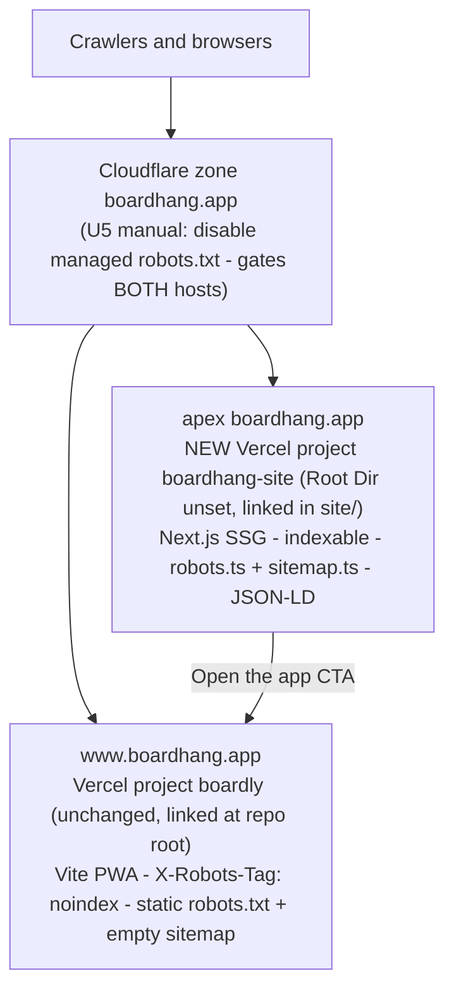

# SEO Floor and Content Site (P0 Slice) - Plan

**Branch:** `worktree-feat-web-seo-content-site` · **Tier:** Standard (no safety-critical paths touched)

## Goal Capsule

- **Objective:** Ship the P0 slice of the SEO/GEO strategy: fix the technical-SEO floor of the live PWA (`web/`), scaffold a crawlable Next.js content site (`site/`) serving apex `boardhang.app`, and publish the first rescue article — without touching the PWA's origin, service-worker scope, or any safety-critical path.
- **Authority:** the strategy doc (`docs/plans/2026-07-25-002-seo-geo-strategy-plan.md`) owns strategy decisions; this plan owns the implementation; `AGENTS.md`/`web/CLAUDE.md` own process and repo conventions.
- **Stop conditions:** surface (don't attempt) the manual dashboard steps in U5 — domain registration, Cloudflare toggle, Vercel domain reassignment need the user. Do not modify `vite base`, router basename, or service-worker scope (that is Phase 2 of the strategy, safety-adjacent, out of scope). Do not rename the `boardly` Vercel slug.
- **Tail:** PR per repo convention (PR-first, no direct push to `main`). U5 runs **after the PR merges**: its manual CLI deploys ship latest `main`, so the `web/CLAUDE.md` runbook applies unchanged and no unreviewed tree ever deploys.

---

## Product Contract

### Summary

Two code workstreams plus an ops workstream: (1) the `web/` PWA gets a real static robots.txt and sitemap, meta/OG tags, an OG image, and a blanket noindex header — it becomes a well-behaved non-indexable app; (2) a new self-contained `site/` Next.js App Router project becomes the indexable surface on apex `boardhang.app`, with a landing page, `/guides`, the rescue article, JSON-LD, and its own robots/sitemap; (3) the manual prerequisites (boardhang.com registration, Cloudflare managed-robots toggle, apex domain reassignment) are documented as gated steps with curl-verifiable outcomes.

### Problem Frame

`site:boardhang.app` returns zero results. The live robots.txt is a Cloudflare-managed block that Disallows ClaudeBot/GPTBot/Google-Extended/CCBot and then falls through to the SPA's `index.html` as garbage (verified live 2026-07-25); `/sitemap.xml` serves the SPA shell; `web/index.html` has no meta description or OG tags; the SPA renders an empty `
` to every crawler, and no AI crawler executes JavaScript. Meanwhile moonboard.com's problem pages are dead-but-still-indexed and the official app's June 2026 migration is generating live "where do I browse problems now" demand — a time-sensitive vacuum the strategy doc targets. Nothing can be captured until Boardhang has a crawlable surface.

### Requirements

**PWA technical-SEO floor (`web/`)**

- R1. `https://www.boardhang.app/robots.txt` serves a real static file allowing all crawlers (including AI bots), with no Cloudflare-injected Disallows and no HTML tail. (Gated on the U5 Cloudflare toggle — the repo half alone is insufficient.)
- R2. `/sitemap.xml` on www returns valid XML (an empty urlset), never the SPA shell.
- R3. The app shell carries a meta description, OG/Twitter tags, and a 1200×630 OG image so shared www links unfurl properly.
- R4. Every www response carries `X-Robots-Tag: noindex` — the whole host is non-indexable; apex is the only indexable surface.
- R5. The service worker never answers `/robots.txt` or `/sitemap.xml` navigations from the cached shell.

**Content site (`site/`)**

- R6. Apex `boardhang.app` serves fully prerendered HTML — every page's content is present in the raw response (no-JS crawlers see everything).
- R7. The landing page describes Boardhang truthfully (what it is, DIY LED story, free, works where the official app breaks) with Organization + SoftwareApplication JSON-LD and a clear "Open the app" CTA to `https://www.boardhang.app`.
- R8. `/guides` exists with the first article published: "The MoonBoard website is retired — where to browse problems now", with real drafted content, honest coverage of alternatives (Boardhang catalog, boardsesh, Moonboard Guidebook, official app), an "unofficial — not affiliated with Moon Climbing Ltd" disclaimer, a dated last-updated line, and FAQPage JSON-LD.
- R9. The content site ships `robots.txt` (all crawlers + AI bots allowed) and `sitemap.xml` listing its pages, and every page has a canonical URL on `https://boardhang.app`.

**Ops and docs**

- R10. All manual steps are documented as an ordered runbook with per-step curl verification: register boardhang.com; disable Cloudflare's managed robots.txt for the zone; create/link the `boardhang-site` Vercel project; move apex `boardhang.app` from `boardly` to it.
- R11. Doc discipline is honored in the same PR: new `docs/content-site.md`, a row in `docs/README.md`, `site/` in `CONTEXT.md`'s repo map, `site/CLAUDE.md` deploy runbook, and the currently untracked strategy doc committed alongside.

### Scope Boundaries

**Deferred to Follow-Up Work**

- Programmatic problem/benchmark pages (strategy Tier 1/2) and the noindex kill-switch mechanics they require.
- Phase 2 origin consolidation (PWA to `/app/*` — safety-adjacent: `vite base`, SW scope, stub service worker).
- PWA share button emitting content-site URLs (no problem-share button exists today; net-new work).
- boardhang.com → boardhang.app redirect wiring (after the user registers the domain).
- Remaining content backlog (DIY LED build guide, 20-byte BLE write-up, app-pain landing pages).
- `llms.txt` (strategy P2, only useful post-SSR).
- A CI workflow for `site/`/`web/` builds (valuable — nothing catches a broken build before deploy today — but adjacent to this slice).

**Outside this slice's identity:** anything touching `web/src/ble/**`, board geometry, or `supabase/migrations/**`.

---

## Planning Contract

### Key Technical Decisions

- **Blanket noindex on www, per-path nothing.** One `headers` rule (`X-Robots-Tag: noindex` on `/(.*)`) instead of enumerating app routes. The apex content site is the sole indexable surface, so indexing any www path (including `/`) would only ever compete with it. OG tags still work on noindexed pages, so link previews are unaffected. Crawling stays allowed (robots.txt `Allow: /`) — a robots Disallow would hide the noindex from Google.
- **www sitemap is an empty urlset.** Every www URL is noindexed, so listing any URL would be contradictory; an empty `<urlset>` is valid XML and fixes the served-HTML-garbage problem. No `Sitemap:` line in www robots.txt.
- **`site/` is a fully self-contained project, linked from inside `site/`.** The `boardly` link lives at the repo root with Root Directory `web` and is documented as fragile (`web/web` path error when run from `web/`). The new project avoids that arrangement entirely: project Root Directory unset, `npx vercel link --cwd site --project boardhang-site`, `npx vercel deploy --cwd site --prod`. The root `.gitignore` patterns are root-anchored (`/.vercel`, `/.env*`) and do **not** cover `site/` — U2 creates `site/.gitignore` (`.vercel`, `.env*`, `node_modules/`, `.next/`, mirroring `web/.gitignore`) and `git check-ignore site/.vercel` must pass before the first link, or the link would leave project IDs and pulled env vars committable.
- **Content site stack: Next.js App Router + TypeScript + Tailwind v4 + `@next/mdx`, no shadcn.** Next.js over Astro is settled in the strategy doc (ISR at pSEO scale, React reuse). All P0 pages are fully static (`next build` prerenders; no ISR yet). Articles are `.mdx` via `@next/mdx` — one dependency, native Next support, room for the content backlog. shadcn is a `web/` app-UI rule; the content site needs typography, not app components — plain Tailwind + a prose style keeps the raw-HTML payload minimal (near-zero client JS is the strategy's stated discipline). Exact-version pinning applies (repo-wide policy, per `web/CLAUDE.md` rationale).
- **Canonical URLs live on `https://boardhang.app` (apex) for now.** `metadataBase` is the apex. The strategy's end-state single-host consolidation happens in Phase 2; the apex-canonical interim is its accepted stepping stone. The pSEO URL shape `/problems/<layout>/<slug>-<id>` is reserved but not built.
- **The PWA's problem deep link is `/board/$layoutId/catalog?problem=<source_catalog_id>` — a search param, not a path.** Future content→app links must use `catalogNavTarget` semantics (`web/src/catalog/catalogNav.ts`); a made-up `/problem/:id` path 404s into `/boards`. Documented in `docs/content-site.md` (U6) so pSEO work doesn't invent a wrong shape.
- **Head-edit constraint in `web/index.html`:** the pre-paint theme script queries and rewrites `meta[name="theme-color"]` and must stay after that meta; new meta/OG tags go above the script, preserving its keep-in-sync comment contract with `src/shell/themeStore.ts`.
- **OG image via the existing icon pipeline.** Extend the `web/scripts/generate-icons.mjs` pattern (sharp, brand assets from `brand/`, committed PNG output) rather than hand-making a one-off — `site/` gets its own copy of the pattern for its OG image.
- **No test runner in `site/` for this slice.** The only unit-testable code is `robots.ts`/`sitemap.ts` (trivial static returns); standing up vitest for them is ceremony. The proportionate proof is `next build`'s all-static route output plus curl of the served bodies — both in the Verification Contract. Revisit when `site/` gains real logic (the pSEO data layer).

### High-Level Technical Design

Today apex 308-redirects to www from inside `boardly` (verified live); U5 reassigns the apex domain to `boardhang-site`, which flips the apex from redirect to content site with no DNS edit expected (both projects are on the same Vercel team behind the same Cloudflare proxy — verify after the move).

**Why Phase 1 is safe for the PWA:** the SW's `navigateFallback: '/index.html'` claims every www navigation, but the content site lives on a different origin (apex), which the SW cannot reach. This cross-host separation is the safety mechanism — never serve content routes from www in this phase.

### Sequencing

U1 (web floor) and U2 (site scaffold) are independent and can land in either order. U3/U4 build on U2. U6 (docs) closes out the same PR. U5 (ops) runs **post-merge**: U1–U4's build/lint gates prove the PR, then U5 deploys latest `main` and carries the deployed verification for all of them — this keeps the `web/CLAUDE.md` "deploy latest main" recipe literally correct and never ships an unreviewed working tree.

### Risks & Dependencies

- **Vercel filesystem-vs-rewrite precedence is assumed, not proven.** The plan relies on `public/` files winning over the `/(.*)` catch-all (documented Vercel behavior: redirects → filesystem → rewrites). Mitigation: U5 step 3's curl checks are the empirical gate; if the rewrite swallows the files, add an explicit negative-lookahead rewrite before re-deploying.
- **The Cloudflare toggle is a single point of failure for both hosts.** Until the zone's managed robots.txt is disabled, both www's static file and apex's `robots.ts` are overridden by the AI-bot Disallow block — all robots verification is gated on that one dashboard action. Mitigation: it is an explicit U5 step, ordered after the `boardly` deploy so its curl check can actually pass.
- **Apex domain reassignment touches the live redirect.** Moving `boardhang.app` from `boardly` to `boardhang-site` changes live behavior (308→content site). Blast radius is small — www is untouched and apex currently only redirects — but U5 step 4's checks verify both hosts immediately after the move, and the rollback is re-adding the domain to `boardly`.
- **SW shell-hijack risk is contained only by the cross-host split.** `navigateFallback: '/index.html'` claims every www navigation; serving any content route from www would hand it to cached shells. Mitigation: hard scope rule (no content routes on www in this phase) plus the U1 denylist for the two static files; `registerType: 'autoUpdate'` means the denylist reaches users on next load.
- **Deploys are manual and working-tree-based; no CI exists.** Merging ships nothing, and a broken `site/` build surfaces only at deploy time. Mitigation: Verification Contract build gates run locally before PR; deploy-from-clean-tree steps are explicit in U5; a CI workflow is named in Deferred work.
- **External dependencies:** boardhang.com registration (user), Cloudflare dashboard access (user), Vercel team access for project/domain changes (user). None block the code PR; all block "live".

---

## Implementation Units

### U1. PWA technical-SEO floor

- **Goal:** www becomes a well-behaved, non-indexable app origin: real robots.txt, valid empty sitemap, meta/OG tags + OG image, blanket noindex header, SW denylist for the two static files.
- **Requirements:** R1, R2, R3, R4, R5
- **Dependencies:** none (deployed effect of R1 gated by U5's Cloudflare toggle)
- **Files:** `web/public/robots.txt` (new), `web/public/sitemap.xml` (new), `web/public/og.png` (new, generated), `web/index.html`, `web/vercel.json`, `web/vite.config.ts`, `web/scripts/generate-icons.mjs`
- **Approach:** robots.txt is minimal (`User-agent: *` / `Allow: /`, no Sitemap line); sitemap.xml is an empty urlset. Vercel serves `public/` files before the catch-all rewrite (redirects → filesystem → rewrites), so no rewrite change is needed — but verify with curl after deploy. Add a `headers` array to `web/vercel.json`: `X-Robots-Tag: noindex` on `/(.*)`. In `web/index.html`, add meta description (reuse the manifest's description string), OG title/description/image/url + `twitter:card`, above the pre-paint theme script. Extend `generate-icons.mjs` to composite a 1200×630 OG image from `brand/` assets (brand colors documented in `brand/README.md`). Add `/robots.txt` and `/sitemap.xml` to `workbox.navigateFallbackDenylist` in `web/vite.config.ts`.
- **Execution note:** config/static-asset work — prefer build + curl smoke verification over unit coverage.
- **Test scenarios:** Test expectation: none — static assets and config; behavior is only observable via build output and deployed responses (Verification below).
- **Verification:** `npm run build` in `web/` passes (includes `tsc -b`); `dist/` contains `robots.txt`, `sitemap.xml`, `og.png`; the generated `dist/sw.js` contains the two denylist entries; `npm run lint` and `npm run test` stay green. Deployed checks live in U5.

### U2. Scaffold the `site/` content project

- **Goal:** a self-contained Next.js App Router project at `site/` with the repo's conventions applied and the SEO plumbing every page inherits.
- **Requirements:** R6, R9
- **Dependencies:** none
- **Files:** `site/package.json`, `site/next.config.ts`, `site/tsconfig.json`, `site/.gitignore`, `site/.oxlintrc.json`, `site/app/layout.tsx`, `site/app/robots.ts`, `site/app/sitemap.ts`, `site/components/json-ld.tsx`, `site/app/globals.css`, `site/CLAUDE.md`, `site/scripts/generate-og.mjs`, `site/public/og.png`
- **Approach:** Next.js (latest stable) + TypeScript + Tailwind v4 + `@next/mdx`, all exact-pinned to lockfile-resolved versions. `layout.tsx` sets `metadataBase: https://boardhang.app`, default title template, description, OG defaults, theme (light/dark via `prefers-color-scheme`, brand colors from `brand/README.md`), and a footer carrying the "unofficial — not affiliated with Moon Climbing Ltd" disclaimer sitewide. `app/robots.ts` allows all crawlers (explicitly including GPTBot, OAI-SearchBot, ChatGPT-User, ClaudeBot, PerplexityBot, Google-Extended, Bingbot, Applebot) and points to the sitemap; `app/sitemap.ts` enumerates the static routes. `json-ld.tsx` is a tiny typed `<script type="application/ld+json">` helper. `.oxlintrc.json` mirrors `web/.oxlintrc.json`; house formatting (2-space, no semicolons, single quotes; no Prettier). `site/CLAUDE.md` owns the new project's deploy runbook (link/deploy with `--cwd site`, Root Directory unset) without restating `web/CLAUDE.md`. Create `site/.gitignore` (`.vercel`, `.env*`, `node_modules/`, `.next/`) and confirm `git check-ignore site/.vercel` passes before the first link. `next.config.ts` adds `redirects()` entries sending every app-shaped apex path — `/board/:path*`, `/boards`, `/session/:path*`, `/lists/:path*`, `/logbook/:path*`, `/settings`, the full top-level route tree in `web/src/router.tsx` (the hand-pasted `boardhang.app/session/join/…` form is explicitly supported by `joinUrl.ts`) — to the same path on `https://www.boardhang.app` as **temporary (307) redirects**, so pre-move apex deep links keep working without browsers caching a permanent bounce that Phase 2's move onto the apex would have to fight.
- **Patterns to follow:** exact-pin policy and supply-chain rationale from `web/CLAUDE.md`; oxlint config from `web/.oxlintrc.json`; OG generation pattern from `web/scripts/generate-icons.mjs`.
- **Test scenarios:** Test expectation: none — scaffold/config; `next build` prerender output is the proof.
- **Verification:** `npm run build` in `site/` succeeds and the build output shows every route as statically prerendered (`○`/`●`, no `ƒ`); `npm run lint` passes; `curl` of the local `next start` output for `/robots.txt` and `/sitemap.xml` returns the expected bodies.

### U3. Landing page

- **Goal:** a truthful, crawlable landing page — the page AI assistants and Google cite for "what is Boardhang".
- **Requirements:** R7
- **Dependencies:** U2
- **Files:** `site/app/page.tsx`
- **Approach:** real prose in the initial HTML: what Boardhang is (free web app for DIY LED MoonBoards over Web Bluetooth), the differentiators with concrete numbers from the strategy doc (works with ArduinoMoonBoardLED firmware, works around the official app's 20-byte BLE write truncation, browse ~12k problems across 5 layouts incl. Mini 2025), how to start (open `www.boardhang.app` in Chrome/Edge — no install), and honest constraints (Web Bluetooth needs Chrome/Edge or Bluefy on iPhone). JSON-LD: Organization + SoftwareApplication (applicationCategory, `offers price: 0`, featureList incl. firmware compatibility). Primary CTA links to `https://www.boardhang.app`. Keep client JS ≈ zero (server components only).
- **Test scenarios:** Test expectation: none — static content page; correctness is editorial and covered by the raw-HTML verification.
- **Verification:** `curl` of the built page contains the descriptive prose and valid JSON-LD (paste into a validator); page renders correctly in light and dark schemes.

### U4. Guides surface + rescue article

- **Goal:** `/guides` index plus the published first article capturing the moonboard.com-retirement vacuum.
- **Requirements:** R8
- **Dependencies:** U2
- **Files:** `site/app/guides/page.tsx`, `site/app/guides/moonboard-website-retired/page.mdx`, `site/mdx-components.tsx`
- **Approach:** article structure per the strategy's GEO guidance: direct answer in the first 40–60 words, H2s phrased as questions, concrete dated facts (moonboard.com problem pages 403 behind Cloudflare challenge; June 22 2026 app migration; where each alternative fits), a fair comparison of options — Boardhang's catalog (free, web, ~12k curated problems), boardsesh, Moonboard Guidebook, the official app — with Boardhang's limits stated honestly, a "last updated" date, FAQ section with FAQPage JSON-LD, and Article JSON-LD (author, dateModified). Draft the full prose at implementation time from the strategy doc's verified facts — no placeholder copy ships. The guides index lists the article and names the upcoming pieces without linking dead stubs.
- **Execution note:** the article's factual claims must come from the strategy doc's verified findings — do not introduce new unverified claims about Moon Climbing.
- **Test scenarios:** Test expectation: none — content page; editorial verification plus schema validation.
- **Verification:** raw HTML contains full article text; FAQPage + Article JSON-LD validate; `sitemap.ts` includes both routes; internal links resolve.

### U5. Ops runbook: Vercel project, domains, Cloudflare

- **Goal:** the manual/ops steps executed in order with per-step verification, turning U1–U4 from built to live.
- **Requirements:** R1 (deployed effect), R10
- **Dependencies:** U1, U2, U3, U4 (the step-4 domain move needs the landing page live, or the step's own check fails against a 404)
- **Files:** `site/CLAUDE.md` (runbook lives here, written in U2, exercised here)
- **Approach:** ordered steps, each with its check, all run **after the U1–U4 PR has merged** (deploys ship latest `main`; never deploy the feature branch's tree). The `boardly` deploy runs **before** the Cloudflare toggle: until U1 is deployed, the origin still serves the SPA shell for `/robots.txt`, so the toggle's check could not pass in the reverse order.
  1. *(user)* Register `boardhang.com` — defensive only; redirect wiring deferred.
  2. *(CLI)* Deploy `boardly` from a clean tree on latest `main` per `web/CLAUDE.md`. Checks: `curl -I` shows `X-Robots-Tag: noindex`; `/sitemap.xml` returns XML; OG tags present in `curl` of `/`. (`/robots.txt` still carries the Cloudflare-injected block until step 3.)
  3. *(user, Cloudflare dashboard)* Disable the zone's managed robots.txt / "block AI bots" feature — it currently injects the Disallow block on **both** hosts and would override `site/`'s `robots.ts` too. Also review Security → Bots for any network-level AI-crawler blocking (the robots.txt body only proves the injection toggle, not crawler access). Check: `curl https://www.boardhang.app/robots.txt` returns exactly the new static file — no managed block, no HTML tail.
  4. *(CLI + dashboard)* Create `boardhang-site` project (Root Directory unset), `npx vercel link --cwd site --project boardhang-site`, deploy, then *(user, dashboard)* move apex `boardhang.app` from `boardly` to `boardhang-site`. Checks: `curl -sI https://boardhang.app/` shows 200 (no 308 to www); `curl -s https://boardhang.app/ | grep -i boardhang` shows content-site HTML; `curl -sI https://boardhang.app/board/7/catalog` and `curl -sI https://boardhang.app/session/join/x` both 307-redirect to www (deep-link preservation); www still serves the PWA; `https://boardhang.app/robots.txt` and `/sitemap.xml` correct.
  5. Post-move: request indexing via Google Search Console (domain property covers both hosts; needs one-time DNS TXT verification via Cloudflare) — noted as a user follow-up.
- **Execution note:** interactive — pause at each *(user)* step and hand over; never attempt dashboard actions or domain purchases autonomously.
- **Test scenarios:** Test expectation: none — operational; the curl checks are the tests.
- **Verification:** all step checks pass; both origins healthy; a PWA regression spot-check (open www, board renders, no SW weirdness on `/robots.txt`).

### U6. Docs and strategy-doc commit

- **Goal:** doc discipline honored; the strategy this plan implements is committed to the repo.
- **Requirements:** R11
- **Dependencies:** U1–U4 (documents what they built, including U1's noindex posture)
- **Files:** `docs/content-site.md` (new), `docs/README.md`, `CONTEXT.md`, `docs/plans/2026-07-25-002-seo-geo-strategy-plan.md` (currently untracked — commit it)
- **Approach:** `docs/content-site.md` owns depth: two-origin architecture and why cross-host separation protects the PWA (SW `navigateFallback`), the canonical URL scheme (apex canonical now, reserved `/problems/<layout>/<slug>-<id>` shape), the deep-link mapping table (`/board/{layoutId}/catalog?problem={source_catalog_id}`, strip-at-default rule), the noindex posture, the future kill-switch requirement, and the apex-redirect rule: every new top-level PWA route needs a matching apex→www redirect entry in `site/next.config.ts` until Phase 2 consolidation. `docs/README.md` gets a "When to read what" row; `CONTEXT.md` gets a `site/` repo-map row and a "Where to read next" link — summaries only, no restating (deploy runbook stays in `site/CLAUDE.md`).
- **Test scenarios:** Test expectation: none — documentation.
- **Verification:** every touched doc cross-links correctly; no topic stated in two places; strategy doc is tracked.

---

## Verification Contract

| Gate | Command / check | Applies to |
| --- | --- | --- |
| Web build + typecheck | `cd web && npm run build` (runs `tsc -b`) | U1 |
| Web lint / tests | `cd web && npm run lint && npm run test` | U1 |
| Site build (all-static proof) | `cd site && npm run build` — every route prerendered, none dynamic | U2–U4 |
| Site lint | `cd site && npm run lint` | U2–U4 |
| Raw-HTML crawlability | `curl` each site page: full content + JSON-LD present without JS | U3, U4 |
| Deployed smoke | U5's per-step curl checks (robots, sitemap, noindex header, apex 200, www PWA intact) | U1, U5 |
| Schema validity | JSON-LD blocks pass a structured-data validator | U3, U4 |

No standalone typecheck script exists in `web/` — `npm run build` is the typecheck (per repo memory: never `tsc --noEmit`). No Prettier anywhere — formatting by house convention, verified by oxlint + review.

## Definition of Done

- All R1–R11 satisfied; every Verification Contract gate green.
- U5 manual steps either completed (with checks passing) or explicitly handed to the user with the runbook — the code PR does not block on dashboard actions, but the plan is not "live" until step 3's robots check passes.
- No changes to `vite base`, router basename, SW scope, the `boardly` slug, or any safety-critical path.
- Working tree clean; branch pushed; PR opened per `AGENTS.md` conventions with test plan and out-of-scope callouts; strategy doc committed.
- No dead-end scaffolding left behind (unused starter boilerplate from `create-next-app` removed).
- Post-merge follow-up noted: write the `docs/solutions/` learning (Cloudflare managed-robots override, two-projects-one-repo Vercel linking, SW-vs-content-routes) — first entry in this domain.
