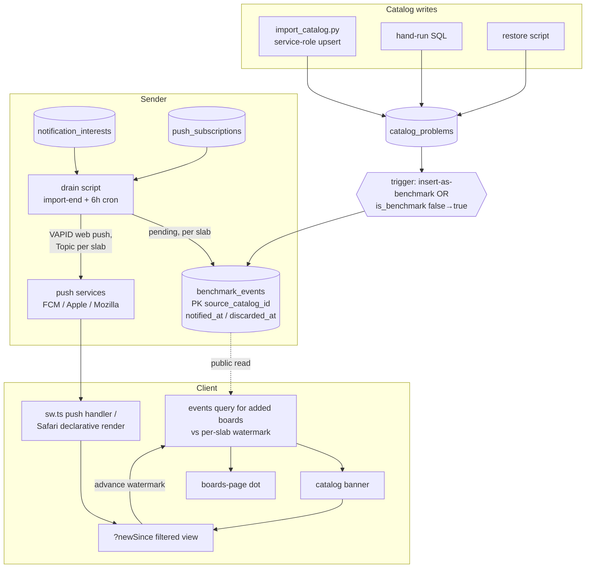
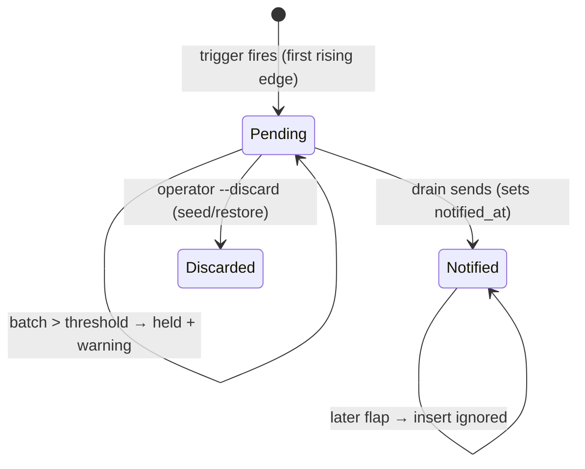

# New-Benchmark Notifications - Plan

## Goal Capsule

- **Objective:** Notify users when problems on a board they have added become benchmarks — an in-app banner for everyone, opt-in web push for signed-in users — aggregated per board and angle, deep-linking to a filtered catalog view of exactly the new problems.
- **Product authority:** The user (product owner). All product decisions in this doc were made explicitly in the planning dialogue.
- **Execution profile:** Seven units in three phases. Phase 1 (U1–U2) is the server events foundation plus the in-app surfaces — most of the user value, none of the push risk. Phase 2 opens with the U7 iOS spike (an afternoon, throwaway keys, no committed code) and only then the U3 service-worker migration. Phase 3 (U4–U6) is push. `supabase/migrations/**` is safety-critical per [AGENTS.md](../../AGENTS.md): U1 is planned test-first, runs at maximum reasoning effort, and review is mandatory.
- **Stop conditions:** Stop and surface rather than guess if the RLS tests cannot express an assertion without weakening a policy, if the service-worker port cannot reproduce any of the four documented Workbox behaviors byte-for-byte in effect, or if the U7 spike cannot demonstrate declarative push delivery on a real installed iOS PWA — in that case stop **before** U3/U4 commit any push infrastructure.
- **Rollout ordering (hard):** migration 0018 applied and verified on the hosted project → drain script proven with a manual send → client bundle deploys. The client never ships first.
- **Isolation:** Implementation happens in a separate git worktree, not on the main checkout.

---

## Product Contract

### Summary

When catalog problems on an added board become benchmarks, the user finds out: a banner on that board's catalog and a dot on its Boards-page row for everyone (logged-out included), and an aggregated web push ("4 new benchmarks on Mini MoonBoard 2025") for signed-in users who opted in via a Settings toggle. Tapping either lands on the catalog filtered to the new problems. Detection is a database trigger, so script imports and hand-run SQL are captured identically; sending is an operator-run drain at import-end plus a scheduled catch-all.

### Problem Frame

Benchmark sets grow — new catalog entries arrive flagged as benchmarks, and existing problems get promoted by import or by hand-run SQL. Today nothing surfaces this: the client's sync cursor quietly absorbs the rows and a user only notices a new benchmark by stumbling over it. Benchmarks are the problems users deliberately seek out, so "new benchmarks exist on your board" is the single highest-signal event the catalog produces, and the app has no channel for it — no push infrastructure, no what's-new state, no notification UI.

### Requirements

**In-app surfaces (work logged out)**

- R1. When a board's `(layout, angle)` slab has benchmark events newer than the device's last-seen watermark, the active board's catalog shows a dismissible banner: "N new benchmarks — view", with N computed client-side after climbability filtering.
- R2. Tapping view opens the catalog filtered to exactly those problems with other filters reset to defaults; viewing or dismissing advances the watermark, clearing banner and dot.
- R3. Non-active added boards show a new-benchmarks dot on their Boards-page row, driven by the same events source and cleared by the same watermark. When every new benchmark on a slab is filtered out by hold sets (visible count zero), opening that board's catalog advances the watermark silently — no banner shows, and the dot clears — so a dot can never become a dead end with nothing to view or clear.
- R4. A slab's first-ever sync, a cache rebuild, and a pull-to-refresh never present pre-existing benchmarks as new.
- R5. Opening the filtered view for a board not added on this device uses the existing preview-plus-"Add this board" affordance — never a blank screen.

**Push (signed-in, opt-in)**

- R6. A "New benchmark alerts" toggle in Settings requests browser permission on tap. On iOS outside an installed PWA it explains install-to-home-screen instead of silently failing, including that the installed app starts fresh (boards and sign-in do not carry over from Bluefy).
- R7. When pending events exist for a `(layout, angle)` a user has registered interest in, each opted-in device receives one aggregated push per board-and-angle — "N new benchmarks on {board}" (catalog-wide count) — and tapping it focuses or opens the app on the filtered view.
- R8. Interests are the device's added boards at their stored angle, reconciled declaratively per signed-in user; signing in reconciles boards that were added while signed out. Last writer wins across a user's devices.
- R9. Sign-out or account switch stops notifications for the previous user on that device; a token refresh never churns the subscription.
- R10. Un-benchmarking (true→false) never notifies, and a problem can produce at most one notification event in its lifetime — a flapping `is_benchmark` value cannot re-notify.
- R11. Mass transitions (initial slab seed, restore, corrected upstream fetch) are guarded whether concentrated or distributed: a batch exceeding the per-slab threshold, the global per-run cap, or the rolling 24-hour cap is held pending with a warning for an operator decision — never auto-sent, never silently discarded.
- R12. Signed-in users who haven't opted in see a single dismissible nudge pointing at the toggle; dismissal is permanent.

**Capture and delivery (operator)**

- R13. Benchmark transitions are captured by a database trigger — insert-as-benchmark or `is_benchmark` false→true — regardless of who writes (`import_catalog.py`, hand-run SQL, anything future).
- R14. The drain runs as the import pipeline's last step and on a scheduled GitHub Actions catch-all (~6 h) with `workflow_dispatch`; it is idempotent, claim-based (a racing pair of runs cannot double-send; a crash between claim and send loses at most that push, and the in-app banner remains the guaranteed surface), and prunes dead subscriptions.

### Acceptance Examples

- AE1. **Manual SQL promotion.** Given problem P on Mini 2025/40° with `is_benchmark = false`, when the operator runs `update catalog_problems set is_benchmark = true where source_catalog_id = 'P'`, then a pending `benchmark_events` row for P exists immediately, the next drain pushes "1 new benchmark on Mini MoonBoard 2025" to interested opted-in devices, and the banner appears on that catalog after the next events check.
- AE2. **Flap immunity (covers R10).** Given P was already notified once, when a bad boardsesh fetch re-imports P as non-benchmark and a later corrected fetch flips it back to true, then no second event row is created and nobody is re-notified.
- AE3. **Seed guard (covers R11).** Given a first-time import of a new slab creates 500 benchmark events, when the drain runs, then it sends nothing for that slab, leaves the events pending, and emits a warning naming the slab and count; the operator resolves with `--force-send` or `--discard`.
- AE4. **Token refresh (covers R9).** Given an opted-in signed-in user, when Supabase fires `TOKEN_REFRESHED`, then no unsubscribe, no subscription-row write, and no interest write occurs.
- AE5. **Signed-out adds (covers R8).** Given a user added two boards while signed out, when they sign in, then both `(layout, angle)` pairs appear in their `notification_interests` without touching any board UI.
- AE6. **Fresh install deep link (covers R5).** Given a push tapped on a device where the board isn't added (e.g. a freshly installed iOS PWA), then the filtered view renders in preview mode with the existing "Add this board" banner.

### Scope Boundaries

- **Deferred to follow-up work:**
  - Shared-boards redesign adaptation ([2026-07-25-001](2026-07-25-001-feat-web-shared-boards-redesign-plan.md)): when board instances land, re-point the dot to instance cards, add the instance param to the deep link, and resolve push board names for user-named shared boards. The server grain `(layout_id, angle)` is unchanged by the redesign; only presentation anchors move.
  - Notification preferences beyond on/off (per-board muting, frequency); delivery/click telemetry; `navigator.setAppBadge()` app-icon badging.
  - An RLS test for the pre-existing `0006` public-read policy (currently untested; noted, not this feature's debt).
- **Outside this feature:** per-problem pushes, email digests, syncing seen-state across devices (each device clears its own banner), push inside Bluefy (WKWebView has no Push API — Bluefy users get the in-app surfaces), any iOS-native work, and syncing full board state to profiles (interest rows are a targeting mirror, not board sync — R9 of the shared-boards plan stays intact).

---

## Planning Contract

### Key Technical Decisions

- KTD1. **`benchmark_events` is the single source of truth for all four surfaces** — banner, dot, deep-link ids, and push. The client queries events for its added boards (public-read, works logged out, always filtered to `discarded_at is null` so an operator `--discard` retracts in-app surfaces too — `notified_at` is ignored by the client, so banners survive the drain) and keeps one device-local watermark per `(layout, angle)`; there is no sync-diff detection inside `catalogSync.ts`. Rationale: a sync-derived unseen store and an events-driven dot can never agree on clearing; and the offline argument for sync-derivation is hollow because learning about new benchmarks requires the network anyway. This supersedes the earlier sync-diff sketch from the planning dialogue.
- KTD2. **Trigger with a transition guard and notified-dedupe.** Capture fires only on rising edges (insert-as-benchmark, or update where `old.is_benchmark IS DISTINCT FROM new.is_benchmark`) — without the guard, a routine full re-import (which re-stamps every row) would write an event for every already-benchmarked problem. Events are keyed by `source_catalog_id`; dedupe is against **notified** events: a problem notified once will never re-notify (R10), but a rising edge after an operator `--discard` re-arms the event (clears `discarded_at`, refreshes `created_at`). This matters because the upstream flag flaps (documented unreliable in [docs/catalog-data-pipeline.md](../catalog-data-pipeline.md)): a spurious flip that gets discarded must not permanently consume the notification for the genuine promotion that follows.
- KTD3. **Drain state lives on the event row** (`notified_at` / `discarded_at`, null = pending). Before sending, the drain **re-reads `catalog_problems.is_benchmark` for every pending event and discards rows no longer true** — the trigger only guarantees a falling edge creates no new event, which alone is weaker than R10 across the up-to-6-hour cron window. Guards are layered: per-slab threshold (~50), a **global per-run cap (~100 across all slabs)**, and a **rolling 24-hour cap**, so a distributed mass flip can't slip through in slices; any tripped guard holds the batch pending with a warning rather than discarding, because a big batch is ambiguous between "restore accident" and "legitimate large benchmark release" — the operator decides with `--force-send` or `--discard`. Seeding/restore runs are followed by `--discard`, which replaces the earlier `--no-notify` idea (a Python flag cannot suppress a database trigger). Runs are serialized by **claiming**: `update ... set notified_at = now() where ... and notified_at is null` returning the claimed rows, and sending only those — so an import-end run racing the cron cannot double-send.
- KTD4. **Service worker migrates to `injectManifest`** (own unit, own PR). The `importScripts` shortcut was evaluated and rejected: imported-script update propagation depends on `updateViaCache` defaults and browser-version behavior that is least documented on Safari — the one platform iOS push requires — and a `public/` file sits outside `tsc -b`/oxlint. The migration was trial-applied during research: byte-identical precache manifest, and the exact port of all four Workbox behaviors is in U3. Critical gotcha: `registerType: 'autoUpdate'` does nothing under injectManifest — `self.skipWaiting()` + `clientsClaim()` must be explicit in `sw.ts`.
- KTD5. **Push payload is declarative web push JSON** (`web_push: 8030`, `notification.title`/`body`/`navigate`, `Content-Type: application/notification+json`): iOS/macOS Safari renders it natively without waking the SW; Chrome/Firefox receive the same JSON in the `push` handler and render it traditionally. Sender sets `TTL: 86400` (pywebpush defaults to 0 — undelivered-if-asleep), `Topic` per `(layout, angle)` (an undelivered older digest is replaced, making at-least-once benign), `Urgency: low`, and an explicit request timeout.
- KTD6. **Deep link carries a timestamp, not an id list:** `?newSince=<ISO>` on the catalog route. The client resolves ids by querying events with `created_at > newSince` for that slab. Keeps the URL and the ≤4 KB encrypted payload small, and the view stays stable after the watermark advances. The sender uses the batch's oldest pending `created_at`; the banner uses the device watermark. `newSince` lives outside `FilterState` — never written by `setFilters`, never persisted by `filterSeed` — and the filtered view shows its own "Showing new benchmarks — show all" affordance that clears the param.
- KTD7. **Interests reconcile declaratively, not per-mutation.** One subscriber on `boardStore`'s `emit()` plus the auth identity hook computes the desired set — added boards × effective angle via `getAngle(board)` — diffs against the last-pushed set, and issues one upsert + one delete, fire-and-forget with the `cacheGeneration`-style guard from `web/src/lists/listsSync.ts`. Fixes the signed-out-then-sign-in gap (AE5) and debounces the `CatalogScreen` URL-angle mirror writes. Interests follow the stored angle wherever it comes from; instance-scoped angles arrive with the redesign.
- KTD8. **Subscription lifecycle binds to identity transitions, not UI actions.** A `syncNotificationsIdentity(userId | null)` sibling joins the existing fan-out in `AuthProvider.resolveSession` — identity-gated on a stored last-user id (token refresh is a no-op, R9/AE4), deferred off the auth-callback tick (supabase-js re-entrancy deadlock caveat), generation-guarded. On identity change: local `pushManager.unsubscribe()` always (works even when the old session is gone); server row delete best-effort while still authed; an orphaned row is retired by the sender's 410-prune. Re-subscribe-and-upsert runs on every app start for the opted-in user (the reliable substitute for `pushsubscriptionchange`, which never dependably fires).
- KTD9. **Sender is a Python script beside the import pipeline** — `pywebpush` (2.3.0, current) with three research-confirmed footguns handled: explicit TTL, a fresh `vapid_claims` dict per endpoint (the library mutates the dict, poisoning `aud` across push services in a batch), explicit `timeout`. Shared `requests.Session`; prune on 404/410 only; retry 429/5xx honoring `Retry-After`; 401/403 alert-and-abort (that's our VAPID config, never prune on it). This introduces the repo's first Python third-party dependency: `scripts/requirements.txt`, exact-pinned, with a `pip install -r` step in the new workflow. Rejected alternative — a hosted push provider (OneSignal-class): it would own subscriber endpoints (push capabilities for user devices) at a third party, add a vendor dependency to a pipeline that is otherwise first-party, and constrain the declarative Safari payload (KTD5); the sender's plumbing is small and rides the existing operator-run script + Actions conventions.
- KTD10. **VAPID keys are permanent.** Regenerating invalidates every subscription (a full subscriber wipe). Generate once; private key in GitHub Actions secret `VAPID_PRIVATE_KEY` (+ `VAPID_SUBJECT`, a real `mailto:` — Apple 403s placeholders) and a password manager; public key as `VITE_VAPID_PUBLIC_KEY` in Vercel env and `web/.env`. Client degrades to toggle-hidden when unset, mirroring the `isConfigured` pattern in `web/src/supabase/client.ts`. The Vercel env var must exist before the deploy that ships the toggle.

### High-Level Technical Design

Event pipeline — every write path funnels through the trigger; two consumers read the same events table:

Event lifecycle — one row per problem, ever:

### Assumptions and Constraints

- The seed-guard threshold starts at 50 events per `(layout, angle)` per run — real benchmark updates are a handful against ~2,900 total benchmarks; tune later if a legitimate release trips it (it holds pending, so nothing is lost).
- The cron cadence is every 6 hours — a manual SQL promotion waits at most that long; imports push immediately via the import-end drain.
- Board display names in push text come from a static layout-id→name map in the drain script, matching `BOARDS` in `web/src/board/boards.ts`.
- The `benchmark_events` public-read surface (problem id, layout, angle, timestamps) is catalog-derived and no more sensitive than the already-public `catalog_problems`.
- Two drains can overlap (local import-end run vs cron; the GH `concurrency` group only serializes cron runs). The claim step in KTD3 makes the race harmless — each pending row is sent by exactly one run. Note `Topic` alone would not have been enough: it only replaces messages still queued at the push service, not ones already delivered to an online device. The claim's cost is at-most-once delivery per event: a crash between claim and send loses that push, which is acceptable because the in-app banner is the guaranteed surface.
- U3 and U5 exist for Chrome, Android, and desktop — Safari renders the declarative payload without waking the service worker, but without a custom SW push handler those platforms get no push at all. The user-base platform split is unmeasured; if it turns out overwhelmingly iOS, the U7 spike result and Phase 1 engagement can inform descoping.
- iOS push requires a real device with the PWA installed from Safari; simulators and Safari tabs cannot receive push. Bluefy (WKWebView) never receives push — its users get the in-app surfaces, and the two contexts share no storage.

### U7 spike — recorded result

- **Status (2026-07-28):** Not yet run. Phase 1 (U1 + U2) completed and verified without touching push infrastructure; the spike is required before U3/U4 can begin per this plan's Stop conditions and Rollout ordering. Awaiting an operator with a real iPhone to install the current production PWA from Safari, generate a throwaway VAPID keypair, `pushManager.subscribe`, hand-send one declarative payload (`web_push: 8030`, `title` + `navigate`), and record here whether the notification was delivered app-closed, rendered natively (no SW involvement), the tap opened the installed PWA at the `navigate` URL, and which header set worked.
- **Pass template:** delivered app-closed = yes/no; native render = yes/no; tap navigate = yes/no; working headers = `TTL:…, Topic:…, Urgency:…, Content-Type:…`.
- **Failure branch:** stop and resurface per the Goal Capsule before U3/U4 commit any push infrastructure.

---

## Implementation Units

### U1. Migration 0018 — events, interests, subscriptions, trigger, RLS (safety-critical)

- **Goal:** All server state for the feature: `benchmark_events` + capture trigger on `catalog_problems`, `notification_interests`, `push_subscriptions`, with RLS and tests.
- **Requirements:** R10, R11 (schema half), R13; enables R1–R3, R7–R9.
- **Dependencies:** none.
- **Files:** `supabase/migrations/0018_benchmark_notifications.sql`, `supabase/migrations/tests/0018_benchmark_notifications_rls.sql`, `supabase/migrations/tests/run_rls_test.sh` (new case + grants-block branches).
- **Approach:**
  - `benchmark_events`: PK `source_catalog_id text`, `layout_id int`, `angle int`, `created_at timestamptz default now()`, `notified_at timestamptz`, `discarded_at timestamptz`; index on `(layout_id, angle, created_at)`. Capture is **two triggers sharing one function** — a single combined trigger is invalid SQL (`tg_op` is unavailable in a WHEN clause, and an INSERT trigger's WHEN may not reference OLD): `after insert ... for each row when (new.is_benchmark)` and `after update ... for each row when (new.is_benchmark and old.is_benchmark is distinct from new.is_benchmark)`, both executing `public.capture_benchmark_event()`. Contract: rising edges only, re-stamps never (the WHEN guards keep the 75k-row import path cheap). The function inserts with an on-conflict clause that re-arms a previously **discarded** event (clears `discarded_at`, refreshes `created_at`) and never touches a notified one (KTD2). RLS: select for `anon, authenticated`; no client writes (service-role/trigger only).
  - `notification_interests`: PK `(user_id, layout_id, angle)`, `user_id references auth.users on delete cascade`. RLS: owner-only select/insert/**update**/delete with the full WITH CHECK clamp per `0011_beta_user_submissions.sql` — the UPDATE policy needs both `using` and `with check` on `user_id = auth.uid()`, because PostgREST upserts compile to `ON CONFLICT DO UPDATE` and the reconcile re-upserts existing rows on every app start; without it, interests sync works once per device and then hard-errors.
  - `push_subscriptions`: `id uuid PK`, `user_id` (cascade), `endpoint text unique`, `p256dh`, `auth`, `created_at`, `last_seen_at`, `updated_at timestamptz not null default now()` maintained via the existing `set_updated_at()` from 0002. RLS: owner-only for **select as well as write** — endpoint+keys are a capability to push to that device, not mere private data.
  - House style: header comment with KTD references, `comment on table`, named prose policies, `create index if not exists`.
- **Execution note:** Test-first at maximum effort. Write `0018_benchmark_notifications_rls.sql` before the migration, following the 0008–0017 shape (`set role authenticated`, `set_config` uid, negative tests granting the verb first so the policy — not a missing grant — is what denies). Migration chain for the test case: `0002 → 0006 → 0018` (0002 defines `set_updated_at`).
- **Test scenarios:**
  - Trigger: insert with `is_benchmark=true` → event row; insert false → none; update false→true → event; true→true re-stamp (the import churn case) → none; true→false → none; false→true when an event row already exists → no duplicate, no error (AE2).
  - RLS: anon can select `benchmark_events`; anon/authenticated cannot insert/update it; user A can insert/select/delete own interests and a **repeat upsert of an already-present interest row succeeds for the owner** (the ON CONFLICT DO UPDATE path) while failing for another user; user B cannot read or forge A's rows (WITH CHECK clamp asserted for both interests and subscriptions); user B cannot select A's `push_subscriptions` row (zero rows, not error) nor update it; duplicate endpoint upsert resolves on the unique constraint for the same owner.
- **Verification:** `bash supabase/migrations/tests/run_rls_test.sh` green including the new case; migration applied to the hosted project (dev first) and AE1's SQL half demonstrated from the SQL editor.

### U2. In-app surfaces — events store, banner, dot, deep-link view

- **Goal:** Everyone (logged-out included) sees new benchmarks: banner on the active board's catalog, dot on other boards' rows, filtered view, watermark clearing.
- **Requirements:** R1–R5; AE6.
- **Dependencies:** U1 (events table live).
- **Files:** `web/src/catalog/benchmarkNewsStore.ts` (new), `web/src/catalog/benchmarkNewsStore.test.ts` (new), `web/src/catalog/CatalogScreen.tsx`, `web/src/catalog/catalogSearch.ts`, `web/src/shell/MyBoards.tsx`, `web/src/router.tsx` (only if the search-param schema requires it), docs: `docs/navigation-and-ui-flows.md`.
- **Approach:**
  - `benchmarkNewsStore`: `useSyncExternalStore` module in the `recentsStore.ts` idiom — per-slab watermark in localStorage (`benchmarkSeen_${layoutId}_${angle}`, ISO timestamp, default = now-on-first-touch so a fresh device/slab starts clean, R4), an in-memory cache of unseen-event ids/counts per slab fetched from `benchmark_events` (`created_at > watermark and discarded_at is null` — the client ignores `notified_at`, so banners survive the drain and an operator `--discard` retracts them; added boards only), refreshed on catalog/boards mount; `null` client or offline degrades to no-banner (Boards page keeps working offline).
  - Banner in `CatalogScreen` mirroring `UnaddedBoardBanner` (mount point beside it): count computed after `isClimbable`/hold-set filtering (R1); view navigates to `?newSince=<watermark>` with other filters reset to defaults; both view and dismiss advance the watermark. When the climbable count is zero (all new benchmarks on uninstalled hold sets), no banner renders and opening the catalog advances the watermark silently (R3's no-dead-end rule).
  - Dot on `MyBoards` rows for added, non-active boards with pending events.
  - `?newSince` as a validated search param in `catalogSearch.ts` **outside** `FilterState` (KTD6): CatalogScreen resolves ids (events query), renders the id-filtered list, shows a "Showing new benchmarks — show all" strip that clears the param; reuse the existing deep-link pending/spinner path (the `?problem` precedent) so a not-yet-synced slab shows loading, and force a `syncSlab` before declaring "no results" — the events row can precede the slab rows locally. The view defines explicit empty states: if the resolved ids exist but are all hold-set-filtered, show "these new benchmarks use hold sets you don't have — show all"; if the ids resolve to nothing (viewed and cleared elsewhere, or operator-discarded), show a plain "nothing new here anymore — show all" state — never an unexplained empty grid that reads as a sync failure.
  - Un-added board: existing `catalogRoute.beforeLoad` + `UnaddedBoardBanner` path already covers R5 — verify, don't rebuild.
- **Patterns to follow:** `recentsStore.ts` (per-slab store shape), `catalogSearch.ts` validate/strip conventions, `filterSeed.ts` (confirm `newSince` never reaches `saveSeed`), snapshot-at-open rule from `docs/solutions/architecture-patterns/snapshot-reactive-store-array-when-opening-a-view.md` — the filtered view pages over a snapshot of resolved ids, since viewing writes back to the store that feeds it.
- **Test scenarios:** watermark default on first touch → zero unseen (R4); events newer than watermark → banner count matches climbable subset (a benchmark on an uninstalled hold set is excluded from N but present after "show all"); a discarded event (`discarded_at` set) produces no banner and no dot; all new benchmarks hold-set-filtered → no banner, opening the catalog advances the watermark and clears the dot (R3 no-dead-end); dismiss advances watermark and hides banner and dot; `?newSince` view lists exactly matching ids, "show all" clears the param and keeps the user on the catalog; `?newSince` ids all hold-set-filtered → "hold sets you don't have" empty state; `?newSince` ids resolve to nothing → "nothing new here anymore" empty state; filter changes while in the view don't write `newSince` into the seed (assert `saveSeed` output); offline/unconfigured client → no banner, no crash; un-added board deep link renders preview + add banner (AE6).
- **Verification:** `cd web && npm run test`, `npm run build`, `npm run lint`; manual: promote a problem via SQL on the dev project, see banner → view → clear on a real device.

### U7. iOS declarative-push spike (runs first in Phase 2)

- **Goal:** Prove or falsify the load-bearing external claim — that Safari delivers a declarative web push to a real installed iOS PWA and renders it natively — before any push infrastructure (permanent VAPID keys, SW migration, sender, workflow) is committed. Also settles the `Content-Type` question from Risks (declarative JSON vs RFC 8291 octet-stream posting).
- **Requirements:** de-risks R6/R7 and KTD5; feeds the platform-mix assumption.
- **Dependencies:** none. U3 and U4 must not start until this passes.
- **Files:** none committed — throwaway VAPID keypair, scratch send script or `curl`. Record the observed result (delivery, native render, tap navigation, working header set) in this plan's Assumptions section.
- **Approach:** Install the current production PWA on a real iPhone from Safari; from the installed app's console (or a temporary page), `pushManager.subscribe` against today's generated service worker with the throwaway public key; hand-send one declarative payload (`web_push: 8030`, `title` + `navigate`) with the candidate header set; observe delivery with the app closed, native render without SW involvement, and tap opening the installed PWA at the `navigate` URL.
- **Test scenarios:** Test expectation: none — this is a spike; its output is an observed pass/fail and the recorded header set.
- **Verification:** a notification delivered app-closed on the real device and a tap landing on the deep link. On failure: stop per the Goal Capsule and resurface before U3/U4.

### U3. Service-worker migration to injectManifest (no push code yet)

- **Goal:** Custom `web/src/sw.ts` owning the service worker with behavior byte-equivalent to today's generateSW output, as its own reviewable, regression-tested change.
- **Requirements:** enables R6, R7; must not regress anything existing.
- **Dependencies:** U7 (spike must pass first); otherwise parallel to U1/U2; must land before U5/U6.
- **Files:** `web/vite.config.ts`, `web/src/sw.ts` (new), `web/tsconfig.sw.json` (new), `web/tsconfig.json` (add reference), `web/tsconfig.app.json` (exclude `src/sw.ts`), `web/package.json` (+ exact-pinned `workbox-core`, `workbox-precaching`, `workbox-routing`, `workbox-strategies`, `workbox-expiration` at 7.4.1 as devDependencies).
- **Approach:** `strategies: 'injectManifest'`, `srcDir: 'src'`, `filename: 'sw.ts'`; move `globIgnores: ['**/*.wasm']` into the `injectManifest` block (the injectManifest default glob **includes** `.wasm` — omitting this regresses the 433 kB QR-decoder exclusion). In `sw.ts`: `precacheAndRoute(self.__WB_MANIFEST)` + `cleanupOutdatedCaches()`; `NavigationRoute(createHandlerBoundToURL('/index.html'), { denylist: [/^\/assets\//, /^\/robots\.txt$/, /^\/sitemap\.xml$/] })`; the `.wasm` `CacheFirst` route (`qr-decoder-wasm`, `ExpirationPlugin({ maxEntries: 4 })`); explicit `self.skipWaiting()` + `clientsClaim()` (KTD4 — autoUpdate wires nothing in this mode). Registration is untouched (plugin still emits `registerSW.js` pointing at `/sw.js`). Add `devOptions: { enabled: true, type: 'module' }` gated appropriately — dev SW is Chromium-only and served at `/dev-sw.js?dev-sw`; without it push handlers can never be exercised under `npm run dev`.
- **Technical design (directional):** the research trial produced an identical 9-entry precache manifest and the same `precache-v2` cache name, so existing installs do not re-download; treat any manifest diff at build time as a failure signal.
- **Test scenarios:** Test expectation: none beyond build assertions — this unit is config/platform work; its proof is the regression checklist. Add a build-level check if cheap (e.g. assert `dist/sw.js` exists and contains no `import` statements).
- **Verification (all manual, against `npm run build && npm run preview`):** deep-link cold load renders the app (navigateFallback); OAuth email-code sign-in round-trips on a hard load; `/robots.txt` and `/sitemap.xml` serve their real bodies, not the shell; QR scanner works and `.wasm` is absent from the precache manifest while `qr-decoder-wasm` cache populates; an edited rebuild activates without a stuck-waiting SW (autoUpdate semantics). Run `/ce-test-browser` for the affected routes.

### U4. Sender — VAPID, drain script, GitHub Actions catch-all

- **Goal:** Pending events become web pushes: aggregated per `(layout, angle)`, interest-targeted, guarded, idempotent, on both triggers (import-end and cron).
- **Requirements:** R7 (send half), R11, R14; AE1, AE3.
- **Dependencies:** U1, U7 (spike must pass first). Independent of U2/U3 (a push can be proven against a hand-inserted subscription row before the client ships).
- **Files:** `scripts/send_benchmark_notifications.py` (new), `scripts/requirements.txt` (new), `.github/workflows/benchmark-notifications.yml` (new), docs: `docs/catalog-data-pipeline.md` (drain step in the pipeline runbook + VAPID key runbook).
- **Approach:** Mirror the house script shape (`import_catalog.py` docstring/env/`_req` conventions; PostgREST via service key). Flow: fetch pending events grouped by `(layout, angle)` → **re-read `catalog_problems.is_benchmark` and discard events no longer true** (KTD3) → apply guards (per-slab >50, global per-run >100, rolling 24 h; any trip: leave those events pending, print a `::warning::`-compatible line naming slabs and counts) → **claim** the surviving rows (`set notified_at where notified_at is null`, send only what the claim returned — serializes racing runs, KTD3) → join interests per slab (a slab whose interest join yields zero recipients stays claimed with nothing sent and no warning, so the pending set never accumulates across runs) → join subscriptions per user → build the payload with `notification.title` from "N new benchmarks on {board}" using the static layout-id→name map matching `BOARDS` in `web/src/board/boards.ts` → send declarative payload (KTD5) with fresh per-endpoint `vapid_claims`, shared `Session`, explicit timeout → per-endpoint error handling (404/410 delete row; 429/5xx retry with backoff honoring `Retry-After`; 401/403 abort loudly). **Logging constraint: never print or log `endpoint`, `p256dh`, or `auth` values** — the repo is public and Actions logs are world-readable; log status code + slab, identifying endpoints only by hash or last-8 truncation. Flags: `--dry-run` default with `--apply` (house style), `--force-send <layout_angle|all>`, `--discard <layout_angle|all>` (sets `discarded_at`; the seed/restore follow-up, KTD3). Workflow: clone `beta-videos-maintenance.yml` — 6 h cron + `workflow_dispatch` (mode input: send/force/discard), concurrency group, `timeout-minutes`, soft-skip warning when secrets absent, plus the repo's first `pip install -r scripts/requirements.txt` step. Update the pipeline doc: drain is the import sequence's last numbered step; seeding/restore sequences end with `--discard`.
- **Patterns to follow:** `prune_catalog_orphans.py` (guard + `--force` precedent), `backup_catalog_problems.py` (paging), workflow file as named.
- **Test scenarios** (pure-logic functions factored for a `scripts/test_send_benchmark_notifications.py` run with `python3 -m unittest`, network faked): grouping/aggregation text ("1 new benchmark" singular; board name from the layout map); revalidation discards an event whose problem is no longer a benchmark; per-slab guard holds and warns; **40 events spread across 20 slabs trips the global cap and nothing sends**; `--force-send` overrides, `--discard` marks without sending; a zero-recipient slab is claimed with nothing sent and no warning; claim excludes rows another run already claimed; claim-dict freshness (two endpoints on different push services get distinct `aud`); 410 marks the row for deletion while the batch continues; 401 aborts before any further sends; log output contains no endpoint or key material; `--dry-run` sends nothing and marks nothing.
- **Verification:** end-to-end against the dev project: hand-insert a subscription (from a local browser via U6-in-progress or a console-subscribed SW), promote a problem, run the drain, notification arrives; workflow dispatch run green; airplane-mode TTL check (send while device offline, arrives on reconnect); Actions run with secrets absent soft-skips.

### U5. Push and notificationclick handlers in sw.ts

- **Goal:** Non-Safari browsers render pushes and taps land on the filtered view.
- **Requirements:** R7 (client half).
- **Dependencies:** U3, U4 (payload shape fixed).
- **Files:** `web/src/sw.ts`.
- **Approach:** `push`: parse `event.data?.json()` in try/catch (fallback title on malformed/absent payload — a received-but-unshown push costs quota), always `showNotification` inside `event.waitUntil`, map the declarative `notification` fields, set `tag` to the Topic value for client-side collapse (iOS ignores `tag`; harmless). `notificationclick`: `notification.close()`, then focus-or-open inside `waitUntil` — `clients.matchAll({ type: 'window', includeUncontrolled: true })`, navigate an existing client to `navigate` and focus it, else `clients.openWindow`. Keep handlers dumb: no fetches, no IndexedDB.
- **Test scenarios:** Test expectation: none in vitest — jsdom has no SW runtime; covered by U4's end-to-end verification plus a malformed-payload manual send (drain `--dry-run` variant or curl) showing the fallback notification.
- **Verification:** real Android Chrome and real installed iOS PWA: push arrives app-closed, tap opens the filtered view; app-open push still shows; malformed payload shows fallback rather than nothing.

### U6. Client push module — subscription, interests, Settings toggle, nudge

- **Goal:** The signed-in opt-in loop: toggle → permission → subscription row; interests mirror the device's boards; identity changes clean up.
- **Requirements:** R6, R8, R9, R12; AE4, AE5.
- **Dependencies:** U1, U3; U4 for end-to-end proof.
- **Files:** `web/src/notifications/pushSubscription.ts` (new), `web/src/notifications/interestsSync.ts` (new), `web/src/notifications/NotificationsSection.tsx` (new), tests beside each (new), `web/src/auth/AuthProvider.tsx` (fan-out line), `web/src/shell/SettingsScreen.tsx` (mount section), `web/src/shell/MyBoards.tsx` (nudge mount — the Boards page, so it never competes with the catalog's new-benchmarks banner), `web/src/lib/pwa.ts` (`NOTIFICATIONS_NUDGE_DISMISSED_KEY`), `web/.env.example`-equivalent documentation of `VITE_VAPID_PUBLIC_KEY`, docs: `docs/navigation-and-ui-flows.md`.
- **Approach:**
  - `pushSubscription.ts`: capability detection (`'serviceWorker' in navigator && 'PushManager' in window`, key present — else the Settings section renders the unsupported/iOS-explainer state); subscribe on toggle-tap gesture (`userVisibleOnly: true`, base64url-decoded `applicationServerKey`); **toggle-on first unsubscribes any existing browser subscription** so a fresh endpoint is always minted — a stale endpoint left by another account would otherwise hit the other owner's row on upsert and fail with an RLS error; then upsert row on conflict `endpoint`. The toggle is **disabled/busy from tap until the permission + subscribe + upsert round trip resolves** (no double-tap double-subscribe, no premature visual flip). On every app start for an opted-in signed-in user, re-read the live subscription and upsert (`last_seen_at`, silent-rotation repair, KTD8); toggle-off unsubscribes locally and deletes the row; `Notification.permission === 'denied'` renders fix-in-browser-settings copy instead of a dead toggle; a dismissed prompt (permission stays `'default'`) reverts the toggle quietly and may re-prompt on a later tap.
  - `interestsSync.ts`: KTD7 reconcile — subscribe to `boardStore`, recompute desired `(layoutId, getAngle(board))` set, diff vs last-pushed (module state), upsert/delete; triggered by board mutations, sign-in, and app start; generation-guarded per `listsSync.ts`.
  - `syncNotificationsIdentity` in the `resolveSession` fan-out beside `syncListsIdentity` (KTD8): stored-last-user gate, deferred network work, never awaited inline.
  - Settings section per `CatalogCacheSection.tsx` + `PreviewToggleRow` idiom; iOS branch via `isIosLike() && !isStandalone()` from `lib/pwa.ts` with honest copy (installed app starts fresh — R6). Nudge: one dismissible strip for signed-in, capability-positive, not-opted-in users; `safeGetItem`/`safeSetItem` permanence.
- **Test scenarios:** toggle on: permission granted → unsubscribe-any-existing, subscribe + row upsert; permission denied → no row, denied-state copy, no re-prompt attempt; prompt dismissed (`'default'`) → toggle reverts, re-promptable on next tap; toggle disabled during the in-flight round trip (second tap is a no-op); stale foreign subscription present → unsubscribe-then-resubscribe yields a fresh endpoint and a clean insert; toggle off → unsubscribe + row delete; identity change A→B → A's local subscription unsubscribed, B starts clean; token refresh (same user re-resolve) → zero subscription/interest calls (AE4); reconcile: add board → interest appears; remove → deleted; angle change → pair replaced; sign-in with signed-out-added boards → full set mirrored (AE5); unconfigured/keyless build → section renders unsupported state, no crash; nudge dismiss persists.
- **Verification:** `cd web && npm run test`, `npm run build`, `npm run lint`; the full AE1 loop on a real device signed in as a test user.

---

## Verification Contract

| Gate | Command / method | Applies to |
|---|---|---|
| Web unit/component tests | `cd web && npm run test` | U2, U4 (Python via `python3 -m unittest`), U6 |
| Typecheck + build | `cd web && npm run build` (`tsc -b` — includes the new `tsconfig.sw.json` project) | U2, U3, U5, U6 |
| Lint | `cd web && npm run lint` (oxlint; never Prettier) | all web units |
| RLS / migration tests | `bash supabase/migrations/tests/run_rls_test.sh` | U1 |
| SW regression checklist | manual against `npm run preview`: deep-link cold load, OAuth return, `/robots.txt` + `/sitemap.xml` bodies, WASM out of precache + runtime-cached, update-on-rebuild | U3 (and re-run after U5) |
| Browser pass | `/ce-test-browser` on catalog, boards, settings routes | U2, U3, U6 |
| Real-device push matrix | Android Chrome + installed iOS PWA (real device, installed from Safari): delivery app-closed, tap deep link, TTL airplane-mode check, 410 prune after browser-side unsubscribe | U4, U5, U6 |
| Pipeline dry-run | `send_benchmark_notifications.py --dry-run` against dev project; workflow_dispatch run | U4 |

Safety-critical tier (U1): mandatory `/ce-code-review` before merge; migration applied to the hosted dev project and verified before any dependent client deploy.

## Definition of Done

- All implementation units (U1–U6) landed through PRs per tier rules (U1 safety-critical with mandatory review), each with its docs updated in the same commit (`docs/catalog-data-pipeline.md` for U4, `docs/navigation-and-ui-flows.md` for U2/U6); the U7 spike's observed result recorded in Assumptions before U3/U4 began.
- Rollout order held: 0018 verified on hosted → drain proven by a real received push → client deployed. `VITE_VAPID_PUBLIC_KEY` present in Vercel env before the deploy that ships the toggle; VAPID private key in GH secrets and the password manager.
- Acceptance examples AE1–AE6 each demonstrated (AE1 end-to-end on a real device; AE2/AE3 via SQL + drain runs on dev; AE4/AE5 via unit tests; AE6 manually).
- Cron workflow live and a scheduled run observed green (or soft-skipped with warning where intended).
- No abandoned experimental code: dead ends from SW or push iterations removed from the diff.
- Follow-up filed for the shared-boards adaptation items (dot surface, instance param, board naming) referencing this plan's Scope Boundaries.

---

## System-Wide Impact

- **First push infrastructure.** The repo gains VAPID key material (GH secrets + Vercel env), a `push_subscriptions` table whose rows are device-push capabilities, and a third external surface (push services) beside Supabase and YouTube. Failure isolation: push breaking never affects the in-app surfaces (separate code paths off the same events table).
- **Service-worker ownership moves in-repo** (U3). Until now the SW was generated config; after U3 it is source code under `tsc -b` + oxlint, and every future PWA behavior change (caching, offline, update semantics) is a `web/src/sw.ts` edit. The four ported behaviors — navigateFallback + denylist, WASM precache exclusion, WASM runtime cache, autoUpdate semantics — become regression surface for any SW change, not just this feature.
- **Auth identity fan-out grows a fourth member.** `resolveSession` in `web/src/auth/AuthProvider.tsx` gains `syncNotificationsIdentity` beside lists/sessions/beta. Its contract (no-op on same user, never block the callback tick, survive a mid-flight identity switch) is inherited from the existing three; a regression there now also leaks notifications across accounts on a shared device.
- **First third-party Python dependency** (`pywebpush` → `cryptography`). `scripts/` loses its stdlib-only invariant; the new workflow gains the repo's first `pip install` step. Other scripts remain stdlib-only — the convention change is scoped to the sender.
- **New always-on write path into Postgres.** The trigger runs on every `catalog_problems` write, including 75k-row full imports. Its cost is one indexed conditional per row with an insert-or-ignore only on rising edges — but it is the first trigger on the catalog hot path, and `import_catalog.py` runtime should be compared before/after on the dev project during U1.
- **Boards page gains its first network read** (events query for dots). It degrades to no-dots when offline or unconfigured; the page's fully-offline, signed-out usability is unchanged.

---

## Risks & Dependencies

- **Upstream benchmark flapping** (boardsesh `benchmark_difficulty` documented unreliable; one staged slab has 0 benchmarks vs 572 at its sibling angle): a corrected fetch can mass-flip rows. Mitigated twice — lifetime dedupe (KTD2) and the threshold hold (R11). Residual: a legitimate large release waits for an operator `--force-send`.
- **Stale installed PWAs:** no periodic SW update polling exists, so long-lived installs update handlers only on relaunch. Payload-shape changes must stay backward-compatible with old handlers (the try/catch fallback in U5 is the floor).
- **URL-angle mirror drift:** opening a shared link at another angle rewrites the stored board angle (pre-existing `CatalogScreen` behavior), and interests follow the stored angle. Documented; properly fixed by instance-scoped angles in the shared-boards redesign.
- **Shared-boards redesign rework** (accepted, "notifications first"): dot surface, deep-link instance param, and push board-naming are known follow-ups; the server grain survives.
- **VAPID key loss or leak** = full subscriber wipe on rotation; the U4 runbook and dual storage are the mitigation.
- **First Python dependency**: `pywebpush` pulls `cryptography`; pin exact versions in `scripts/requirements.txt` and keep the workflow's install step scoped to it.

## Deferred / Open Questions

### From 2026-07-28 review

All three are deferred, not blocking — each has a stated default the plan executes unless the owner redirects.

- **Benchmark-promotion rate is unmeasured** (adversarial review, P1). The feature's payoff rests on how often `is_benchmark` rising edges actually occur on established slabs; if the rate is near zero, Phase 3's infrastructure fires never and the failure is invisible. Suggested: count rising edges across catalog backups / successive fetches before U1 and record a floor below which Phase 3 isn't built. **Default if unanswered:** build per the plan; the U7 spike and Phase 1 banner engagement become the de-facto signal.
- **Interest targeting grain: per-user or per-device** (adversarial review, P1). KTD7's full-set diff means a phone/laptop pair converges to whichever device reconciled last — the other device's boards are deleted from targeting, so a user can stop receiving pushes for the board they actually climb. Alternative: key `notification_interests` per subscription (device) so each device targets its own boards and cleanup cascades with the subscription. Decide before U1 lands (it sets the schema). **Default if unanswered:** per-user as planned, accepting the documented convergence behavior.
- **No go/no-go gate between the in-app phase and the push phase** (adversarial review, P1). Signed-in share × opt-in rate × iOS-installed share are all unmeasured; nothing in the plan names a Phase 1 result that would stop Phase 3. Suggested: pick an observed signal (banner views per event, distinct devices seeing a banner) and a floor before starting U4–U6. **Default if unanswered:** phases proceed in order once U7 passes.

---

## Sources & Research

- Repo: `web/src/catalog/catalogSync.ts` (slab sync, cursor resets on resync/rebuild — why sync-diff detection was dropped), `web/src/board/boardStore.ts` (`emit()` seam, unvalidated `setAngle`), `web/src/auth/AuthProvider.tsx:111-145` (identity fan-out + re-entrancy caveat), `web/src/lists/listsSync.ts` (generation guard), `supabase/migrations/0006_catalog_problems.sql` (unguarded `set_updated_at` — the re-stamp churn that forces KTD2's WHEN guard), `supabase/migrations/0011_beta_user_submissions.sql` (WITH CHECK clamp model), `supabase/migrations/tests/run_rls_test.sh`, `scripts/import_catalog.py` + `scripts/prune_catalog_orphans.py` (script house style, guard/`--force` precedent), `.github/workflows/beta-videos-maintenance.yml`, `web/vite.config.ts`.
- Institutional: `docs/solutions/developer-experience/testing-supabase-rls-rpc-migrations-locally.md` (harness gotchas: grant-the-verb negative tests, `set role authenticated`), `docs/solutions/architecture-patterns/offline-first-sync-swiftdata-supabase.md` (conflict-target/idempotency trap, auth-transition cache safety), `docs/solutions/architecture-patterns/snapshot-reactive-store-array-when-opening-a-view.md`.
- External (load-bearing): pywebpush 2.3.0 source (TTL-0 default, `vapid_claims` mutation, timeout passthrough — KTD9); [WebKit: Declarative Web Push](https://webkit.org/blog/16535/meet-declarative-web-push/) + W3C Push API WD (KTD5 payload); [RFC 8030](https://datatracker.ietf.org/doc/html/rfc8030) (TTL/Topic/Urgency); vite-plugin-pwa 1.3.0 source (`autoUpdate` no-op under injectManifest; `srcDir`/`filename` resolution) and a trial migration verifying byte-identical precache output (KTD4); [Apple web push docs](https://developer.apple.com/documentation/usernotifications/sending-web-push-notifications-in-web-apps-and-browsers) (installed-PWA requirement, `mailto:` sub).
