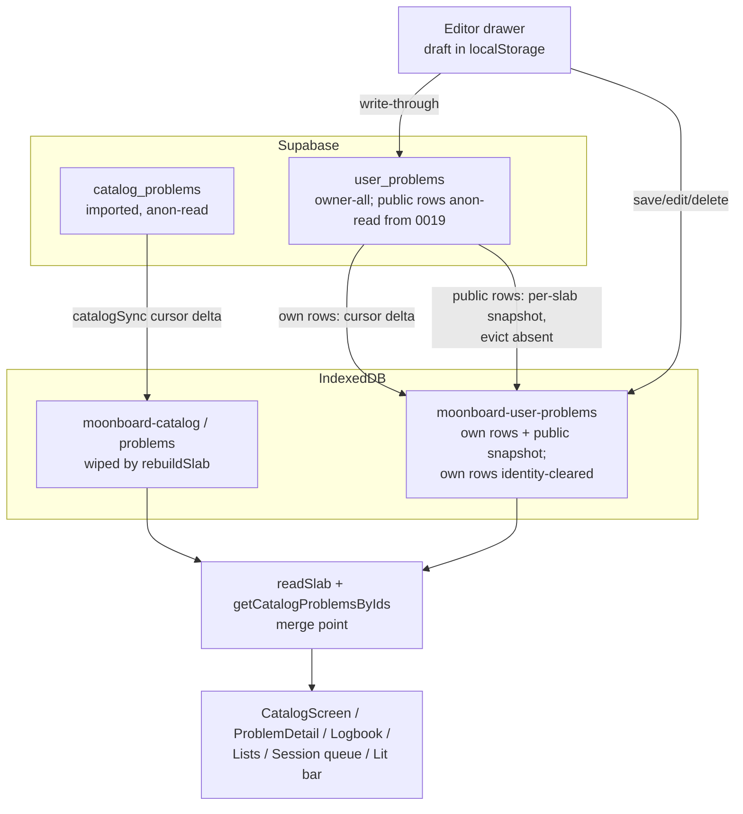
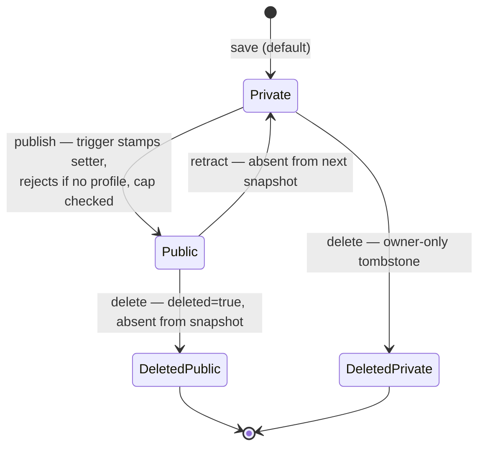

# Web Problem Authoring - Plan

## Goal Capsule

- **Objective:** Restore problem authoring to the web PWA as a full flow — build on a tap-grid over real board art, light on a connected board, save with name/grade and private/public visibility, and have saved problems behave as first-class catalog problems everywhere (catalog, logbook, lists, session queues).
- **Authority:** This plan > repo conventions (AGENTS.md, web/CLAUDE.md) > implementer judgment. The Product Contract's requirements are user-confirmed; Key Technical Decisions may be revisited only if implementation proves one wrong, and that discovery must be surfaced.
- **Execution profile:** Safety-critical tier (`supabase/migrations/**`): maximum reasoning effort, migrations planned test-first, mandatory review before merge. Work happens in the `fix/web-add-problems` worktree branch.
- **Stop conditions:** Stop and surface if (a) the public-visibility RLS design cannot be expressed without leaking private content, (b) production `user_problems` rows conflict with a planned constraint (verify the live table's shape before the hosted apply — legacy rows are asserted, not yet observed), or (c) a change to `web/src/board/geometry.ts` / `renderGeometry.ts` turns out to be needed (separately safety-critical, out of this plan's scope). The U4 editor-shell spike (see Sequencing) exists to hit (c) early, when changing course is cheap.
- **Tail ownership:** Implementer finishes with docs updated in the same PR (see U8), a `docs/solutions/` compound entry, and a PR via the repo's PR-first flow. Each migration must be applied and verified on the hosted project before the client bundle that depends on it deploys.

---

## Product Contract

### Summary

Add a "New problem" entry to a board's catalog that opens a drawer editor: tap holds over the real board render (all five hold roles), light the draft over BLE, and save with name, Font grade, and a private/public choice. Saved problems sync through the existing `user_problems` table (extended, not replaced) and merge into the catalog as first-class problems; public ones appear in that board's catalog for every user, attributed and discoverable.

### Problem Frame

The PWA's original authoring surface (`web/src/shell/BuildScreen.tsx`) was orphaned during the app-shell/routing rework — no route, no navigation entry — and it never saved anything, only lit holds. Meanwhile the backend already has a `user_problems` table (migration 0002, built for iOS logbook sync) that no web code reads, and the catalog has a single id→problem resolution seam through which logbook, lists, session queues, and the detail pager all flow. Authoring is the app's founding feature ("author and light problems on a DIY MoonBoard") and is currently absent from the only active client.

### Requirements

**Authoring**

- R1. A board's catalog screen offers a "New problem" entry (FAB alongside the existing Recents/Filter FABs).
- R2. The editor is a tap-grid over the real board art for the current board and angle, restricted to positions in installed hold sets, supporting all five hold roles (`start`, `left`, `right`, `match`, `end`).
- R3. The author can light the in-progress draft on a connected board over BLE; lighting an unsaved draft must not update a session's shared "on the wall" pointer.
- R4. Saving requires sign-in; a signed-out tap opens the sign-in dialog and resumes the save intent. A save captures name (required, ≤60 chars), Font grade, and visibility. The in-progress draft survives a full page reload — including the OAuth redirect and PWA tab eviction (AE1).
- R5. After saving, the new problem's detail opens so the author immediately sees it.

**Managing own problems**

- R6. The author can edit a problem's holds, name, and grade; change its visibility; and delete it (soft-delete), from the problem's detail view.

**Catalog integration**

- R7. Custom problems appear in the board catalog merged with imported problems and are first-class: loggable in the logbook, addable to lists and session queues, favoritable, lightable, and deep-linkable by id. A save, edit, or delete is reflected in the open catalog list without a manual refresh.
- R8. The catalog can filter to the user's own problems (a "Mine" facet), so authored problems are findable despite default repeat-count sorting.
- R16. Other users' public custom problems are discoverable through a "Community" facet ordered by recency — without it, `repeats: 0` sorting buries them beneath the imported catalog and the public path serves content nobody encounters.
- R9. The author's own problems are browsable offline once synced; Settings → "Rebuild catalog" must not destroy them.

**Sharing**

- R10. At save (and later), the author chooses private or public. Visibility defaults to private.
- R11. Public problems appear in that board's catalog for all users, including signed-out visitors, attributed to the setter. Publishing requires a profile handle, enforced server-side.
- R12. Flipping a public problem to private, or deleting it, propagates: other devices remove it from their caches on next sync (accepting that already-synced copies persist until then).
- R13. The public write path is abuse-limited: a per-user cap on live public problems enforced on any transition into public (including the private→public flip), name length/emptiness and `holds` shape enforced server-side, and every server-owned column pinned or trigger-derived.

**Data safety**

- R14. Existing `user_problems` rows (created by iOS, in production) stay private and untouched: visibility defaults to `private`, no retroactive flip, and no constraint may fail against legacy rows (empty names, no layout/angle).
- R15. Ascent history is not rewritten by problem edits or deletion — logbook rows keep their denormalized name/grade snapshot.

### Acceptance Examples

- AE1. **Signed-out author.** Given a signed-out user with holds placed in the editor, when they tap Save and sign in — including via Google OAuth, which does a full-page redirect — then after auth lands the editor restores their draft (holds, name, grade, visibility) and the save resumes. Verified across a full remount, not just an in-memory auth change.
- AE2. **Retraction.** Given user A published a problem and user B's device synced it, when A flips it to private, then B's device removes it from the catalog cache on B's next sync, and B's existing logbook rows for it keep their name/grade snapshot.
- AE3. **Publish gate.** Given a signed-in user with no profile handle, when they set visibility to public, then they are prompted to pick a handle first — and the server independently rejects a publish without a profile row (the UI gate has a server-side backstop).
- AE4. **Rebuild survives.** Given an author with synced custom problems, when they run Settings → Rebuild catalog for that board, then imported problems re-download and their custom problems remain.
- AE5. **Draft light-up in a session.** Given an author in an active session lighting an unsaved draft, then co-members' "On the wall" bar does not change.

### Scope Boundaries

**Deferred to Follow-Up Work**

- An "edited" marker when a public problem's holds change after others logged it (v1 allows the edit; ascent snapshots are the protection).
- Offline draft *saving* (v1 blocks the Supabase write offline with a clear message; the localStorage draft plus client-generated UUID keep a full offline queue feasible later).
- Report/moderation UI for public problems. v1 posture: takedown is a documented service-role runbook (U8), and public custom problems are unreachable by search engines because the PWA is fully noindexed (`X-Robots-Tag` on every path). Note: the beta-videos precedent does *not* transfer here — that content is YouTube-hosted and moderated upstream; this is self-hosted text, hence the explicit runbook.
- A warning when adding a private problem to a shared list or session queue (co-members see the existing graceful "this climb" fallback; ids leak, content does not). The session ascent projection likewise ships raw ids: co-members can learn *that* you climbed something private, never what it is — accepted and documented, not hidden.
- Grade-filter behavior below the `6A+` floor (existing clamp semantics accepted; the grade picker offers `FONT_GRADES` from the floor up).
- Migrating/backfilling legacy iOS rows (no `layout_id`/`angle`; they stay out of the catalog merge and invisible on web, as today).
- Beta videos on custom problems: gated **off** in v1 (`BetaVideos` renders for any resolved id, which would open public YouTube submissions against possibly-private problems); enabling them deliberately is a follow-up.
- iOS client compatibility with the public read policy. The shipped iOS sync pulls `user_problems` unfiltered and would mis-ingest public rows — accepted: iOS is dormant, no iOS work is active, and the iOS sync path gets reworked if/when iOS relaunches. Recorded here so the relaunch inherits the warning.

**Outside this product's identity**

- iOS parity work (iOS is on hold; flag divergences, don't build for them).
- Community moderation, voting, repeats/stars accrual for custom problems.

---

## Planning Contract

### Key Technical Decisions

- KTD1. **Extend `user_problems`; do not create a new table and do not open writes on `catalog_problems`.** The table exists (migration 0002) with the right spine (`id` client-generated, `holds jsonb`, `updated_at`/`deleted` sync columns, owner RLS quartet) and a live FK from `ascents.user_problem_id`. The schema lands in **two migrations**: `0018` (Phase A — private authoring: `layout_id int`, `angle int`, `visibility text not null default 'private'`, generated identity column per KTD2) and `0019` (Phase B — public machinery: public read policy, publish constraint, cap trigger, attribution columns/triggers per KTD6/KTD7). Splitting keeps the public surface off the production table until Phase A has taught us the shape is right; an additive `0019` is routine in a repo with seventeen migrations. Public-completeness constraint (0019): `check (visibility = 'private' or (layout_id is not null and angle is not null and name <> '' and char_length(name) <= 60))` plus a bound on `holds` (element shape `{c,r,t}` with valid role, array length ≤ a sane max) — legacy private rows are untouched (R14). Migration numbering: `0004`/`0005` are reserved on an unmerged branch.
- KTD2. **One text-id lane: `source_catalog_id text generated always as ('user:' || id::text) stored`, unique.** Every downstream surface (`ascents`, `list_problems`, `session_queue`, `sessions.lit_problem_id`) stores a bare text id and resolves through `getCatalogProblemsByIds` (`web/src/catalog/catalogSync.ts`), whose docstring already anticipates user problems. A `user:`-prefixed id cannot collide with the UUIDv5 catalog ids, fits the 64-char `lit_problem_id` cap (41 chars), and a generated column cannot drift. No dual-lane handling anywhere; `ascents.user_problem_id` stays a vestigial iOS lane. Reversal cost: once Phase B ships, `user:` ids are denormalized into four tables (including other users' rows) and are effectively permanent — the hedge is that every resolver already degrades gracefully on an unresolvable id, so the only forever-invariant is that nothing else claims the `user:` prefix. The column is generated and therefore read-only to PostgREST: no write path may round-trip it.
- KTD3. **Custom problems live in their own IndexedDB database, merged at read time.** A separate database `moonboard-user-problems` (version 1), owned by the user-problems module — *not* a new store inside `moonboard-catalog`, whose version bump would throw `VersionError` in any still-open tab running the previous bundle (`openDB` has no `onblocked`/`onversionchange` handling; `listsSync` set the precedent with its own `moonboard-lists` database). `readSlab` and `getCatalogProblemsByIds` merge across the two connections, fixing all six resolver call sites in one place; `clearSlab`/`rebuildSlab` never touch it (R9/AE4). Custom rows map to `CatalogProblem` with `setter = setter_handle`, `stars 0`, `repeats 0`, `is_benchmark false`.
- KTD4. **Sync = cursor delta for own rows, per-slab snapshot for public rows.** Own rows: delta pulls on an `updated_at` cursor with soft-delete tombstones, optimistic write-through mutations with rollback, a cache-generation guard, and a `syncUserProblemsIdentity(userId)` hook in `AuthProvider` beside the existing three. The identity clear removes **only the outgoing user's own rows** — cached public rows from others carry no private data and survive sign-out. All pulls use `catalogSync`'s paged shape (empty-page termination, advance-by-rows-returned, `>=` cursor) — `listsSync`'s single unpaged `.select()` silently truncates at PostgREST's ~1000-row cap, a bug `catalogSync` already documents. Mutations and pull-applies fire a `subscribeUserProblemsChanged` notification (copying `subscribeListProblemsChanged` in `web/src/lists/listsStore.ts`) that `useSlab` subscribes to, so a save/edit/delete re-renders the open catalog list (R7).
- KTD5. **Retraction propagates by snapshot, not a tombstone stream.** Each slab sync pulls the **full list of public custom problems for that slab** (paged) and evicts cached public rows absent from it (never the user's own rows). Public rows per slab are bounded by design (per-user cap × active setters — nothing like the imported catalog's 20k), so the snapshot is affordable, and eviction-by-absence handles retraction, deletion, account deletion (FK cascade), and re-publish with zero extra machinery: the list is always ground truth. No retraction table, no triggers, no third cursor. If public volume ever outgrows this, a delta mechanism can be added then, with real data.
- KTD6. **RLS shape (0019):** owner reads/writes own rows (existing quartet, re-asserted); non-owner SELECT `to anon, authenticated` where `visibility = 'public' and deleted = false` (anon-readable like `catalog_problems` (0006) and `problem_beta_videos` (0010) — signed-out browsing must not change shape); INSERT/UPDATE `with check` pins `user_id = auth.uid()` and every server-owned field, following the `0011_beta_user_submissions` clamp; a per-user cap on live public rows enforced by a `security definer` trigger with `pg_advisory_xact_lock` firing **`before insert or update` on any transition into public** (the 0011 template is INSERT-only, but publishing here is a private→public UPDATE — an INSERT-only cap is bypassable by bulk-flipping), with the row's own id excluded from the count so re-saving an already-public row cannot fail. Cap value ~50; final number at implementation. Known accepted risk: the shipped iOS sync pulls this table unfiltered and would mis-ingest public rows — iOS is dormant; see Scope Boundaries.
- KTD7. **Attribution is server-derived: `setter_user_id uuid` + denormalized `setter_handle`, stamped by trigger.** The client never writes either: a `security definer` BEFORE INSERT OR UPDATE trigger stamps `setter_user_id = auth.uid()` and `setter_handle` from the caller's own `public.profiles.handle` on any transition into public, and **rejects the publish when no profile row exists** — the server-side backstop for AE3. A companion trigger on `profiles` handle updates re-stamps the denormalized handle on the setter's live public rows, so handle changes (and handle recycling, which would otherwise credit a *different* person) cannot misattribute content. The denormalized copy exists for anon readers (`profiles` is `to authenticated` only); `setter_user_id` is authoritative.
- KTD8. **The editor is built on the `HoldFilterPicker` pattern, not `BoardGrid`.** `HoldFilterPicker` already solves the hard parts: absolutely-positioned tap targets as children of `CatalogBoard` (exact registration with board art at any aspect ratio), installed-hold-set restriction via `holdSetContext`, and the full-height drawer shell. `BuildScreen.tsx` + `BoardGrid.tsx` are retired (deleted if nothing else imports them). **Committed interaction model:** tapping an empty position cycles the common roles — start → move (`right`) → end → remove — matching the old BuildScreen cycle; a role palette (built from `holdLabel`/`holdColor`) sets an explicit brush for the beta roles (`left`, `match`, and explicit `right`), and tapping with a brush assigns that role, tapping a same-role hold removes it. All five `HoldType`s are assignable; each tap target carries an `aria-label` naming its position and current role ("B4, start hold" / "B4, empty") — a binary `aria-pressed` cannot convey a five-state control.
- KTD9. **Editor light-up sends BLE directly and never calls `reportProblemLit` for unsaved drafts** (R3/AE5). `bleClient.send(holds, {rows: board.geometry.numRows, flipped, showBeta: true})` with connect-if-needed, modeled on `useLightUp` but without the session pointer write. Once saved, normal detail-view lighting reports the real id.
- KTD10. **Editor state is URL-opened, localStorage-persisted.** `?new=1` opens the create editor, `?edit=<id>` the edit flow, extending `catalogSearch.ts` (and the `filtersToSearch` Omit list). The in-progress draft (holds, name, grade, visibility) persists to localStorage keyed by board+angle on every change and restores when the editor mounts — one mechanism makes the draft survive the Google OAuth full-page redirect, magic-link round-trips, and PWA tab eviction at the wall (AE1). Angle is inherited from the URL's resolved slab and shown in the editor header. Dismissal confirms only when the draft is **dirty since open** (create mode: anything placed; edit mode: differs from the loaded snapshot — a pre-populated edit must not demand a discard confirmation when nothing changed).

### High-Level Technical Design

Data flow — where custom problems enter the existing pipeline:

Visibility lifecycle — all transitions propagate to other devices via the snapshot (present = show, absent = evict):

Prose is authoritative where they disagree.

### Sequencing

**The U4 editor shell goes first, as a validation spike:** build the tap-grid over board art and BLE light-up against local-only drafts and run the browser pass before any migration lands. It has no persistence dependency, it is the feature's kill-risk (does the tap interaction feel right against real board art?), and it is the cheapest moment to hit stop-condition (c). Then: U1 → U2 → U3 → U4 (save wiring) → {U5, U6} → U7 → U8. Phase A (U1–U6) delivers private-only authoring end-to-end on migration 0018; Phase B (U7) turns on the public path with migration 0019.

---

## Implementation Units

### U1. Migration 0018 — private authoring schema (test-first)

- **Goal:** `user_problems` supports board-scoped web authoring; public machinery deliberately deferred to 0019 (U7).
- **Requirements:** R2 (layout/angle), R10 (visibility column, default private), R14.
- **Dependencies:** none (the U4 editor-shell spike runs before this — see Sequencing).
- **Files:** `supabase/migrations/0018_user_problems_authoring.sql`, `supabase/migrations/tests/0018_user_problems_authoring_rls.sql`, `supabase/migrations/tests/run_rls_test.sh` (new grants branch + `run_case` line).
- **Approach:** Per KTD1/2: add `layout_id int`, `angle int`, `visibility text not null default 'private'` with a `check (visibility in ('private','public'))`, and the generated `source_catalog_id` + unique index. No policy changes in 0018 — the owner-only quartet stands. Prose header per house style, closing with the manual-apply step. Reuse `public.set_updated_at()` from 0002 — do not redefine.
- **Execution note:** Write the RLS assertion file first; it is the first test coverage `user_problems` has ever had, so assert the pre-existing owner-only behavior. Confirm in the throwaway harness that the generated-column expression passes Postgres's immutability check — a rejection invalidates the single-lane id design and is a stop-the-line discovery. Chain `0002` + `0018` in `run_case`; add the `to_regclass`-guarded grant lines so denials fail on policy, not on a missing grant.
- **Test scenarios:**
  - Owner selects own private and deleted rows; a second authenticated user cannot select any row; anon cannot select any row (owner-only invariant intact through 0018).
  - INSERT with `user_id` ≠ `auth.uid()` is rejected; owner insert with layout/angle lands and its generated `source_catalog_id` equals `'user:' || id`.
  - A legacy-shaped row (empty name, null layout/angle, private) violates no constraint after migration.
- **Verification:** `supabase/migrations/tests/run_rls_test.sh` passes with the new case; then the migration applies cleanly to the hosted dev project.

### U2. User-problems store and sync

- **Goal:** A `userProblems` module owning types, cache, delta sync, identity clearing, change notifications, and CRUD mutations.
- **Requirements:** R4 (save), R6, R7 (re-render), R9, R14.
- **Dependencies:** U1.
- **Files:** `web/src/catalog/userProblemsTypes.ts`, `web/src/catalog/userProblemsSync.ts`, `web/src/catalog/userProblemsStore.ts`, tests alongside each; `web/src/auth/AuthProvider.tsx` (fourth identity hook); `web/src/catalog/recentsStore.ts`, `web/src/catalog/favoritesStore.ts` (pruning on delete/evict).
- **Approach:** Per KTD3/4. Own database `moonboard-user-problems` v1. Row↔model mapping with a column-projection constant (no `select *`; never write the generated `source_catalog_id`). Own-rows delta pull uses the paged `catalogSync` shape. Mutations: create (client-generated UUID, current slab's layout/angle), update, soft-delete, set-visibility — optimistic, write-through, rollback on error. Every mutation and pull-apply fires `notifyUserProblemsChanged`. `syncUserProblemsIdentity` clears **own rows only** with the generation guard; cached public rows survive. Delete and public-row eviction prune the id from `recentsStore` and `favoritesStore` — dangling recents ids occupy the 5-slot cap and can make the Recents FAB vanish entirely. Offline save fails with a clear error for the UI to surface.
- **Patterns to follow:** `web/src/lists/listsSync.ts` (generation guard + identity hook, gate-ordering invariant), `web/src/catalog/catalogSync.ts` (paged pulls — NOT listsSync's unpaged select), `web/src/lists/listsStore.ts` (optimistic mutation shape, `subscribeListProblemsChanged`).
- **Test scenarios (fake-indexeddb):**
  - Create then read-back: row lands in `moonboard-user-problems` keyed by `source_catalog_id`, absent from the catalog `problems` store.
  - Own-rows delta pull upserts changed rows and deletes tombstoned rows; a pull spanning more than one page (> PAGE_SIZE rows) syncs completely.
  - Identity switch: `syncUserProblemsIdentity(null)` removes own rows but a cached public row from another user survives; an in-flight pull started under the old generation does not write after the clear.
  - Deleting a problem (and evicting a public row) prunes its id from recents and favorites.
  - A create/update/delete fires the change notification exactly once.
  - Rollback: a failed Supabase insert restores prior cache state and surfaces the error.
- **Verification:** `cd web && npm run test`; store behavior proven against fake-indexeddb.

### U3. Catalog merge

- **Goal:** Custom problems resolve and list everywhere imported problems do, live.
- **Requirements:** R7, R9/AE4, R15.
- **Dependencies:** U2.
- **Files:** `web/src/catalog/catalogSync.ts` (`readSlab`, `getCatalogProblemsByIds` merge across both databases), `web/src/catalog/useSlab.ts` (subscribe to user-problems changes), `web/src/catalog/catalogSync.test.ts`, `web/src/catalog/CatalogCacheSection.tsx` (confirm-dialog copy: custom problems untouched).
- **Approach:** Per KTD3: `readSlab` merges slab-matching custom rows (mapped to `CatalogProblem`); `getCatalogProblemsByIds` falls back to the user-problems database for `user:`-prefixed ids. `useSlab` subscribes to `subscribeUserProblemsChanged` and re-reads the current slab, so saves/edits/deletes appear without a refresh. `clearSlab`/`rebuildSlab` untouched. Rows with null `layout_id` (legacy iOS) never merge into a slab but stay resolvable by id.
- **Test scenarios:**
  - `readSlab` returns imported + custom rows for the slab; a custom row for another slab is excluded.
  - `getCatalogProblemsByIds` resolves a mixed id list (catalog + `user:` ids) in one call; missing ids still absent (existing fallback contract intact).
  - `rebuildSlab` deletes and re-pulls imported rows while custom rows survive (AE4).
  - A save appears in a mounted catalog list without a remount (via the subscription).
  - A resolved custom problem carries `setter` = handle, `stars 0`, `repeats 0`, `is_benchmark false`.
- **Verification:** `npm run test`; existing resolver call-site tests still pass unmodified.

### U4. Editor drawer and save flow

- **Goal:** The authoring surface: FAB entry, tap-grid editor, BLE preview, persistent draft, save sheet with sign-in gate.
- **Requirements:** R1–R5, AE1, AE5.
- **Dependencies:** editor shell: none (it is the opening spike); save wiring: U2, U3.
- **Files:** `web/src/catalog/ProblemEditorDrawer.tsx` (+ test), `web/src/catalog/CatalogScreen.tsx` (FAB + drawer wiring; verify the `h-24` list buffer still clears the taller FAB stack), `web/src/catalog/catalogSearch.ts` (`new`/`edit` params: interface, defaults strip, and the `filtersToSearch` Omit list), `web/src/shell/BuildScreen.tsx` and `web/src/components/BoardGrid.tsx` (delete if no other importers, plus their orphaned `App.css` rules).
- **Approach:** Per KTD8/9/10. Tap targets over `CatalogBoard` via `holdSetContext` (installed-sets restriction; boards with no membership map allow all positions — mirror `isClimbable`'s fail-open, not `setIdAt`'s fail-closed). Interaction per KTD8's committed model: common-role tap cycle + beta-role brush palette, with per-position role-naming `aria-label`s. Draft persists to localStorage keyed by board+angle on every change; restored on `?new=1` mount. Light-up: direct `bleClient.send`, no `reportProblemLit`. Save sheet: name input (`text-base md:text-sm`), grade `Select` over `FONT_GRADES.slice(GRADE_FILTER_FLOOR)` **with the `items` label map**, visibility toggle defaulting private (public disabled with hint when no handle — AE3). Sign-in gate copies `useAddToList`'s dialog-and-resume pattern, backed by the persisted draft so it survives the OAuth redirect (AE1). On save: clear the persisted draft, close editor, navigate to `?problem=<new id>` (R5). Dismiss confirms only when dirty-since-open (KTD10).
- **Execution note:** Build and browser-validate the editor shell (grid + roles + light-up, local drafts only) **before** U1 lands — it is the plan's kill-risk and has no persistence dependency.
- **Test scenarios:**
  - Covers AE1: signed-out Save opens `SignInDialog`; after a full remount with an auth session present, the editor restores the persisted draft and the save sheet resumes with holds intact.
  - Tap cycling covers start/move/end/remove; the brush palette assigns `left` and `match`; a position outside installed hold sets is not tappable; each target's `aria-label` names its current role.
  - Light-up calls `bleClient.send` with `rows` from `board.geometry.numRows` and does not call `reportProblemLit` (AE5); a send failure surfaces the BLE error inline.
  - A failed save surfaces the error inline in the save sheet and leaves the draft intact for retry.
  - Save produces a store row with the current slab's `layout_id`/`angle`, clears the persisted draft, and opens the new problem's detail (R5).
  - Dismissing a dirty draft asks for confirmation; dismissing an untouched pre-populated edit closes silently.
  - Route-level: `?new=1` opens the editor via `renderWithRouter`; unknown `?edit` id closes gracefully.
- **Verification:** `npm run test`, `npm run lint`, `npm run build`; manual browser pass (`/ce-test-browser`) for the tap-grid registration against board art — run this at spike time, not only at the end.

### U5. Own-problem management

- **Goal:** Edit, delete, and visibility controls on the author's own problems.
- **Requirements:** R6, R10, R15.
- **Dependencies:** U4.
- **Files:** `web/src/catalog/ProblemDetail.tsx` (owner actions + beta gating), `web/src/catalog/ProblemDetail` tests.
- **Approach:** Owner detection uses the `ownProblemIds` set from the user-problems store (the `user:` prefix alone is insufficient — another user's public problem carries it too, and `CatalogProblem` has no `user_id` field). **Placement:** an owner-only "…" overflow cell appended to the detail toolbar, so the six-cell geometry and measured sheet height are unchanged for non-owners; the menu holds Edit → `?edit=<id>`, Delete (with confirm), and the visibility toggle. Edit reuses the U4 editor pre-populated. Delete soft-deletes and closes the drawer. The visibility toggle enforces the handle gate client-side (AE3); flipping to public is enabled once 0019 (U7) is applied. Gate `BetaVideos` to non-`user:` ids (Scope Boundaries: betas on custom problems are a deliberate follow-up).
- **Test scenarios:**
  - Owner sees the overflow menu with Edit/Delete/visibility; a non-owner viewing a public custom problem sees the standard six-cell toolbar only.
  - Delete removes the problem from the catalog list and leaves an existing logbook ascent row rendering on its snapshot (R15).
  - Covers AE3 (client side): toggle-to-public with no handle prompts for profile setup instead of publishing.
  - Editing holds updates the cached row; the detail re-renders the new holds.
  - The beta-videos section does not render on a custom problem's detail.
- **Verification:** `npm run test`; manual check that a logged ascent on a deleted problem still renders in the logbook.

### U6. "Mine" and "Community" facets, attribution display

- **Goal:** Authored problems are findable (R8) and public ones discoverable (R16), with setter attribution shown (R11 display side).
- **Requirements:** R8, R16, R11.
- **Dependencies:** U3.
- **Files:** `web/src/catalog/pinnableFacets.ts`, `web/src/catalog/catalogSearch.ts`, `web/src/catalog/filters.ts`, `web/src/catalog/FilterControls.tsx`, `web/src/catalog/FilterPillBar.tsx`, `web/src/catalog/FilterSheet.tsx`, `web/src/catalog/CatalogRow.tsx` (custom badge), `web/src/catalog/CatalogScreen.tsx` (FilterContext assembly), tests alongside.
- **Approach:** Thread a source facet through the full chain (facet id union + `CANONICAL_ORDER` + `isFacetActive`/`facetActiveLabel`/`facetClearPatch`, URL encode/decode + defaults strip, `FilterState`, `activeFilterCount`, chips, controls) with values Mine and Community. Predicates run on id sets through `FilterContext` — `ownProblemIds: Set<string>` + ready flag (mirroring `favoritesOnly`/`listMembersReady`, failing open while loading) — not on row fields. Community = `user:`-prefixed and not own, sorted by recency within the facet. `CatalogRow`/`ProblemDetail` show the setter handle where imported problems show `setter`; a small "custom" marker distinguishes user-authored rows. A stale pinned facet degrades gracefully when signed out (compare the `lists` facet gating).
- **Test scenarios:**
  - Mine on: only own problems; Community on: only others' public customs, recency-ordered; each participates in `activeFilterCount`, renders a removable chip, and round-trips the URL.
  - Facets off: custom problems still interleave in the full list.
  - Mine while the store is still loading fails open (does not blank the list).
  - A public custom problem from another user shows that setter's handle in row and detail.
- **Verification:** `npm run test`; `npm run build` (the facet union's exhaustive switches are exactly where `tsc -b` catches missed threading).

### U7. Migration 0019 + public visibility end-to-end

- **Goal:** Turn on the public path: publish/retract with server-derived attribution and abuse limits; other users' public problems appear and evict correctly.
- **Requirements:** R11, R12, R13, R16 (data side), AE2, AE3 (server side).
- **Dependencies:** U1, U2, U3 (U5/U6 UI benefits land with it; sequencing places it after them).
- **Files:** `supabase/migrations/0019_user_problems_public.sql`, `supabase/migrations/tests/0019_user_problems_public_rls.sql`, `supabase/migrations/tests/run_rls_test.sh` (case line), `web/src/catalog/userProblemsSync.ts` (per-slab public snapshot pull + eviction, joined to slab sync triggers), `web/src/catalog/CatalogScreen.tsx` (public rows flow through existing sync status), tests.
- **Approach:** 0019 per KTD6/KTD7: public read policy, public-completeness + `holds`-shape constraints, cap trigger (any transition into public, own id excluded, advisory lock), `setter_user_id`/`setter_handle` columns with the stamping trigger (rejects publish without a profile) and the profiles re-stamp trigger. Client: the public snapshot pull (paged) piggybacks `syncSlab`'s triggers (screen open, pull-to-refresh); eviction removes cached public rows absent from the snapshot, then upserts present ones. Signed-out clients pull the snapshot too (anon policy).
- **Execution note:** Write the 0019 RLS tests first; chain `0002` + `0018` + `0019` (+ `0001` for the profiles trigger) in `run_case`.
- **Test scenarios (SQL):**
  - Anon and a second authenticated user select a public row; neither selects a private row, a deleted row, or any row via a policy hole; non-owner UPDATE/DELETE denied by policy (with grants present).
  - Publish stamps `setter_user_id`/`setter_handle` from the caller's profile regardless of client-sent values; publish with no profile row is rejected (AE3 server side).
  - A profiles handle change re-stamps the setter's live public rows.
  - Cap: flipping a private row to public past the cap is rejected; re-saving an already-public row at the cap succeeds; concurrent flips at the boundary cannot both succeed.
  - Public insert/update with empty name, null layout/angle, oversized or malformed `holds` is rejected; legacy private rows are untouched.
- **Test scenarios (client):**
  - Covers AE2: user B's snapshot sync evicts A's retracted problem from cache and list.
  - A snapshot spanning multiple pages syncs completely; a signed-out (anon) pull returns public rows.
  - Cap and no-profile publish errors surface as readable messages.
- **Verification:** `run_rls_test.sh` green incl. 0019; `npm run test`; manual two-account check against the hosted dev project (publish on one, sync on the other, retract, re-sync).

### U8. Docs and compound

- **Goal:** Docs match behavior in the same PR; learning captured; takedown runbook exists.
- **Requirements:** repo doc discipline (behavior change → same-commit doc update); Scope Boundaries' moderation posture.
- **Dependencies:** U1–U7.
- **Files:** `docs/catalog-data-pipeline.md` (second, client-written problem source + the service-role takedown runbook: the SQL to unpublish/tombstone a row by `source_catalog_id`), `docs/data-model-and-logging.md` (user-problem id scheme, visibility, snapshot eviction), `docs/navigation-and-ui-flows.md` (new catalog params + editor), `docs/multi-board-model.md` (hold-set interaction with authored problems), `shared/spec/data-model.md` (visibility + identity columns), `CONTEXT.md` (drop "read-only" from the catalog description; retire the BuildScreen mention), `docs/solutions/` (new entry: snapshot-eviction over tombstone streams for small shared datasets + RLS-relaxation lessons).
- **Approach:** Each doc owns its topic once; CONTEXT.md stays summary + link.
- **Test scenarios:** Test expectation: none — documentation unit.
- **Verification:** Docs updated in the feature PR; compound entry and takedown runbook present.

---

## Verification Contract

| Gate | Command | Applies to | Done signal |
| --- | --- | --- | --- |
| RLS suite | `supabase/migrations/tests/run_rls_test.sh` | U1, U7 | All cases pass incl. the new 0018 and 0019 cases |
| Web tests | `cd web && npm run test` | U2–U7 | Green, including new store/editor/facet tests |
| Lint | `cd web && npm run lint` | U2–U7 | Clean (oxlint; never Prettier) |
| Typecheck + build | `cd web && npm run build` | U2–U7 | `tsc -b` + vite build clean |
| Browser pass | `/ce-test-browser` (dev server against hosted dev Supabase) | U4 spike, then U4–U7 | Editor spike validated first; then author → light → save → find → log → list → queue → publish → retract walked end-to-end |
| Migration apply | Manual apply to hosted dev project (per `docs/social-accounts-login-SETUP.md` runbook) | U1, U7 | Each migration applied and verified before any dependent client deploy |

## Definition of Done

- All requirements R1–R16 satisfied; AE1–AE5 demonstrably pass (tests or the browser pass), including AE1 across a full remount.
- All Verification Contract gates green; mandatory code review completed (safety-critical tier).
- `BuildScreen.tsx`/`BoardGrid.tsx` removed if orphaned, along with dead `App.css` rules; no abandoned experimental code in the diff.
- Docs updated per U8 in the same PR, including the takedown runbook; `docs/solutions/` compound entry written.
- Migrations applied to the hosted dev project before the PR's client code is exercised against them; the prod apply + deploy ordering noted in the PR body.
- PR opened via the repo's PR-first flow with test plan and out-of-scope callouts (the deferred items in Scope Boundaries, including the accepted iOS-sync risk).
