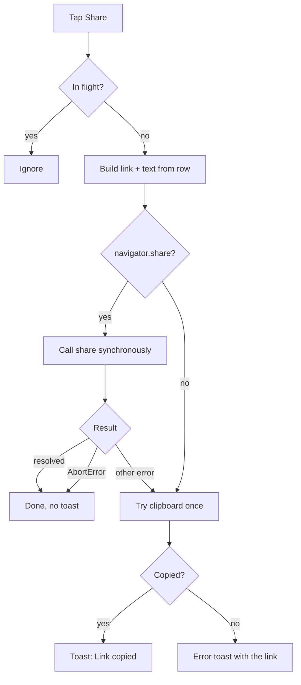
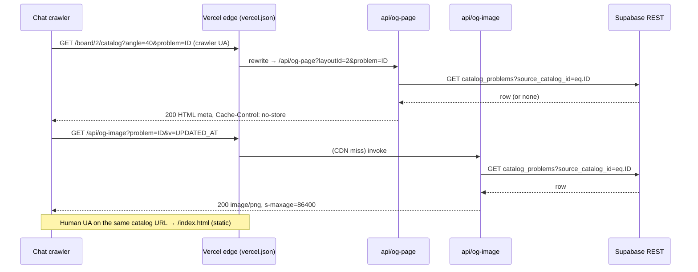

# Share a Problem with Link Previews - Plan

## Goal Capsule

- **Objective:** Add a Share button to the web PWA's problem drawer that hands a friend the canonical catalog deep link, and make that link unfurl in chat apps with a per-problem card (name, grade, board, and the board art with the holds marked).
- **Authority:** The Product Contract below is fixed; it records decisions the user made in the planning interview and they are not to be re-opened during implementation. Repo conventions in `AGENTS.md`, `web/CLAUDE.md` (shadcn-first, exact dependency pins) and `docs/` apply. Where the Planning Contract marks an item as verify-on-preview, the preview deploy's evidence wins over this document.
- **Tier:** Standard (new UI inside an existing component, new server functions, routing config). No safety-critical path is modified: `web/src/board/renderGeometry.ts` is imported read-only.
- **Execution profile:** Implement on branch `feat/web-share-problem` in a git worktree. A Vercel preview deploy from that worktree is authorized for verification. Production deploy is not; it stays with the user.
- **Stop conditions:** Stop and report if the crawler rewrite cannot be made to hit the function on the preview deploy; if the preview PNG stays over the size budget after the JPEG fallback in KTD11; or if the preview deployment is protected and no bypass is available. Anything that would change product behavior (button placement, share payload, link target, recipient path) is a scope question for the user, not an implementation choice.
- **Tail ownership:** The user pastes the preview link into iMessage and WhatsApp for the real unfurl check, checks the share sheet inside Bluefy on a phone, deploys to production, and adjusts Cloudflare if crawlers are challenged there.

---

## Product Contract

### Summary

The drawer gets an icon-only Share button in the empty right slot of its header row. Tapping it opens the native share sheet with the text "Name Grade" and the canonical link `{origin}/board/{layout}/catalog?angle={angle}&problem={id}`, built from the problem row's own fields; without a share sheet it copies the link and toasts. The friend lands on the existing deep-link path, unchanged. On www, a `vercel.json` rewrite routes known chat crawlers on that URL to a Vercel function that returns per-problem Open Graph tags and a generated 1200×630 board card; humans keep getting the app shell. Apex content URLs, a lighter single-problem fetch for recipients, and any change to the recipient experience are out of scope.

### Problem Frame

Problem deep links already exist and are the URL-as-truth backbone of the catalog, but there is no affordance to hand one to a friend: the sharer has to copy the address bar, which on the logbook and list hosts isn't even a catalog URL and on the catalog carries their personal filters. When a link is shared, every chat app shows the same generic Boardhang card because the www shell has static Open Graph tags, so the recipient can't see which climb it is without opening it. `docs/content-site.md` records the missing share button as the blocker for the SEO plan's later switch to apex content URLs.

### Requirements

**Share button**

- R1. The problem drawer shows an icon-only Share button in the right slot of the name/grade header row, present on all three hosts of the drawer (catalog, logbook, list detail), with the accessible name "Share problem", usable signed out.
- R2. Tapping calls the native share API when the browser exposes it, with title and text both "{name} {grade}" and the canonical link as the URL. The text never contains the URL.
- R3. When the share API is absent, or rejects for any reason other than the user cancelling, the link is copied to the clipboard and a "Link copied" toast confirms it.
- R4. Cancelling the share sheet produces no visible effect.
- R5. If neither the share API nor the clipboard succeeds, an error toast says the link couldn't be shared and shows the link as its description so it can still be copied by hand.
- R6. A tap while a share is in flight is ignored.

**The link**

- R7. The link is `{origin}/board/{layout_id}/catalog?angle={angle}&problem={source_catalog_id}`, built from the problem row's `layout_id`, `angle` and `source_catalog_id`, never from the route, props or the address bar. `angle` is always present. No filter params.
- R8. `origin` is `window.location.origin`, matching the session join link, so prod, preview and localhost all produce working links.
- R9. The URL is built by a single exported function whose internals are the only thing that changes for the later switch to apex content URLs.

**Recipient**

- R10. The recipient path is the existing deep-link behavior and is not changed: the drawer opens from the URL with a spinner until the slab syncs, an un-added board shows the "Add this board" banner, and the URL angle is mirrored into the recipient's stored board angle.

**Link previews**

- R11. A request to `/board/{layout}/catalog` with a non-empty `problem` query param whose user agent matches a known link-preview crawler receives an HTML document whose head carries `og:title` "{name} {grade}", `og:description` "{board name} {angle}° · by {setter} · ★{stars} · {repeats} repeats" with " · Benchmark" appended for benchmarks and the "by {setter}" segment omitted when there is no setter, `og:url` set to the canonical link on the request's host, `og:type` website, `og:image` as an absolute URL with `og:image:width`, `og:image:height` and `og:image:type`, and `twitter:card` summary_large_image.
- R12. Any other request to that path, including human browsers and unlisted crawlers, is served the app shell exactly as today.
- R13. `og:image` is a generated 1200×630 card: the board's overlay art for all of its hold sets, the problem's holds marked in their role colors with beta shown, and the name, grade, board name and angle as text. The encoded image is under 300 KB for every board in the registry.
- R14. An unknown, deleted or malformed problem, a layout id not in the registry, a Supabase failure, or any rendering failure yields the generic Boardhang tags and the static `og.png`; a crawler never receives a 5xx.
- R15. Every row string placed in HTML is escaped; every id placed in a URL is URL-encoded.
- R16. The `og:image` URL carries the row's `updated_at` as a version param, and the image function renders only when that param matches the row, redirecting any other value to the canonical URL. The image response is CDN-cacheable for a day with a week of stale-while-revalidate; the crawler HTML response is never CDN-cached.
- R17. The installed-PWA service worker never serves the app shell for `/api/` paths.

**Verification and docs**

- R18. Unit tests cover the link builder, the share action's branches, the button, the meta-HTML builder and its escaping, the crawler pattern, and the card element; a preview deploy proves the rewrite, the tags and the image.
- R19. `docs/navigation-and-ui-flows.md` and `docs/content-site.md` are updated in the same PR.

### Actors

- A1. **Sharer** — a Boardhang user with the drawer open, signed in or out, on iOS (Safari or Bluefy), Android Chrome, or desktop.
- A2. **Recipient** — a friend opening the link, with or without the board added, possibly with no Boardhang state at all.
- A3. **Preview crawler** — the fetcher a chat app runs to build a link card. iMessage fetches from the sender's device with a Facebook/Twitter-style agent; WhatsApp and Signal send "WhatsApp/2"; others are server-side bots.

### Key Flows

- F1. Share on a phone with a share sheet
  - **Trigger:** A1 taps Share in the drawer header.
  - **Steps:** The link and text are built from the row; the share API is called synchronously in the tap handler; the OS sheet opens; A1 picks an app or cancels.
  - **Outcome:** The chat app receives text plus link. Cancel does nothing. A rejection that isn't a cancel falls through to F2.
  - **Covered by:** R1, R2, R4, R6, R7
- F2. Share without a share sheet
  - **Trigger:** A1 taps Share on a browser with no share API, or F1 fell through.
  - **Steps:** The link is written to the clipboard; a toast confirms. If the clipboard is unavailable (insecure context, denied permission), an error toast shows the link.
  - **Outcome:** The link is on the clipboard or visible for manual copy.
  - **Covered by:** R3, R5
- F3. Recipient opens the link
  - **Trigger:** A2 taps the link in a chat.
  - **Steps:** The apex 307s to www when needed; the app shell loads; the catalog route resolves the layout and angle; the drawer shows a spinner until the slab syncs; the problem renders standalone with paging disabled; an un-added board shows the banner.
  - **Outcome:** The friend sees the problem and can light it. Unchanged from today.
  - **Covered by:** R10
- F4. Crawler builds a card
  - **Trigger:** A3 fetches the shared URL.
  - **Steps:** The rewrite matches the crawler agent and the `problem` param and hands the request to the page function; it reads the row from Supabase and returns the meta HTML; the crawler fetches `og:image`; the image function reads the row, composes the card from bundled art and the render geometry, and returns the PNG.
  - **Outcome:** The chat shows the problem's name, grade and board picture.
  - **Covered by:** R11, R12, R13, R14, R15, R16

### Acceptance Examples

- AE1. Link from a different host and angle
  - **Given** the drawer is open on a saved list showing a 25° MoonBoard 2016 problem while the catalog route last visited sat at 40°
  - **When** the sharer taps Share
  - **Then** the link ends in `/board/2/catalog?angle=25&problem=<id>` and carries no other params.
- AE2. Native share payload
  - **Given** `navigator.share` exists
  - **When** the sharer taps Share
  - **Then** it is called once, synchronously from the tap, with title and text "Chunky Monkey 7A" and the link as `url`, and no toast appears.
- AE3. Cancel
  - **Given** the share sheet rejects with an `AbortError`
  - **Then** the clipboard is not touched and no toast appears.
- AE4. Clipboard fallback
  - **Given** `navigator.share` is undefined
  - **When** the sharer taps Share
  - **Then** `clipboard.writeText` receives the link and a "Link copied" toast appears.
- AE5. Nothing available
  - **Given** the app runs on a LAN IP over plain HTTP where both `navigator.share` and `navigator.clipboard` are undefined
  - **When** the sharer taps Share
  - **Then** an error toast appears whose description is the link.
- AE6. Crawler fetch
  - **Given** the deployment is reachable
  - **When** `curl -A "facebookexternalhit/1.1 Facebot Twitterbot/1.0"` fetches `/board/2/catalog?angle=40&problem=<known id>`
  - **Then** the body contains `og:title` with the problem's name and grade, and the `og:image` URL returns 200 with `content-type: image/png` and a body under 300 KB.
- AE7. Human fetch
  - **When** the same URL is fetched with a desktop Chrome user agent
  - **Then** the body is the app shell (`
`).
- AE8. Degraded crawler fetch
  - **When** a crawler fetches the URL with `?problem=` empty
  - **Then** the rewrite does not match and the app shell is served; **when** it fetches with an id that does not exist **then** the page function returns 200 with the generic Boardhang tags and `og.png`.
- AE9. Service worker
  - **Given** an installed PWA
  - **When** the user opens an `/api/og-image` URL in the app
  - **Then** the PNG is served, not the app shell.
- AE10. Stale or forged version
  - **When** `/api/og-image` is fetched with a `v` that does not equal the row's `updated_at`
  - **Then** the response is a 302 to the same URL with the canonical `v`, and nothing is rendered.
- AE11. Cache ordering
  - **Given** a desktop browser has fetched the canonical URL twice for a fresh problem id and the second response was a CDN hit
  - **When** a crawler fetches the same URL
  - **Then** it still receives the per-problem meta document.

### Scope Boundaries

- Sharing hands over a link only. No board image attachment, no in-app send to a friend, no QR code.
- The recipient path is not changed: no single-problem fetch before the slab syncs, no suppression of the angle mirror-back, no special-casing of shared URLs.
- Desktop browsers that expose the share API get the share sheet, matching the session share; no clipboard-first rule for fine-pointer devices.
- iOS is on hold; nothing is done in `ios/`.

#### Deferred to Follow-Up Work

- Switch the link builder to apex content URLs (`/problems/<layout>/<slug>-<id>`) when the programmatic problem pages ship, per `docs/plans/2026-07-25-002-seo-geo-strategy-plan.md`.
- If Cloudflare challenges preview crawlers on www, add a WAF skip rule scoped to `/board/*` for the crawler agents (Super Bot Fight Mode on Pro) or turn Bot Fight Mode off. This is a dashboard change the user owns after the production deploy.
- Axis labels in the card: the background art is black labels on transparency and the app inverts it with CSS, which the image renderer does not support. The card omits the label layer; a pre-inverted PNG could restore it later.
- A bold weight in the card requires bundling a TTF; the first version uses size hierarchy with the renderer's default font.

---

## Planning Contract

### Key Technical Decisions

- KTD1. **The link is built from the row, in one module.** `web/src/catalog/problemShareUrl.ts` exports a builder that takes a `CatalogProblem` and returns the URL from `layout_id`, `angle` and `source_catalog_id`, prefixed with `window.location.origin`. The logbook host renders the drawer against the active board and the address bar strips the default angle and carries filters, so anything but the row is wrong in at least one host. Mirrors `web/src/sessions/joinUrl.ts`.
- KTD2. **The share API is called synchronously in the tap handler.** Safari revokes transient activation across an `await`, so any work before the call must be synchronous, and a clipboard write after a rejected share also fails there. The share action tries the share API first, treats `AbortError` as a silent no-op, tries the clipboard once on any other rejection or when the API is absent, and reports one of shared, copied, cancelled or failed so the component decides what to toast. An in-flight flag disables the button (a second concurrent call rejects with `InvalidStateError`). Pattern: `web/src/sessions/ShareSession.tsx`, minus its unconditional share-error to clipboard fall-through.
- KTD3. **Header-slot icon button.** A shadcn `Button` with `variant="ghost"` and `size="icon"` and the lucide `Share2` icon (the glyph the catalog's existing "Share session" button in `web/src/catalog/SessionBar.tsx` already uses, so one verb keeps one icon), `aria-label="Share problem"`, with `disabled` bound to the in-flight flag so it dims like the sibling Light up and Log ascent buttons while pending, placed as the second child of the header row's `flex items-start justify-between` wrapper in `web/src/catalog/ProblemDetail.tsx`. The action toolbar keeps its geometry; the queue/list/light/favorite cells are untouched.
- KTD4. **Crawlers are routed by a `has` rewrite ahead of the catch-all.** In `web/vercel.json` a rewrite with `source` `/board/:layoutId/catalog`, a `header` condition on `user-agent` and a `query` condition on `problem` sends matching requests to the page function; the existing `/(.*)` to `/index.html` rewrite stays last. Rewrites are first-match in order. The agent regex is anchored by Vercel, so it is written `.*(token|token).*`; inline `(?i)` is undocumented and is not used; crawler tokens have fixed casing. The `problem` value is captured with a named group `(?<problem>.+)` and forwarded explicitly in the destination query alongside `:layoutId`, because query pass-through on rewrites is not documented. An empty `problem` does not match, which satisfies AE8. The rejected alternative was routing every request with a `problem` param through a function that injects tags into the built app shell: no crawler list to maintain, but every cold-loaded share link would pay a function hop before first paint and the function would have to carry the hashed build output of `index.html` to stay in sync. Vercel's framework-agnostic Routing Middleware was also considered: it would do the same user-agent test in code and remove the `has` uncertainties, at the cost of an edge invocation on every catalog request; it is the fallback if the preview shows named-group capture unsupported. The forwarded `layoutId` must equal the row's `layout_id`, otherwise the page function serves the generic tags.
- KTD5. **Two Node functions with Web-standard handlers.** `web/api/og-page.ts` returns the meta HTML; `web/api/og-image.ts` returns the PNG. Both export `GET(request: Request): Promise<Response>`, which Vercel's Node runtime supports and which unit tests can call directly. Shared, pure logic lives under `web/api/_lib/` (underscore-prefixed paths are not deployed as functions) so tests can sit next to it without becoming endpoints. Two functions rather than one: the image needs its own URL so it can be CDN-cached and versioned independently of the HTML (KTD10), and a crawler fetches the two at different times.
- KTD6. **No JSX in `api/`.** Vercel's Node builder finds its tsconfig by walking up from the project root, so it lands on `web/tsconfig.json` (a solution file with no `jsx` setting) and forces NodeNext module settings. Rather than depend on that lookup, the card's element tree is built with `createElement` from `react` in plain `.ts` files; `@vercel/og`'s `ImageResponse` accepts the resulting elements.
- KTD7. **`api/` imports `src/` leaf modules with `.js`-suffixed specifiers.** The builder traces files with `@vercel/nft` and transpiles each TypeScript file in place without bundling, so under the package's `"type": "module"` Node resolves imports at runtime and requires extensions. The functions import `../src/board/boards.js`, `../src/board/renderGeometry.js` and `../src/types.js`; both `./renderGeometry` import statements in `boards.ts` (the type-only import and the value import) gain a `.js` suffix, since nodenext enforces the extension on type-only imports too. These three are the only `src/` modules `api/` may import: everything else under `src/` reaches the Supabase client, `import.meta.env` or DOM globals, and even a type-only import would pull it into the API type-check program and fail the build. Vite and Vitest resolve a `.js` specifier to the `.ts` source, and TypeScript does the same under every resolution mode, so the app build is unaffected. A new `web/tsconfig.api.json` (include `api`, `module` and `moduleResolution` nodenext, `types` node, no DOM lib, same strictness as the app config) is added to the root `tsconfig.json` references so `npm run build`'s `tsc -b` type-checks the functions and rejects an extensionless import. `renderGeometry.ts` itself is not modified.
- KTD8. **Board art is bundled into the image function, not fetched.** `vercel.json` `functions["api/og-image.ts"].includeFiles` is `public/boards/**`; the function reads overlay PNGs from a directory resolved relative to the module (`new URL('../../public/boards/', import.meta.url)`), which does not depend on where the function's working directory lands under the `web` Root Directory; the KB's `process.cwd()` form is the alternative if the preview shows the module-relative path missing. Files are embedded as data URIs. Self-fetching would break on protected preview deployments. All of the board's hold sets are drawn because the sharer's installed sets are device-local. The label background layer is omitted (see Deferred).
- KTD9. **One REST read, no client library.** The functions fetch `${VITE_SUPABASE_URL}/rest/v1/catalog_problems?select=...&source_catalog_id=eq.<id>&limit=1` with the anon key headers and a short timeout. The table is world-readable and `source_catalog_id` is the primary key, so one row is enough; `supabase-js` and its session machinery are unnecessary weight. The row's own `layout_id` and `angle` feed `og:url`; a row whose `layout_id` is not in the registry, or with `deleted` set, is treated as unknown. Both env vars already exist in the Vercel project.
- KTD10. **Cache the image, never the HTML.** Vercel's CDN cache key is the request URL and host, not the matched route, so a cached crawler HTML at the catalog URL could be served to a human. The page function sets `Cache-Control: no-store`. The image lives at its own `/api/og-image?problem=<id>&v=<updated_at>` URL and sets `Cache-Control: public, max-age=0, s-maxage=86400, stale-while-revalidate=604800`, overriding the library's one-year immutable default; the version param makes a catalog re-import produce a new URL. The image function renders only when `v` equals the row's `updated_at` and otherwise 302s to the canonical URL, so an arbitrary `v` cannot force an uncached render on every request. The reverse direction, a CDN-cached static shell at the catalog URL being served to a later crawler, is not covered by `no-store` and is proven or disproven by the cache-ordering gate (AE11); if it bleeds, a `headers` rule adding `Vary: User-Agent` on `/board/:layoutId/catalog` is the first fix to try, and Routing Middleware the second.
- KTD10b. **Absolute URLs come from an allowlisted host.** Both functions build `origin` from the request's host header only when it equals the production domain or one of the deployment's own hosts (`VERCEL_URL`, `VERCEL_BRANCH_URL`, `VERCEL_PROJECT_PRODUCTION_URL`); any other value falls back to `https://www.boardhang.app`. The image function's failure redirect uses a relative `Location: /og.png`, so no header value can turn it into an open redirect.
- KTD11. **1200×630 PNG with a size budget and a JPEG escape hatch.** `@vercel/og` 1.0.2 (satori plus resvg-wasm, Node runtime supported, Node ≥ 22) renders the card as PNG. WhatsApp drops images over roughly 300 KB, so the preview deploy measures the PNG for one problem on each of the six boards (the Masters 2019 and 2024 layouts carry the most overlay art and the Minis render widest); if the largest exceeds the budget, the function keeps `ImageResponse` as the only rasterizer, reads its PNG bytes and transcodes them with `sharp` to JPEG at quality ~80, and `og:image:type` becomes `image/jpeg`. Calling satori directly is not the fallback: it renders no text without a bundled font. If the JPEG path ships, `sharp` moves from devDependencies to dependencies at its exact pin (`0.35.3`) so the runtime import is declared rather than inherited from a dev install. Which path ships is decided by that measurement, not in this plan.
- KTD12. **Generic fallback is a 200.** Any failure in the page function returns the generic tags with `og.png`; any failure in the image function redirects to the static `/og.png`. A crawler that sees a 5xx shows nothing, which is worse than the generic card. Every fallback logs one `console.error` with the problem id and the error message first, so a systemic breakage (untraced WASM, wrong art path, rejected key) is visible in `vercel logs` instead of hiding behind identical generic cards.
- KTD13. **Service worker denylist.** `navigateFallbackDenylist` in `web/vite.config.ts` gains `/^\/api\//` so an installed PWA never answers an `/api/` navigation with the app shell.

### High-Level Technical Design

Share tap decision path (client):

Crawler path (server):

### Assumptions

- Query pass-through on rewrites is undocumented; the explicit capture in KTD4 removes the dependency, and the preview deploy confirms it.
- The builder's tsconfig lookup lands on `web/tsconfig.json`; KTD6 and KTD7 are designed so the functions work whether or not that file's options are applied.
- The `boardly` project's preview deployments may have Deployment Protection enabled. If the crawler curl returns 401, the checks use the project's protection-bypass header; if no bypass secret is available, that is a stop condition.
- The Preview environment exposes `VITE_SUPABASE_URL` and `VITE_SUPABASE_ANON_KEY`; if they are Production-only, every preview crawler curl returns the generic card and looks like a rewrite bug. Confirm with `npx vercel@latest env ls` before the crawler curls and take the known problem ids from whichever Supabase project the preview resolves.
- `includeFiles` places `public/boards/**` at the same relative position to the compiled `api/_lib` module as in the source tree under the `web` Root Directory; the U5 integration test and the preview image gate prove the path.
- Cloudflare fronts www but not `*.vercel.app` preview hosts, so the preview deploy proves the Vercel side only. The Cloudflare side is verified after the production deploy.
- Vitest's default include glob picks up `web/api/_lib/*.test.ts`; those files run under the jsdom environment, where Node's `Request` and `Response` globals remain available. A file may opt into `// @vitest-environment node` if jsdom gets in the way.

### Sequencing

U1 and U3 have no dependencies and can proceed in parallel. U2 depends on U1. U4 and U5 depend on U3. U6 depends on U4 and U5. U7 depends on everything. The preview-deploy gate in the Verification Contract runs after U6.

---

## Implementation Units

### U1. Canonical link builder and share action

- **Goal:** One module that builds the link and text from a problem row and runs the share-or-copy sequence, returning an outcome the UI can toast on.
- **Requirements:** R2, R3, R4, R5, R6, R7, R8, R9
- **Dependencies:** none
- **Files:** `web/src/catalog/problemShareUrl.ts` (new), `web/src/catalog/problemShareUrl.test.ts` (new)
- **Approach:** Export `problemShareUrl(problem)` (KTD1), `problemShareText(problem)` ("{name} {grade}"), and `shareProblem(problem)` implementing KTD2. `shareProblem` reads `navigator.share` and `navigator.clipboard` at call time so tests can stub them; the share call happens before the first `await`. Outcome union: `'shared' | 'cancelled' | 'copied' | 'failed'`. Keep the module free of React so the header button stays thin.
- **Patterns to follow:** `web/src/sessions/joinUrl.ts` (origin handling, single builder), `web/src/sessions/ShareSession.tsx` (share then clipboard).
- **Test scenarios:**
  - Covers AE1. A row with `layout_id` 2, `angle` 25 and id `abc` yields `<origin>/board/2/catalog?angle=25&problem=abc` with no other params; an id containing characters that need encoding is URL-encoded.
  - Text is "{name} {grade}" and does not contain the URL.
  - Covers AE2. With `navigator.share` stubbed to resolve, it is called once with `{ title, text, url }` before any microtask runs, and the outcome is `shared`.
  - Covers AE3. Share rejects with an `AbortError` → clipboard untouched, outcome `cancelled`.
  - Share rejects with a `NotAllowedError` → clipboard called once with the URL, outcome `copied`.
  - Covers AE4. `navigator.share` undefined → clipboard called with the URL, outcome `copied`.
  - Covers AE5. Both undefined → outcome `failed`; clipboard rejecting → outcome `failed`.
- **Verification:** The test file passes; the module has no React or router imports.

### U2. Share button in the drawer header

- **Goal:** The icon button in the header row on every host, wired to U1 with toasts and an in-flight guard.
- **Requirements:** R1, R3, R5, R6
- **Dependencies:** U1
- **Files:** `web/src/catalog/ProblemDetail.tsx`, `web/src/catalog/ProblemDetailShare.test.tsx` (new)
- **Approach:** Render the button as the second child of the header's `justify-between` wrapper (KTD3). On click, if a share is in flight return; otherwise call `shareProblem(current)` synchronously and toast on `copied` ("Link copied") and `failed` (error toast, link as description); `shared` and `cancelled` are silent. The in-flight flag also drives the button's `disabled` prop. Nothing else in the component changes; the toolbar cells and their order are untouched.
- **Patterns to follow:** The existing separate host-level test files such as `web/src/catalog/ProblemDetailAddToList.test.tsx`; toast usage in `web/src/lists/AddToListSheet.tsx`; the `sonner` mock in `web/src/catalog/useSwipeToQueue.test.ts`, whose `toast` is itself callable and carries `.error` (the mock at the top of `ProblemDetail.test.tsx` only stubs `toast.error` and would throw on the copied path).
- **Test scenarios:**
  - The button is found by role `button` with name "Share problem" in the header row, and the toolbar still exposes Previous, Next, Save to list, Favorite and Light up.
  - Covers AE2. With `navigator.share` stubbed, clicking calls it with the row-derived link and no toast is shown.
  - Covers AE4. With `navigator.share` absent, clicking copies and `toast` is called with "Link copied".
  - Covers AE5. With neither available, `toast.error` is called and the description contains the link.
  - Two rapid clicks while the first share is pending call the share API once, and the button is disabled while pending.
  - Paging to the next problem and clicking shares that problem's id, not the previous one.
- **Verification:** Tests pass; `npm run lint` clean; in the browser the button sits at the top-right of the drawer on the catalog, the logbook and a list without shifting the toolbar.

### U3. Server foundation: API type-check, row read, crawler pattern, registry import

- **Goal:** The scaffolding every function needs: a tsconfig that covers `api/`, the `.js`-suffixed import path into `src/`, a single-row Supabase reader, and the crawler pattern shared by config and tests.
- **Requirements:** R11, R14, R15, R18
- **Dependencies:** none
- **Files:** `web/tsconfig.api.json` (new), `web/tsconfig.json`, `web/src/board/boards.ts` (`.js` suffix on both `./renderGeometry` imports only), `web/api/_lib/catalogRow.ts` (new), `web/api/_lib/catalogRow.test.ts` (new), `web/api/_lib/crawlers.ts` (new), `web/api/_lib/crawlers.test.ts` (new), `web/api/_lib/html.ts` (new, escaping), `web/package.json`, `web/package-lock.json`
- **Approach:** KTD7 for the tsconfig and import shape; `tsc -b` must fail on an extensionless import from `api/`. `catalogRow.ts` declares its own `ProblemRow` type, mirroring the non-exported `CatalogRow` in `web/src/catalog/catalogSync.ts` (`source_catalog_id`, `layout_id`, `angle`, `name`, `grade`, `setter`, `stars`, `repeats`, `is_benchmark`, `method`, `holds` as `{ c, r, t }[]`, `updated_at`, `deleted`), with `HoldType` imported type-only from `src/types.js`; the REST `select=` list is exactly those columns. It does not import `catalogSync.ts` (not a leaf module) and does not reuse `HoldAssignment` from `types.ts` (its `col/row/type` fields are the BLE shape, not the catalog row shape). It exports `fetchProblemRow(id, { fetch, env })` returning a `ProblemRow` or null, treating a non-registry `layout_id`, `deleted: true`, a non-2xx, a timeout, or malformed JSON as null (KTD9). `crawlers.ts` exports the anchored agent pattern string used in `vercel.json` and an `isPreviewCrawler(userAgent)` helper for tests; the initial token list is facebookexternalhit, Facebot, Twitterbot, WhatsApp/, TelegramBot, Discordbot, Slackbot-LinkExpanding, LinkedInBot, Bluesky Cardyb, Mastodon/, SkypeUriPreview, GoogleMessages, Google-PageRenderer. `html.ts` exports an attribute/text escaper. Add `@vercel/og` at exactly `1.0.2` to dependencies.
- **Patterns to follow:** REST query shape in `web/src/catalog/catalogSync.ts` (`fetchCatalogDeltas`); env names in `web/.env.example`; exact-pin rule in `web/CLAUDE.md`.
- **Test scenarios:**
  - A stubbed fetch returning one row resolves to that row; an empty array resolves to null.
  - A row with `deleted: true`, or a `layout_id` absent from `BOARDS`, resolves to null.
  - A 500, a thrown fetch, and a body that is not JSON each resolve to null without throwing.
  - The request URL contains `source_catalog_id=eq.` with the id URL-encoded and `limit=1`; the anon key is sent as `apikey`.
  - A stubbed row whose `holds` is `[{ c: 3, r: 5, t: 'start' }]` round-trips unchanged.
  - The crawler pattern matches the full iMessage agent string, "WhatsApp/2", and each listed bot's documented agent, and does not match desktop Chrome, Safari, Googlebot, or the in-app browsers of Facebook/Messenger (`FBAN`/`FBAV`), Instagram, LinkedIn (`LinkedInApp`), Telegram for Android, or the WhatsApp Android WebView. A token is admissible in the list only if no in-app browser sends it; a matching human would otherwise loop on the meta page.
  - The pattern string exported by `crawlers.ts` is byte-identical to the `has` header value in `web/vercel.json` (read the file in the test).
  - Escaping turns `<`, `>`, `&`, `"` and `'` into entities.
- **Verification:** `npm run build` type-checks `api/` (prove it by temporarily leaving an extensionless import and watching it fail); `npm run test` runs the `_lib` tests; the app's own tests and build are unaffected by the `boards.ts` suffix change.

### U4. Page function: per-problem Open Graph HTML

- **Goal:** `GET /api/og-page?layoutId=&problem=` returns the meta document for a crawler, or the generic tags.
- **Requirements:** R11, R14, R15, R16
- **Dependencies:** U3
- **Files:** `web/api/og-page.ts` (new), `web/api/_lib/problemMeta.ts` (new), `web/api/_lib/problemMeta.test.ts` (new)
- **Approach:** `problemMeta.ts` exports a pure `renderProblemMeta({ row, board, origin })` and `renderGenericMeta({ origin })` producing a minimal HTML document (title, the OG and Twitter tags from R11, a one-line body linking to the canonical URL). Description segments follow R11's rules. `og:image` is `${origin}/api/og-image?problem=<id>&v=<encoded updated_at>` with width 1200, height 630 and type image/png. The handler derives `origin` per KTD10b, reads the row via U3, requires the forwarded `layoutId` to equal the row's `layout_id`, resolves the board from `boards.js`, and always returns 200 with `Cache-Control: no-store` and `Content-Type: text/html; charset=utf-8` (KTD10, KTD12), logging once on every fallback.
- **Patterns to follow:** The static tag set in `web/index.html`; the description grammar in `web/src/catalog/ProblemMeta.tsx`.
- **Test scenarios:**
  - A benchmark row with a setter produces `og:title` "{name} {grade}", a description with the board name, angle, setter, stars, repeats and "Benchmark", an `og:url` equal to the canonical link on the given origin, and an `og:image` carrying the id and version.
  - A row with an empty setter omits the "by" segment; a non-benchmark omits "Benchmark".
  - A name containing `<script>` and a quote is escaped in both the title and the meta attribute.
  - The handler returns the generic document with `og.png` when the row is null, when `problem` is missing, when `layoutId` does not match the row, and when the reader throws; status is 200 and `Cache-Control` is `no-store` in every case, and `console.error` is called once on each fallback.
  - A request whose host header is `evil.example` yields `og:url` and `og:image` on `https://www.boardhang.app`; a host equal to `VERCEL_URL` is used as-is.
  - Integration: calling `GET` with a `Request` for `https://preview.example/api/og-page?layoutId=2&problem=<id>` and a stubbed global `fetch` returning one row yields a 200 whose `og:url` and `og:image` both start with `https://preview.example`, whose Supabase request carried the `apikey` header, and whose body parses as HTML with exactly one `og:title`.
- **Verification:** Tests pass; calling `GET` locally with a stubbed reader yields valid HTML.

### U5. Image function: the board card

- **Goal:** `GET /api/og-image?problem=&v=` returns the 1200×630 card, or redirects to the static `og.png`.
- **Requirements:** R13, R14, R16
- **Dependencies:** U3
- **Files:** `web/api/og-image.ts` (new), `web/api/_lib/boardCard.ts` (new), `web/api/_lib/boardCard.test.ts` (new), `web/api/_lib/boardArt.ts` (new), `web/vercel.json` (functions `includeFiles` for `api/og-image.ts`)
- **Approach:** `boardArt.ts` loads a board's overlay PNGs from `public/boards/<folder>/`, resolved relative to the module per KTD8, and returns data URIs. `boardCard.ts` exports a pure `boardCardElement({ row, board, art })` built with `createElement` (KTD6): a dark card (theme `#0E1116`) with the board on one side, sized to the layout's aspect from `renderGeometry`, overlays stacked absolutely, and one absolutely positioned circle per hold at `center(g, c, r)` with diameter 0.9 of a column span, a translucent role-colored fill and a 2px role-colored border, using `displayed(t, true)` and `holdColor` from `src/types.js`; the other side carries name, grade, board name plus angle, and a small "boardhang.app" footer. Satori constraints apply: every multi-child node is `display: flex`, no `z-index`, no CSS filters. The handler reads the row, compares the request's `v` to the row's `updated_at` and 302s to the canonical URL on any mismatch (R16), builds art and element, and returns `new ImageResponse(element, { width: 1200, height: 630, headers })` with the KTD10 cache header; any failure logs once and returns a 302 with a relative `Location: /og.png` (KTD12, KTD10b). Compute the board box and every marker in absolute pixels from the fixed 1200×630 canvas (the box height, the layout aspect from `renderGeometry`, and `center()`'s 0–1 fractions scaled to that box) rather than leaning on `aspect-ratio` or percentage `translate`, whose support in the renderer is unverified. KTD11's size budget is measured on the preview across all six boards.
- **Execution note:** Render one card locally first (a throwaway script or test that writes the PNG to the scratch directory) and check the marker positions against the app's board for the same problem before wiring the handler; geometry mistakes are cheap to see and expensive to discover in a chat preview.
- **Patterns to follow:** Marker constants and stacking order in `web/src/board/CatalogBoard.tsx`; `center` in `web/src/board/renderGeometry.ts`; the `@vercel/og` README's `ImageResponse` options.
- **Test scenarios:**
  - For a Mini 2025 row with a start, two hand and one end hold, the element tree contains one overlay image per hold set of layout 7 and exactly four circles whose pixel `left`/`top` equal the board box origin plus `center(MINI_GEOMETRY, c, r)` scaled by the box size (minus half the marker), and whose colors match `holdColor` for start, right/left and end.
  - The board box's aspect ratio equals the layout geometry's width/height for both a Mini and a standard board.
  - The text nodes include the name, the grade and "{board name} {angle}°".
  - Every element with more than one child declares `display: flex` (walk the tree).
  - `boardArt` returns one data URI per hold set and rejects for an unknown folder.
  - The handler returns a 302 to `/og.png` when the row is null or rendering throws, with a relative `Location` and one `console.error`.
  - Covers AE10. A request whose `v` differs from the row's `updated_at` returns a 302 to the same path with the canonical `v` and never calls the renderer.
  - Integration (node environment): calling `GET` with a stubbed `fetch` returning a Mini 2025 row and the real PNGs under `public/boards` returns 200 `image/png` with the KTD10 cache header, and the body decodes to a 1200×630 image; record its byte size in the test output as the first reading for the KTD11 budget; repeat for one Masters 2019 row (the heaviest overlay set).
- **Verification:** Tests pass; a locally rendered PNG for a known problem visually matches the app's render of the same problem; on the preview deploy the image is under 300 KB for one problem on each of the six boards (else apply the KTD11 fallback and re-measure all six).

### U6. Routing: crawler rewrite and service-worker denylist

- **Goal:** Crawlers reach U4 on the canonical URL; humans, unlisted agents and installed PWAs are unaffected.
- **Requirements:** R11, R12, R17
- **Dependencies:** U4, U5
- **Files:** `web/vercel.json`, `web/vite.config.ts`
- **Approach:** Insert the KTD4 rewrite before the catch-all: `source` `/board/:layoutId/catalog`, `has` a `header` condition on `user-agent` whose `value` is the U3 pattern string and a `query` condition on `problem` with value `(?<problem>.+)`, `destination` `/api/og-page?layoutId=:layoutId&problem=:problem`. Keep the `X-Robots-Tag` header rule. Add `/^\/api\//` to `navigateFallbackDenylist` (KTD13). `has` conditions do not run under `vercel dev`, so this unit is proven only by the preview deploy.
- **Test expectation:** none for the rewrite itself beyond the parity test in U3; the denylist is a config line. The Verification Contract's preview gate is this unit's proof.
- **Verification:** On the preview deploy, AE6, AE7, AE8 and AE11 hold; the response for a crawler carries no `x-vercel-cache: HIT` on the HTML; the image response shows a CDN hit on the second fetch. For AE9, the built `dist/sw.js` contains the `/api/` denylist entry, and the preview installed as a PWA in desktop Chrome renders the PNG when an `/api/og-image` URL is opened inside the app.

### U7. Documentation

- **Goal:** The subsystem docs describe the new behavior, and the SEO blocker note is updated.
- **Requirements:** R19
- **Dependencies:** U1 through U6
- **Files:** `docs/navigation-and-ui-flows.md`, `docs/content-site.md`
- **Approach:** In the problem-drawer bullet of the web routing section, state the Share button, the row-derived canonical link and the share-then-copy rule. In `content-site.md`, replace the "Blocked: the PWA's share button cannot emit apex content URLs yet" note: reason (1) is resolved by `web/src/catalog/problemShareUrl.ts`, reason (2) remains; add a short subsection on link previews (the crawler rewrite, the two functions, the no-cache rule, the Cloudflare caveat, the crawler token list location). Keep each topic in one place per the doc discipline in `CLAUDE.md`.
- **Test expectation:** none -- documentation only.
- **Verification:** The two docs read as current state, not history; no other doc restates the same subsystem.

---

## Verification Contract

| Gate | Command or step | Applies to | Passes when |
| --- | --- | --- | --- |
| Unit tests | `cd web && npm run test` | U1–U5 | All green, including the new `api/_lib` tests. In a fresh worktree copy `web/.env` from the main checkout first; a known session-filter test needs it. |
| Lint | `cd web && npm run lint` | all | oxlint clean, `api/` included. |
| Typecheck and build | `cd web && npm run build` | all | `tsc -b` covers `api/` via `tsconfig.api.json`; Vite build succeeds. |
| Preview env | `npx vercel@latest env ls` from the linked root | U4–U5 | `VITE_SUPABASE_URL` and `VITE_SUPABASE_ANON_KEY` are present for the Preview environment; note which Supabase project they point at and pick the six known problem ids from it. |
| Preview deploy | From the worktree root: `npx vercel@latest link --yes --project boardly`, then `npx vercel@latest deploy --yes` (no `--prod`) | U4–U6 | A READY preview URL. Use the latest CLI; the old one fails with a misleading "Not authorized". |
| Crawler curls | `curl -si -A "facebookexternalhit/1.1 Facebot Twitterbot/1.0" "<preview>/board/2/catalog?angle=40&problem=<id>"`, repeated for `WhatsApp/2`, `TelegramBot (like TwitterBot)`, `Discordbot/2.0`, `Slackbot-LinkExpanding 1.0`, `Bluesky Cardyb/1.1` | U6 | AE6 for each agent; `cache-control: no-store` on the HTML. If 401, retry with the `x-vercel-protection-bypass` header. |
| Image | For one known problem on each board (layout ids 7, 6, 5, 3, 4, 2), fetch the `og:image` URL from the HTML with `curl -sI` and `curl -o`; also fetch one with a wrong `v` | U5 | 200, `content-type: image/png` (or `image/jpeg` after the KTD11 fallback), every body under 300 KB, second fetch shows `x-vercel-cache: HIT`; the wrong-`v` fetch is a 302 to the canonical `v`; open the files and compare marker positions with the app. |
| Human curls | Same URL with a desktop Chrome agent; the URL with `?problem=` empty with a crawler agent | U6 | AE7 and AE8: app shell in both cases. |
| Cache ordering | On a fresh problem id: fetch the canonical URL twice with a desktop Chrome agent, then once with the crawler agent | U6 | AE11: the second human fetch shows `x-vercel-cache: HIT` and the crawler fetch still returns the per-problem `og:title`. If it returns the shell, apply the KTD10 `Vary` fallback and re-run. |
| Service worker | Inspect `web/dist/sw.js` after the build; install the preview as a PWA in desktop Chrome | U6 | AE9: the denylist contains `/api/`; the installed app renders the PNG for an `/api/og-image` URL. |
| Browser pass | `/ce-test-browser` on the preview or `npm run dev` | U2 | Button visible on catalog, logbook and list drawers; share sheet on a phone; copy toast on desktop Firefox; AE1 link when sharing from a list at a non-default angle. |
| User checks | After merge and the user's production deploy | tail | Card unfurls in iMessage and WhatsApp against www; Bluefy shows the share sheet or the copy toast; a `WhatsApp/2` curl against www is not challenged by Cloudflare (else the deferred WAF rule). Optional before merge, when the preview is unprotected: the Facebook Sharing Debugger or LinkedIn Post Inspector against the preview URL as an early unfurl signal. |

---

## Definition of Done

**Global**

- All gates above pass on the preview deploy, and the preview URL plus curl outputs are pasted into the PR description as the test plan.
- No safety-critical path is modified; the `boards.ts` change is the `.js` suffix on its two geometry imports only.
- No dead-end code from the KTD11 measurement remains (one rasterization path ships, not both).
- `docs/` updated per U7; PR opened with `feat(web): share a problem with link previews` and a body that lists the user's tail steps (chat unfurl check, production deploy, Cloudflare check).

**Per unit**

| Unit | Done when |
| --- | --- |
| U1 | Builder and share action tested for every branch in F1/F2; no React imports. |
| U2 | Button present on all three hosts, toasts wired, in-flight guard tested. |
| U3 | `tsc -b` covers `api/`; row reader and crawler parity tests pass; `@vercel/og` pinned exactly. |
| U4 | Meta document correct, escaped, generic on every failure, `no-store`. |
| U5 | Card matches the app's render for a known problem; version check and relative redirect tested; size budget met on the preview for all six boards. |
| U6 | Crawler, human and cache-ordering curls behave per AE6–AE8 and AE11 on the preview; AE9 proven on the built service worker and an installed PWA. |
| U7 | Both docs updated; the content-site blocker note reflects the new state. |

---

## System-Wide Impact

- **Build and typecheck.** `npm run build` now type-checks `web/api/` through the new project reference; a second TypeScript project means `src/board/boards.ts`, `renderGeometry.ts` and `types.ts` are checked under nodenext rules as well as bundler rules. Only the `.js` suffix in `boards.ts` changes for that; a future extensionless import in those three files fails the build, which is the intended guard.
- **Tests and lint.** Vitest's default glob picks up `web/api/_lib/*.test.ts`; oxlint already covers the directory. The image integration test runs satori and resvg-wasm in-process and adds a few seconds to the suite.
- **Function bundle.** `includeFiles` puts about 2 MB of board art into the image function; the page function stays tiny. Both run on the project's default Node 24 with Fluid compute; no new environment variables, the existing `VITE_SUPABASE_*` values are read at runtime.
- **Deploy runbook.** Preview deploys from a worktree need `npx vercel@latest link --yes --project boardly` in that worktree root first (the link file is gitignored). Production stays `npx vercel@latest deploy --prod --yes` from a clean main checkout, unchanged.
- **Routing and caching.** The catalog URL now has two server-side behaviors keyed on the user agent. The `no-store` rule on the HTML function is what keeps them from bleeding into each other through the CDN; anyone later adding caching to that function must add `Vary: User-Agent` or move crawlers to a distinct URL.
- **Installed PWA.** The service worker denylist entry is the only client-side change for previews; without it an installed app would answer `/api/` navigations with the shell.
- **Content site.** Apex `/board/*` already 307s to www, so crawlers following an apex link reach the rewrite; `site/` is untouched.

---

## Risks & Dependencies

- **Rewrite semantics.** Regex anchoring on `has` rewrites is inferred from Next.js behavior, not Vercel docs; named-group capture is implemented in Vercel's routing utilities, so it is firmer. Mitigation: explicit capture (KTD4) and the preview gate; if capture is unsupported, fall back to a presence-only `query` condition and read `problem` from the forwarded query, and if the cache-ordering gate shows the static shell bleeding into crawler fetches, apply the KTD10 `Vary` fallback or move the test into Routing Middleware.
- **Unauthenticated compute.** Both functions are public. The version check (R16) keeps the expensive image render behind the CDN; the page function does one small REST read per crawler fetch by design. No rate limit is planned; if `vercel logs` shows abuse after launch, a Vercel Firewall rate-limit rule on `/api/og-*` is the operational answer.
- **Builder module resolution.** If the deployed function fails to import `src/` modules despite the `.js` suffixes, the fallback is a small `api/_lib/boardRegistry.ts` mirror of the six boards with a parity test against `BOARDS`; `renderGeometry` and `types` have no internal imports and remain importable either way.
- **Image size.** PNG of photographic overlay art may exceed 300 KB; KTD11 names the JPEG path. Measure before shipping.
- **Preview protection.** A protected preview returns 401 to crawlers; the bypass header is the workaround, and preview links must not be handed to friends.
- **Cloudflare.** Bot Fight Mode on the Free plan cannot be bypassed by rule and is reported to block WhatsApp and Telegram previews; iMessage, Signal and WhatsApp fetch from end-user IPs and can never be "verified bots". This is only observable on www after production deploy and is the user's dashboard decision.
- **Cold start.** First uncached image render loads satori plus resvg WASM and decodes several PNGs; some crawlers time out at a few seconds. Mitigation: CDN caching and the version param; if it proves slow, pre-scaling the overlay PNGs is the follow-up.
- **Dependency:** `@vercel/og` 1.0.2 requires Node ≥ 22; the project runs Vercel's default Node 24.

---

## Sources & Research

- Existing share pattern and origin rule: `web/src/sessions/ShareSession.tsx`, `web/src/sessions/joinUrl.ts`.
- Drawer, hosts and deep-link behavior: `web/src/catalog/ProblemDetail.tsx`, `web/src/catalog/CatalogScreen.tsx` (problem resolution and angle mirror-back), `web/src/logbook/LogbookScreen.tsx`, `web/src/lists/ListDetailScreen.tsx`, `web/src/catalog/useProblemDrawer.ts`, `docs/navigation-and-ui-flows.md` (Web PWA routing).
- Marker drawing to mirror: `web/src/board/CatalogBoard.tsx` (0.9 column ratio, `59` alpha fill, 2px border, stacking order), `web/src/board/renderGeometry.ts` (`center`, `MINI_GEOMETRY`, `STANDARD_GEOMETRY`), `web/src/types.ts` (`holdColor`, `displayed`), `web/src/board/boards.ts` (folders, hold-set image names).
- Static tags today: `web/index.html`; hosting config: `web/vercel.json`, `web/vite.config.ts`, `web/CLAUDE.md` (deploy runbook), `web/.env.example`.
- SEO context and the blocker note: `docs/content-site.md`, `docs/plans/2026-07-25-002-seo-geo-strategy-plan.md`.
- Vercel Functions in a Vite project and handler signatures: https://vercel.com/docs/functions/runtimes/node-js and https://vercel.com/docs/functions/functions-api-reference; the builder traces with nft and transpiles per file without bundling: https://github.com/vercel/vercel/blob/main/packages/node/src/build.ts and `typescript.ts` alongside it.
- Rewrites with `has`: https://vercel.com/docs/project-configuration/vercel-json#rewrites and https://vercel.com/docs/routing/rewrites; anchoring inferred from https://nextjs.org/docs/pages/api-reference/config/next-config-js/rewrites#header-cookie-and-query-matching.
- `includeFiles` and `process.cwd()`: https://vercel.com/kb/guide/how-can-i-use-files-in-serverless-functions.
- OG generation on Node: https://vercel.com/docs/og-image-generation and https://vercel.com/docs/og-image-generation/og-image-api; CSS subset: https://github.com/vercel/satori.
- CDN cache key and headers: https://vercel.com/docs/caching/cdn-cache/purge#cache-keys, https://vercel.com/docs/caching/cache-control-headers.
- Crawler agents: WhatsApp https://developers.facebook.com/documentation/business-messaging/whatsapp/link-previews, Facebook https://developers.facebook.com/docs/sharing/webmasters/web-crawlers/, Slack https://api.slack.com/robots, Signal's `WhatsApp/2` in Signal-Android `LinkPreviewRepository`, Mastodon `fetch_link_card_service.rb`; iMessage, Telegram, Discord, Bluesky, Teams and Google Chat agents come from community sources only.
- Cloudflare bot modes: https://developers.cloudflare.com/bots/get-started/bot-fight-mode/, https://developers.cloudflare.com/bots/get-started/super-bot-fight-mode/, https://developers.cloudflare.com/waf/custom-rules/skip/options/.
