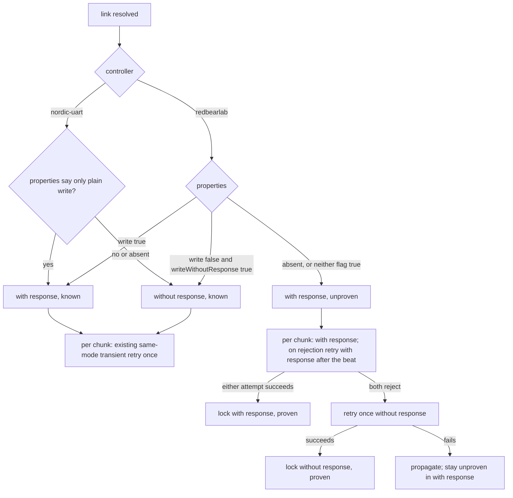

# First-Generation MoonBoard LED Box Support - Plan

## Goal Capsule

- **Objective:** Make the web PWA light problems on the first-generation official MoonBoard LED box (RedBearLab BLE Shield, service `713d0000-…`) as well as today's Nordic UART controllers, with no change to the wire format, LED numbering, or 20-byte chunking.
- **Authority:** The Product Contract below is fixed. `AGENTS.md` tier rules apply: `web/src/ble/**` and `shared/spec/ble-protocol.md` are safety-critical, so work is test-first, review before merge is mandatory, and a `docs/solutions/` entry follows the merge. `docs/ble-hardware.md` invariants 1 to 5 must survive unchanged.
- **Tier:** Safety-critical. Effort max.
- **Execution profile:** Implement on branch `feat/web-redbearlab-led-box` in a git worktree (copy `web/.env` from main first or the session filter tests fail). Unit tests prove the client; the user owns the hardware check on a real first-generation box before merge.
- **Stop conditions:** Stop and report if the box does not appear in the chooser on Chrome while powered and advertising, if the box accepts writes but the LEDs stay dark or the lit holds do not match the problem, if the box rejects both write modes, if the probe cannot be made to fit inside the existing connect timeout and race guards, or if anything would require changing the shared BLE state shape consumed by the UI. Product-shape questions (surfacing the controller in the UI, per-board memory of the controller) belong to the user.
- **Tail ownership:** The user captures the box's advertisement and GATT table with nRF Connect first (U0), runs the manual light-up check on the first-generation box last (U4, desktop Chrome or Android Chrome, plus Bluefy if available), and reports the observed write property so the docs can drop the "unverified" wording.

---

## Product Contract

### Summary

The chooser surfaces boards advertising either the Nordic UART service or the RedBearLab service, and boards whose name starts with `MoonBoard`. After connecting, the client resolves the write characteristic by trying Nordic UART first and RedBearLab second. On the original box, chunks are acknowledged (write-with-response) unless its characteristic reports that only unacknowledged writes are allowed; when the browser reports no properties at all, the client starts acknowledged and only falls back to an unacknowledged retry after two acknowledged rejections of the same chunk. A capture of the real box's advertisement and characteristic properties comes first, and a light-up on the box comes last. Everything above the transport is untouched: same `l#…#` frame, same serpentine LED index, same 20-byte chunks, same reconnect behavior. The protocol spec and the hardware doc gain the second controller generation in the same change.

### Problem Frame

The web client only knows the Nordic UART service. It filters the chooser on that service UUID, resolves only that service after connect, and writes only with write-without-response. The first-generation official MoonBoard LED kit shipped on a RedBearLab BLE module that exposes a different service family (service `713d0000-503e-4c75-ba94-3148f18d941e`, write characteristic `713d0003-503e-4c75-ba94-3148f18d941e`) and, per the official app's behavior captured by boardsesh, wants acknowledged writes on iOS. On such a box the board either never appears in the chooser or connects and then fails to resolve a characteristic, so the wall stays dark. Nothing about the LED protocol itself differs between the generations.

### Requirements

**Discovery**

- R1. The chooser request lists three filters: the Nordic UART service, the RedBearLab service, and the `MoonBoard` name prefix, with both service UUIDs in `optionalServices`.
- R2. After GATT connect, the client resolves the write characteristic by trying the Nordic UART service and RX characteristic first, then the RedBearLab service and its write characteristic, and records which controller generation matched.
- R3. When both lookups fail because the service or characteristic is absent, connect fails with a readable message that says the board exposes no known MoonBoard LED service. Any other failure during the probe (link drop, permission error) surfaces as itself through the existing error normalization.
- R4. Discovery keeps the existing connect timeout, the retained-device chooser-free reconnect, and the user-disconnect invariant. Before the fallback lookup, a guard checks only user-disconnect and device identity and bails silently on either. The full late-resolution race guard (adding `gatt.connected === false`) runs before the connected state is committed, as today. A dead link during the probe is never swallowed by a guard; it propagates per R3.

**Writing**

- R5. Write mode per resolved link: a Nordic UART characteristic writes without response unless its properties report only plain write. A RedBearLab characteristic writes with response whenever its properties report plain write or report nothing usable, and without response only when properties report `writeWithoutResponse` true and `write` false.
- R6. A RedBearLab link whose properties are absent, or present with neither write flag true, starts unproven in the acknowledged mode. While unproven, a rejected chunk first gets the existing same-mode retry after the short beat; if that second acknowledged attempt also rejects, the chunk is retried once without response. Whichever attempt succeeds locks its mode for the link; if all three fail the error propagates and the link stays unproven in the acknowledged mode. A link that is known or proven uses only the existing single same-mode transient retry.
- R7. When the split write methods are absent on the characteristic (older shims), the client uses the legacy `writeValue` method, resolved once per link, and fails with a readable message if no write method exists.
- R8. Message building, ASCII encoding, the 20-byte chunk cap, and the sequential await per chunk stay as they are for both generations.
- R9. Clear-all still sends `l##` on both generations.

**Surface and compatibility**

- R10. The shared BLE state consumed by the UI (`state`, `deviceName`, `error`) and the connection-state union do not change shape. The resolved controller and write mode are readable on the client and logged with the `[ble]` prefix on connect, and are not shown in the UI.
- R11. Existing client tests keep passing unchanged, and every new behavior in R1 to R7 is covered by a test written before the code that satisfies it.

**Documentation**

- R12. `shared/spec/ble-protocol.md` documents both controller generations: UUID table, the revised scan rule, the write-mode rule, and the connection lifecycle. `docs/ble-hardware.md` documents the web client's probe and write-mode behavior and gains a gotcha bullet. `CONTEXT.md` and `README.md` lines that say Nordic UART only are corrected. The docs state whether the RedBearLab path has been verified on hardware.

### Acceptance Examples

- AE1. **Original box in the chooser.** Given a box advertising only the RedBearLab service, when the user taps connect, then the box appears in the chooser, connects, and the client reports controller `redbearlab`.
- AE2. **Nordic board unchanged.** Given a Nordic UART board, when the user connects and lights a problem, then the request options, the resolved characteristic, the chunk sequence, the write method, and the transient retry are identical to today, including when the shim reports no properties.
- AE3. **Name-only match with no known service.** Given a device named `MoonBoard X` that exposes neither service, when the user picks it, then connect rejects with the readable no-known-service message and the next tap opens the chooser again.
- AE4. **Acknowledged writes on the original box.** Given a resolved RedBearLab characteristic whose properties report `write` true, when a 45-byte message is sent, then three chunks go out through write-with-response in order and none through write-without-response, whatever `writeWithoutResponse` says.
- AE5. **Properties unknown on a thin shim.** Given a resolved RedBearLab characteristic with no `properties` object, when a message is sent, then chunks go out with write-with-response.
- AE6. **One-way flip after the same-mode retry.** Given an unproven RedBearLab link whose write-with-response rejects twice for the first chunk, when a message is sent, then the same chunk is retried without response, the message completes, and a second message uses write-without-response from the first chunk. If only the first acknowledged attempt had rejected, the same-mode retry would have succeeded and locked the acknowledged mode.
- AE7. **Reconnect re-resolves.** Given an unexpected disconnect from an original box, when the silent reconnect succeeds, then the probe runs again and the write mode is re-derived, without the chooser.
- AE8. **Link drop during the probe is reported as a link drop.** Given the Nordic lookup rejects with a `NetworkError`, when the RedBearLab lookup also fails, then the error the user sees is the network error, not the no-known-service message.

### Scope Boundaries

- The iOS app is on hold and is not changed. Its manager stays Nordic UART only; the spec marks the web client as the one that speaks both generations.
- No per-board memory of the controller or the proven write mode. Every connect probes Nordic UART first, then RedBearLab, and an unproven link pays at most one rejected chunk after each reconnect.
- No UI change. The controller is not shown in the connect bar or settings.
- The community firmware's `~D` "light the hold above" prefix, Aurora boards, and any notify channel stay out.
- Clear-all on the original box is sent as today. It is unconfirmed there and at worst a no-op.
- The web client has no message-replacement queue (hardware-doc invariant 4 is iOS-only); interleaved sends share one link and its write mode, as they share one characteristic today.

### Deferred to Follow-Up Work

- `web/src/shell/BuildScreen.tsx` normalizes connect errors with `String(err)` instead of `describeBleError`. Pre-existing and unrelated to this change.
- A `docs/solutions/` entry for dual-generation BLE support after merge, per the compound phase.
- Persisting the resolved controller and proven write mode per retained device to skip the probe and the first-chunk flip on reconnect, if either proves costly on real hardware.

---

## Planning Contract

### Key Technical Decisions

- **KTD1. One chooser request with three OR'd filters and both services in optionalServices.** Web Bluetooth OR's filter entries, and service access after connect is granted by the union of `filters[].services` and `optionalServices`, regardless of which filter matched. So a name-prefix match can still open either service. This is the boardsesh shape and needs no second chooser path. The exported options object is a frozen constant and the test seam. Risk: a name-only match with no known service reaches the probe and fails there, which R3 turns into a readable error.
- **KTD2. Probe order Nordic UART then RedBearLab, inside `establish`, falling through on any Nordic failure.** Nordic is the common case today and a missing service rejects fast. The fallback runs on any rejection of the Nordic pair, including the nameless numeric rejections the Bluefy shim produces, because gating on an error name would break the original box on iOS. The no-known-service message is raised only when both pairs failed with `NotFoundError` or a nameless rejection; a rejection carrying any other name (`NetworkError`, `SecurityError`) is rethrown as itself. Before the RedBearLab lookup a reduced guard checks user-disconnect and device identity only, so a user disconnect mid-probe never triggers a second GATT call or surfaces an error. It must not check `gatt.connected`: Chrome drops that flag before a lookup rejects with `NetworkError`, and including it would swallow a real link drop as a silent bail instead of surfacing it (AE8). Reconnects already re-run `establish`, so re-probing on reconnect comes for free. Considered and not adopted: enumerating with `getPrimaryServices()` once and picking from the list, which would avoid classifying rejection names; its support on the Bluefy shim is unknown while the two-lookup probe uses only calls the client already makes today. On Bluefy a nameless link drop mid-probe will read as the no-known-service message; accepted, and U4 watches for it.
- **KTD3. Write mode is derived per link, acknowledged by default on RedBearLab, with a one-way safety net.** Sources conflict: boardsesh reports the RedBearLab characteristic as plain write only and says iOS silently drops write-without-response to it, while the reference Biscuit firmware declares it write-without-response. The Biscuit evidence is indirect (BLE Mini firmware sharing the UUID family; which RedBearLab module the box carries is unconfirmed), so the properties observed in U0 are authoritative over both sources. The two failure directions are not symmetric. A wrong acknowledged write is loud: the peripheral answers "write not permitted" and the browser rejects. A wrong unacknowledged write is silent at every layer: ATT write commands carry no error response, so no handler can ever recover it, and a locally successful write proves only that the browser accepted it, not that the board did. Therefore RedBearLab writes with response whenever properties allow it or say nothing, and without response only when properties rule out acknowledged writes. Nordic keeps write-without-response, the mode already proven in the field on the one shim that lacks properties. The only unproven case is RedBearLab with absent or empty properties. There the chunk first gets the existing same-mode retry, so a transient rejection recovers in the acknowledged mode as it does today, and only a second acknowledged rejection triggers the one-way retry without response. Flipping on the first rejection was rejected because it would let a single transient error lock the silent mode for the whole connection, and a locally successful unacknowledged write can never prove itself. The flip triggers on any rejection rather than on `NotSupportedError`, because Chrome maps ordinary transient GATT failures to that name too and Bluefy may not name errors at all. Also rejected: always trying without response first (silent failure), and hardcoding with-response for RedBearLab (fails if the box really refuses acknowledged writes). Chrome always populates `properties`, so the unproven path is reachable only on a shim that has the split write methods but no properties; if Bluefy lacks the split methods the legacy fallback applies and the flip is a no-op.
- **KTD4. Legacy `writeValue` as the auto mode when the split methods are missing.** The split with/without-response methods date from Chrome 85 and Bluefy's changelog does not mention them. Chrome's legacy `writeValue` picks with-response when the `write` property is present, so it is a reasonable automatic mode rather than a degraded one. The write function is resolved once per link; if none of the three methods exist, sends fail with a readable message.
- **KTD5. Keep 20-byte chunks on both generations.** The RedBearLab firmware buffers 20 bytes per characteristic write, the same ceiling the ArduinoMoonBoardLED firmware imposes, so the existing cap is correct for both. Chunking is a transport detail and the frame is byte-identical. With acknowledged writes the sequential await becomes a true ATT-level acknowledgement, which is stronger back-pressure, not a different scheme.
- **KTD6. One link record on the client, not on the shared BLE state.** Characteristic, controller generation, write function, write mode, and proven flag live in a single record set in one synchronous step after the race guard, where the characteristic is committed today, and nulled in `enterDisconnected`. `write` captures the record at the top of the loop and only mutates mode or proven when the record is still the client's current link, so a rejection from a stale characteristic after a fast reconnect cannot touch the new link. Five test files mock the `useBle` state shape and `ConnectBar` maps the connection-state union to labels, so nothing is added there. The type is named `ControllerGeneration` (`'nordic-uart' | 'redbearlab'`) and the readable field `controller`, to avoid collision with the board generations in the board registry.

### High-Level Technical Design

Connect and probe sequence:

```mermaid
sequenceDiagram
  participant UI
  participant Client as MoonBoardClient
  participant BT as Web Bluetooth
  participant Board
  UI->>Client: connect()
  Client->>BT: requestDevice(3 filters, optionalServices both)
  BT-->>Client: device
  Client->>Board: gatt.connect() (10 s timeout wraps everything below)
  Client->>Board: getPrimaryService(Nordic UART) then getCharacteristic(RX)
  alt Nordic pair resolves
    Board-->>Client: characteristic (controller nordic-uart)
  else any rejection
    Client->>Client: reduced guard (userDisconnect, device identity only); bail silently if it fails
    Client->>Board: getPrimaryService(RedBearLab) then getCharacteristic(write)
    alt RedBearLab pair resolves
      Board-->>Client: characteristic (controller redbearlab)
    else rejection
      Client-->>UI: NotFound or nameless on both: no known MoonBoard LED service; otherwise rethrow the named error
    end
  end
  Client->>Client: race guard (userDisconnect, device identity, gatt.connected === false)
  Client->>Client: build link record (characteristic, controller, write fn, mode, proven), set connected, log controller and mode
```

Write-mode derivation per link, and the per-chunk retry rule:



Both sketches are directional. The prose in Implementation Units is authoritative where they differ.

### System-Wide Impact

- `web/src/ble/moonboard.ts` is the only code file that changes. `useBle.ts`, `useLightUp.ts`, `ConnectBar.tsx`, and `BuildScreen.tsx` keep their imports and shapes.
- The chooser gets broader: a user with an Aurora board or any device named `MoonBoard…` may now see it listed. Picking a non-MoonBoard device fails with the R3 message rather than a raw GATT error.
- Reconnect timing is unchanged for Nordic boards. Original boxes pay one extra rejected service lookup per connect, and an unproven link pays at most one rejected chunk on its first message.
- Interleaved sends (two `useLightUp` instances, or clear during a send) share the link record, as they share one characteristic today. A flip locked by one message applies to the other.

### Risks & Dependencies

- **The real box's write property and advertisement are unknown until captured.** U0 records both before code is written; KTD3's acknowledged default and one-way flip cover the shim case regardless. If the box refuses both modes, never appears in the chooser, or accepts writes without lighting correctly, stop and report.
- **Bluefy support for `writeValueWithResponse` and `properties` is unverified.** Mitigated by the acknowledged default and the legacy `writeValue` fallback (KTD3, KTD4). A Bluefy run on the box is part of U4 when the device is at hand.
- **A "proven" mode means the browser accepted the write, not that the board rendered it.** Only the hardware check can confirm the LEDs light; the docs say so.
- **Chooser noise.** The name-prefix filter can list devices the client cannot drive. Accepted, matching boardsesh, and bounded by the R3 error.
- **Regression of the founding 20-byte fix.** No chunk-size logic changes; U2's tests assert the chunk sequence on both write methods.

### Sources & Research

- boardsesh `docs/MOONBOARD_BLUETOOTH_PROTOCOL_SPEC.md` (static read of the official Moon Climbing app v1.2.45): both UUID families present, write-only, unbonded, per-board `led_version`; RedBearLab path implemented but unverified on hardware.
- boardsesh `packages/shared/ble-protocol/src/web-transport.ts`: three-filter request options, Nordic-then-RedBearLab probe, `properties.writeWithoutResponse === false` gating of `writeValueWithResponse`.
- RedBearLab Biscuit firmware `txrxservice.c` (BLE Mini, CC2540; indirect evidence, same UUID family): `713d0003` declared `GATT_PROP_WRITE_NO_RSP` with a 20-byte buffer. Conflicts with boardsesh on the property, agrees on 20 bytes. The RedBearLab BLE Shield library chunks at 20 bytes as well.
- MDN `Bluetooth.requestDevice()` and `BluetoothCharacteristicProperties`: OR'd filters, optionalServices access rule, property flags. Chromium Intent to Ship for the split write methods (Chrome 85), and Chromium's mapping of generic GATT failures to `NotSupportedError`.
- Repo: `web/src/ble/moonboard.ts` (request options, `establish`, `writeWithRetry`, `write`), `web/src/ble/moonboard.test.ts` (`fakeStack`, race and reconnect suites), `docs/ble-hardware.md` invariants, `shared/spec/ble-protocol.md`.

---

## Implementation Units

### U0. Advertisement and GATT capture on the first-generation box

**Goal:** Record what the real box advertises and what its write characteristic reports, so the chooser filters and the write-mode rule rest on evidence before code lands.

**Requirements:** R1, R5, R12.

**Dependencies:** None. Needs the box and a phone with nRF Connect (or an equivalent BLE scanner). U1 and U2 may start in parallel; U4 depends on this unit's record.

**Files:**
- `docs/ble-hardware.md` (modify: add the observed advertisement and properties under the web client section, marked as observed on one unit)

**Approach:** Power the box, scan with nRF Connect, and record: the advertised device name, the 128-bit service UUIDs in the advertisement (if any), and, after connecting, the full list of services plus the properties of the `713d0003-503e-4c75-ba94-3148f18d941e` characteristic (`write`, `writeWithoutResponse`). Disconnect the scanner afterwards so it does not hold the link during U4. If the advertisement carries neither the RedBearLab UUID nor a `MoonBoard`-prefixed name, stop and report: no Web Bluetooth filter can surface the box and R1 needs rethinking. If the properties are captured, note in U2 which write-mode branch the real box takes; the state machine is kept regardless for the shim case.

**Test expectation:** none. Manual capture. The record in the hardware doc is the output.

**Verification:** The hardware doc carries the observed name, advertised UUIDs, and characteristic properties, and the stop condition above did not fire.

### U1. Dual-generation discovery and probe

**Goal:** Surface both controller generations in the chooser and resolve whichever write characteristic the connected board exposes, recording the controller.

**Requirements:** R1, R2, R3, R4, R10. AE1, AE2, AE3, AE7, AE8.

**Dependencies:** None (U0 recommended first; not blocking).

**Files:**
- `web/src/ble/moonboard.ts` (modify)
- `web/src/ble/moonboard.test.ts` (modify)

**Approach:** Add the RedBearLab service and write-characteristic UUID constants beside the Nordic ones, lowercase: `713d0000-503e-4c75-ba94-3148f18d941e` and `713d0003-503e-4c75-ba94-3148f18d941e` (confirm against boardsesh `web-transport.ts` before committing). Export `ControllerGeneration` and a readable `controller` field on the client, null while disconnected. Replace the single-service request options with the three-filter shape and `optionalServices`, exported as a frozen constant. Inside `establish`, after `gatt.connect`, try the Nordic service and characteristic as one pair; on any rejection run the reduced guard (user-disconnect and device identity only, never `gatt.connected`), bail silently if it fails, then try the RedBearLab pair. If that also fails, throw the readable no-known-service Error only when both failures are `NotFoundError` or carry no name, and otherwise rethrow the first named error. The existing post-await race guard stays where it is and runs after whichever branch succeeded. Commit the link record (U2 fills in the write fields) in the same synchronous block as the connected state, log controller and mode with the `[ble]` prefix, and clear the record in `enterDisconnected`. Update the file header comment to name both generations.

**Execution note:** Write the failing tests first. Extend `fakeStack` with an options argument that selects which service UUID resolves (Nordic, RedBearLab, or neither) and lets a lookup be gated or made to reject with a chosen error, rather than building a second harness. `getPrimaryService` becomes UUID-aware; keep the default behavior so the existing suites pass untouched.

**Patterns to follow:** The `=== false` style guard for possibly-missing shim fields, `describeBleError` for anything user-facing, friendly actionable error sentences, `[ble]` console prefix, JSDoc explaining why on each new constant.

**Test scenarios:**
- Request options: `requestDevice` is called with the exported options, which contain filters for the Nordic service, the RedBearLab service, and the `MoonBoard` name prefix, and `optionalServices` with both service UUIDs (R1).
- Nordic board: resolves the Nordic RX characteristic, controller `nordic-uart`, and never asks for the RedBearLab service (AE2).
- RedBearLab-only board: the Nordic lookup rejects `NotFoundError`, the RedBearLab lookup resolves, controller `redbearlab`, state `connected` (AE1).
- Bluefy-shaped rejection falls through: the Nordic lookup rejects with the bare number `2`, the RedBearLab pair resolves, connect succeeds with controller `redbearlab`.
- Nordic service present but RX characteristic missing: `getCharacteristic` rejects `NotFoundError`, the RedBearLab pair resolves, controller `redbearlab`.
- Neither service: both lookups reject `NotFoundError`; connect rejects with a message naming MoonBoard and no known service, state ends `disconnected`, device dropped so the next `connect` calls `requestDevice` again (AE3, R3).
- Link drop during the probe: the fake sets `gatt.connected` to false before the Nordic lookup rejects `NetworkError`, and RedBearLab rejects `NetworkError` too; connect rejects with the network error's own message, not the no-known-service message, and the device is dropped (AE8).
- Permission error propagates: Nordic rejects `SecurityError`, RedBearLab rejects `NotFoundError`; the surfaced error is the security error.
- Race guard between the probes: `disconnect()` lands while the gated Nordic lookup is pending, then the lookup rejects; the RedBearLab lookup is never called, connect resolves as a silent bail, state `disconnected`, `controller` null, no reconnect scheduled after 60 s (R4).
- Race guard after the fallback: `disconnect()` lands while the RedBearLab lookup is pending; state ends `disconnected`, `gatt.disconnect` called, `controller` null.
- Reconnect after an unexpected drop from a RedBearLab box re-runs both lookups in order and ends `connected` with controller `redbearlab`, `requestDevice` called once (AE7).
- Explicit disconnect then a different board: connected to a RedBearLab stack, `disconnect()`, swap the fake to a Nordic stack, `connect()`; `requestDevice` called twice, controller `nordic-uart`.
- Timeout wraps the probe: a hung Nordic lookup rejects with the existing timeout message at 10 s and the RedBearLab lookup is never called; a hung RedBearLab lookup likewise times out.
- `controller` is null after `disconnect()` and after an unexpected drop.

**Verification:** All existing tests in the file pass unchanged. New tests pass. `npm run build` and `npm run lint` in `web/` are clean.

### U2. Write mode selection and acknowledged writes

**Goal:** Send each chunk with the write method the link needs, acknowledged by default on the original box, with a one-way retry the other way while the mode is unproven, and the legacy method when the split methods are missing.

**Requirements:** R5, R6, R7, R8, R9. AE2, AE4, AE5, AE6.

**Dependencies:** U1 (U0's captured properties, when available, say which branch the real box takes).

**Files:**
- `web/src/ble/moonboard.ts` (modify)
- `web/src/ble/moonboard.test.ts` (modify)

**Approach:** When the link record is built, derive mode and proven from controller and properties per KTD3 (a `properties` object with neither write flag true counts as absent), and resolve the write function once per KTD4: the split method matching the mode when it is a function, else legacy `writeValue`, else a readable failure at send time. Replace the two hardcoded `writeValueWithoutResponse` calls in the retry helper with a call through the link's write function. The retry rule per chunk: on a known or proven link, keep today's single same-mode retry after the short beat; on an unproven link, first the same same-mode retry after the beat, then if that also rejects one immediate retry without response. Whichever attempt succeeds locks its mode; if all fail, propagate and leave the link unproven in the acknowledged mode. `write` captures the link record at the top of the loop and mutates mode or proven only while that record is still current. The chunk loop, cap, encoding, and `clear` do not change.

**Execution note:** Test-first. Add `properties`, `writeValueWithResponse`, and optionally a legacy `writeValue` to the fake characteristic through `fakeStack` options so each scenario states the characteristic shape it simulates.

**Patterns to follow:** The existing `writeWithRetry` retry-once shape with a `[ble]` warning on the swallowed first error. Keep `MAX_CHUNK_LENGTH` as the only chunk-size source.

**Test scenarios:**
- Nordic characteristic with `writeWithoutResponse` true: a 45-byte message produces three chunks of 20, 20, 5 bytes through `writeValueWithoutResponse`, in order, nothing through `writeValueWithResponse` (AE2, R8).
- Nordic characteristic with no `properties`: chunks go without response, and a rejection on the first chunk is retried without response after the beat, never with response (AE2 on the shim path).
- Nordic characteristic reporting only plain write: chunks go with response.
- RedBearLab characteristic with `write` true and `writeWithoutResponse` false: three chunks through `writeValueWithResponse` in order, nothing without response (AE4).
- RedBearLab characteristic with both `write` and `writeWithoutResponse` true: chunks go with response (AE4).
- RedBearLab characteristic with `write` false and `writeWithoutResponse` true: chunks go without response, known, and a rejection follows the same-mode transient retry.
- RedBearLab characteristic with no `properties`: chunks go with response (AE5). Same with `properties` present but both `write` and `writeWithoutResponse` false.
- Transient recovers in the acknowledged mode: unproven link, first `writeValueWithResponse` rejects with a nameless value, the retry after the beat succeeds; two with-response calls, no without-response call, and a following `send` starts with response, proven.
- One-way flip: unproven link, `writeValueWithResponse` rejects twice for the first chunk; the chunk is then retried through `writeValueWithoutResponse` without a further beat, the message completes, and a following `send` starts without response (AE6).
- Flip then failure: unproven link, with-response rejects twice, without-response also rejects; `send` rejects, exactly two with-response calls and one without-response call, and a following `send` starts with response again (still unproven).
- Locked by success: unproven link whose first with-response chunk succeeds; a later rejection on chunk 2 of 3 is retried with response after the beat, never without response, and if it fails again `send` rejects with chunk 3 unsent.
- Transient non-flip on a known link: RedBearLab with `write` true, chunk rejects `GATT busy` once then succeeds; two with-response calls, no without-response call, mode unchanged.
- Legacy fallback: characteristic has `writeValue` but neither split method; chunks go through `writeValue`, and a rejection on an unproven link retries through `writeValue` once, never loops (R7).
- No write method at all: `send` rejects with a readable message that passes `describeBleError` (R7).
- Clear: `clear()` on a RedBearLab characteristic writes the single 3-byte chunk `l##` with the link's mode (R9).
- Stale link cannot mutate a new one: a chunk's rejection settles after a drop and reconnect resolved a new characteristic with different properties; the new link's mode and proven flag are unchanged.
- Mode resets across reconnect: after an unexpected drop and reconnect to a characteristic with different properties, the new properties decide the mode.

**Verification:** New and existing tests pass. Build and lint clean. A read of the diff confirms no change to chunk sizing, encoding, or message building.

### U3. Documentation for both controller generations

**Goal:** Make the spec, the hardware doc, and the orientation lines describe the two-generation client.

**Requirements:** R12.

**Dependencies:** U1, U2 (document what was built).

**Files:**
- `shared/spec/ble-protocol.md` (modify)
- `docs/ble-hardware.md` (modify)
- `CONTEXT.md` (modify, one line)
- `README.md` (modify, one line)

**Approach:** In the spec: rename the UUID section to cover both generations and add the RedBearLab rows; replace the "scan by service UUID, not device name" rule with the three-filter rule and the reason the name prefix is included; extend the chunking section into a write-mode section stating the per-controller rule from KTD3, the one-way flip and why it is one-way, that "proven" means the browser accepted the write, and that 20-byte chunks apply to both; reword flow control as "await each chunk sequentially, whichever method"; update the lifecycle steps to include the probe order and the R3 error rule; note that the iOS manager is Nordic only and on hold. In the hardware doc: update the transport paragraph, add the probe and write-mode behavior to the web client section, extend the race-guard sentence to say the guard also runs before the fallback probe, state that the web client has no message-replacement queue so interleaved sends share one link, and add a gotcha bullet that the original box is written acknowledged unless its properties rule it out because an unacknowledged write fails silently. In `CONTEXT.md` and `README.md`, replace the Nordic-only phrasing with wording that covers both official controller generations. Every place that claims hardware verification says "unverified on a first-generation box" until U4 replaces it with the observed result. Do not restate protocol depth in the hardware doc or implementation depth in the spec.

**Test expectation:** none. Documentation only. Verify by reading each edited section once for a contradiction with the code in U1 and U2.

**Verification:** The four files describe the same behavior as the shipped code, and no doc still says the client filters only by the Nordic service or writes only without response.

### U4. Hardware check on a first-generation box

**Goal:** Prove the RedBearLab path on the real box and record the observed write property in the docs.

**Requirements:** R5, R12. AE1, AE4 on hardware.

**Dependencies:** U0, U1, U2, U3.

**Files:**
- `shared/spec/ble-protocol.md` (modify: replace the unverified note with the observed result)
- `docs/ble-hardware.md` (modify: same)

**Approach:** The user runs the preview build against the first-generation box. Checklist, each row recorded as observed: the box appears in the chooser on desktop Chrome or Android Chrome (if not, stop and report); the `[ble]` log reports controller `redbearlab` and the chosen write mode; a problem with more than four holds lights every hold in the right places (the 20-byte truncation symptom is "only about four LEDs"; dark or wrong holds with writes accepted means the frame or LED-order premise failed, stop and report); clear darkens the wall or is noted as a no-op; a power-cycle is followed by the chooser-free reconnect. Repeat connect and light-up in Bluefy if an iPhone is at hand, watching for a flip warning or a no-known-service message in the log. Record the working write mode next to U0's captured properties in the two docs and drop the "unverified" wording.

**Test expectation:** none. Manual hardware verification. The checklist rows above are the outcomes.

**Verification:** A problem with more than four holds lights fully and correctly on the original box, reconnect works, and the docs carry the observed characteristic properties and write mode.

---

## Verification Contract

| Gate | Command (from `web/`) | Applies to | Done signal |
| --- | --- | --- | --- |
| Unit tests | `npm test` | U1, U2 | All suites pass, including every scenario listed in U1 and U2 |
| Typecheck and build | `npm run build` | U1, U2 | `tsc -b` and Vite build succeed |
| Lint | `npm run lint` | U1, U2 | oxlint reports nothing |
| Doc consistency | read-through | U3 | No remaining Nordic-only or write-without-response-only claims |
| Hardware capture | manual, see U0 | U0 | Advertisement and `713d0003` properties recorded in the hardware doc |
| Hardware | manual, see U4 | U4 | Full light-up on the first-generation box, working write mode recorded |
| Review | mandatory per `AGENTS.md` | all | Safety-critical review completed before merge |

Never run Prettier in `web/`. Use `tsc -b` via the build, not `tsc --noEmit`.

---

## Definition of Done

- U0's capture is recorded in the hardware doc and its stop condition did not fire.
- U1 and U2 land test-first with the scenarios above green and the existing client suites untouched.
- The shared BLE state shape and connection-state union are unchanged, and the five files that mock them still typecheck.
- U3's four documents describe the two-generation behavior and agree with the code.
- U4 completed on a real first-generation box with the observed write property recorded in the spec and hardware doc.
- Safety-critical review done, PR opened from the worktree branch with a test plan naming the hardware check.
- No abandoned experiment code remains in the diff, and no chunk-size, encoding, or message-building line changed.

---

## Open Questions

- **Deferred to U4:** What `713d0003` actually reports on the user's box, plain write or write-without-response. The code handles both; the docs need the observed answer.
- **Deferred to U4:** Whether Bluefy exposes `writeValueWithResponse` and `properties`. The acknowledged default and the legacy fallback cover the unknown, and a Bluefy run on the box settles it.
