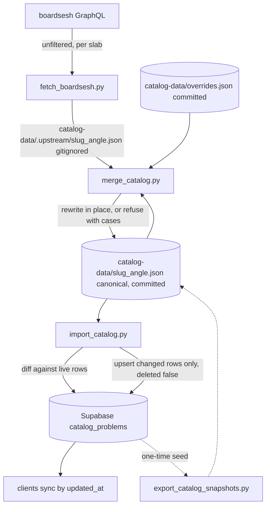
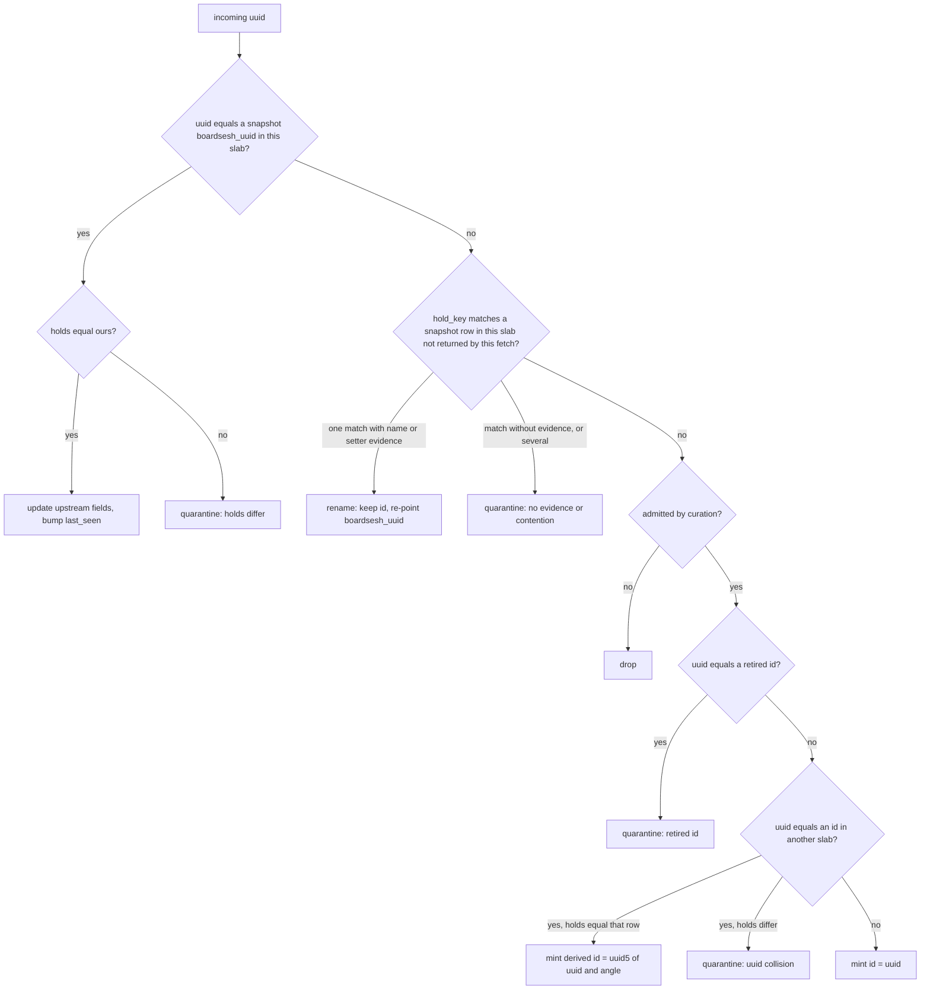

# Own the problem catalog, demote boardsesh to a feed - Plan

## Goal Capsule

- **Objective:** make the committed snapshot files in `catalog-data/` the canonical MoonBoard problem catalog, in a shape we own, with Supabase prod a deployment of them and boardsesh only a feed for new problems and live stats.
- **Authority:** this plan, then `AGENTS.md` and `docs/catalog-data-pipeline.md`. Where the plan and existing script behavior disagree, the plan wins; where the plan is silent, mirror the conventions in `scripts/reconcile_catalog_renames.py`.
- **Execution profile:** Standard tier. Scripts, snapshot data and docs only. No `supabase/migrations/**`, no client code, so not safety-critical. Pure-core logic test-first; shells exercised through dry-runs against prod with the anon key.
- **Stop conditions:** stop and ask if any step would write to prod other than the documented operator import, if the seed export finds a slab whose row count differs from the per-slab counts in U5's verification, or if any acceptance merge quarantines a problem the plan did not predict.
- **Tail ownership:** the implementer opens the PR. This PR uploads nothing to prod, because the seeded snapshot is a copy of it. The first real refresh is a later PR whose import the operator runs after merge, as with PR #168.

---

## Product Contract

### Summary

Rebuild the catalog refresh pipeline as fetch, merge, import. The fetch writes boardsesh output to a gitignored scratch directory. The merge applies ownership rules to rewrite the committed snapshot in place and refuses anything ambiguous until a human records a verdict in a committed overrides file. The import uploads only the rows that differ from prod. Nothing is ever deleted.

### Problem Frame

Every problem in the app is keyed by the uuid boardsesh assigned it, and boardsesh derives that uuid from the problem's name and setter. A typo fix upstream re-keys the problem. Our refresh then sees a vanished row and a new row, and before PR #168 it tombstoned the old one and inserted the new one, orphaning every ascent, list entry and session reference that pointed at the old key. The rename reconciler added in that PR papers over the common case, but it is a separate step the operator must remember, it cannot help once a row has been tombstoned, and the uuid is still the identity. Boardsesh has also re-partitioned a board across new set ids once, which made 96% of a slab look deleted.

The committed staging files are rewritten wholesale by every fetch in boardsesh's shape, so the only place our identity decisions and tombstones exist together is the live prod table. There is no complete copy anywhere else.

### Requirements

**Identity**

- R1. `source_catalog_id` keeps its name in every table, client and script, and means our id. It never changes once minted.
- R2. A new problem's id is the boardsesh uuid first seen for it. A separate `boardsesh_uuid` field on the snapshot tracks the upstream key and may change.
- R3. A hold set is identified by `hold_key`, the full sha256 hex digest of the canonical sorted `c,r,t` string. It is an identity key, so it is never truncated, and merge decisions compare the recomputed key, never the stored string alone.

**Merge rules**

- R4. An incoming row whose uuid matches a snapshot row's `boardsesh_uuid` updates that row's upstream-owned fields.
- R5. An incoming row with an unknown uuid whose `hold_key` matches a snapshot row that this fetch did not return, with matching name or setter, is a rename: the snapshot row keeps its id and gets the new `boardsesh_uuid`.
- R6. An incoming row with an unknown uuid whose `hold_key` matches only rows this fetch did return is a distinct problem and is minted with its own id.
- R7. An incoming row with an unknown uuid and no geometry match is new and is minted.
- R26. Boardsesh now gives one uuid to a problem at both angles, so an incoming uuid that is already our id in another slab is the same problem at this angle when its holds equal that row's holds. Such a row is minted with a deterministic derived id, the uuid5 of the upstream uuid and the angle under a fixed namespace, so two operators merging the same fetch mint the same id. The in-slab geometry rules run before this check, so a row this slab already holds under an old angle-specific uuid resolves as a rename to the shared uuid instead.
- R8. New problems are admitted only if they are benchmarks or have at least 10 repeats. Existing problems are updated regardless of repeats.
- R9. Upstream overwrites name, setter, grade, user grade, stars, repeats, benchmark flag and method. We own id and holds.
- R10. Every problem records `upstream_last_seen`, the fetch date it last appeared in, taken from the fetch header so a re-run is byte-identical. It is null until a fetch has returned the problem; the seed makes no claim boardsesh did not.
- R11. No row is ever removed or tombstoned by the merge or the import.

**Quarantine and overrides**

- R12. The merge refuses the whole slab and writes nothing when it meets a geometry match with no name or setter evidence, a uuid-matched row whose holds differ from ours, an incoming uuid equal to an id in another slab whose holds differ from that row's, an incoming uuid equal to a retired id, or several incoming rows contending for one snapshot row.
- R13. A refused merge computes the complete match report first, then prints it together with each case's class and a ready-to-paste override entry, so one run shows both the renames it found and the cases it refused on.
- R14. A committed overrides file resolves cases by hand and wins over the feed on every later run. It supports: upstream uuid is our row, upstream uuid is new with a given id, accept a specific holds change on a row, and pin a field on a row to a value. It also carries the list of retired ids, the ids tombstoned in prod that no snapshot holds, so the merge can refuse to mint them again.
- R15. The merge warns about any override that matched nothing this run.

**Guards**

- R16. The merge refuses an empty fetch, and a fetch whose row count is below 80% of its own header total or of the previous fetch's total recorded in the snapshot header, unless told to accept a short fetch. A set-id re-partition collapses the total; an upstream re-keying does not, so the guard is not measured against known uuids. The first merge after the seed has no previous total and only warns.
- R17. Before writing, the merge checks that ids are unique across all snapshots, `boardsesh_uuid` values are unique within the slab, every id matches the existing id character guard, and every stored `hold_key` equals the recomputed value.

**Import**

- R18. The import diffs the snapshot against prod and writes only rows that are new or whose uploaded fields differ, sending `deleted: false` for every row it writes.
- R19. The import refuses, by default, when prod holds a live row the snapshot lacks, or when any row it would insert or un-delete exists in prod under another board or angle, tombstoned or not. It never writes to those rows. An upsert payload carries the slab columns, so this is the only thing stopping an un-delete from moving a row between slabs.
- R20. The import runs as a dry run by default and prints per-class counts, every un-delete by id, and an upper bound on the benchmark banner events the apply would create.

**Rollback**

- R25. The operator runbook backs up the table before every apply. A partial apply is recovered forward by re-running the apply, which is idempotent because written rows diff as unchanged. Rolling back updates and un-deletes is a restore from the backup. Rolling back inserts is a slab-scoped flag on the restore script that tombstones live rows absent from the backup, the one path in the repo that writes `deleted: true`, documented as rollback only.

**Seed and retirement**

- R21. The snapshot files are seeded once by exporting prod, per slab, sorted by id, one problem per line. The three legacy tombstones are left out of the snapshot and untouched in prod.
- R22. The prune, enrich, reconcile and Mini 2025 fetch scripts are deleted. Their surviving logic lives in the fetch and merge, except prune's tombstone write, which moves to the restore script's rollback flag.
- R23. `scripts/seed_beta_videos.py` and its weekly workflow keep working unchanged against the new snapshot shape.
- R24. `docs/catalog-data-pipeline.md`, `CONTEXT.md` and the script docstrings describe the new pipeline in the same PR.

### Scope Boundaries

- No database migration. The new snapshot fields are not uploaded. Prod keeps the columns it has.
- No client changes. Clients keep syncing `catalog_problems` by `updated_at` and honoring `deleted`.
- No UI for problems boardsesh has dropped. `upstream_last_seen` is recorded only.
- No merging of the three legacy tombstones into their live twins. Each has a live row with identical holds in prod, so un-deleting them would show duplicates, and re-pointing user data is a separate job.
- No scheduled refresh. A refresh is a pull request an operator opens.

#### Deferred to Follow-Up Work

- Re-point user data from the tombstoned KRUSE row to the live Kruse row and retire the tombstone. Needs the service role to inspect ascents and lists.
- A CI workflow that runs the Python tests on pull requests touching `scripts/`. Nothing runs them today.
- Share the fetch board table with `scripts/seed_beta_videos.py`, which keeps its own copy.
- A "no longer on MoonBoard" badge or filter driven by `upstream_last_seen`.

### Acceptance Examples

- AE1. **Seed is a faithful copy.** Given the seeded snapshots, when the import runs as a dry run for every slab, then it reports zero inserts, zero updates, zero un-deletes, zero retired-id hits and zero live rows missing from the snapshot.
- AE2. **Yesterday's reconcile reproduces.** Given a fresh unfiltered fetch of 2024@40° merged into a scratch copy of the snapshot, when the merge and then an import dry run against that copy run, then the merge reports zero quarantines, the 97 renames from PR #168 are reported with name or setter evidence and keep their ids, every minted row is absent from the 2026-10-08 fetch and shares no `hold_key` with an existing row, existing rows change only in upstream-owned fields, `boardsesh_uuid` on renamed rows and `upstream_last_seen` on every returned row, and the import's write classes equal the rows the merge reported as changed.
- AE3. **Re-cased benchmarks resolve as renames.** Given a fresh unfiltered fetch of 2024@25°, when the merge runs, then the 41 re-cased benchmarks are reported as renames with name evidence and keep their ids.
- AE4. **Shared uuids resolve without quarantine.** Given the 2024@25° fetch, where hundreds of problems now carry the uuid that is our 40° id, when the merge runs, then every such row whose holds match a 25° snapshot row is a rename to the shared uuid, every such row new to 25° whose holds equal the 40° row is minted with a derived id, and zero uuid-collision quarantines are raised.
- AE5. **Re-partition is refused.** Given a copy of the Mini 2025 fetch file with 30% of its rows removed and its header total left intact, when the merge runs, then it refuses as a short fetch and names the returned count and the header total.
- AE6. **Second run is a no-op.** Given a merge that succeeded, when it runs again on the same fetch file, then the snapshot is byte-identical.

### Sources

- `scripts/reconcile_catalog_renames.py` and `scripts/tests/test_reconcile_catalog_renames.py`: the evidence ladder, per-hold-set claim settlement, keyset paging and atomic write to lift into the merge.
- `scripts/restore_catalog_problems.py`: the column whitelist that sends `deleted`.
- `supabase/migrations/0018_benchmark_notifications.sql`: the rising-edge trigger contract the import must respect.
- `docs/solutions/developer-experience/paginate-supabase-rest-reads-past-the-1000-row-clamp.md`.
- `docs/plans/2026-10-08-001-fix-catalog-2024-benchmark-refresh-plan.md`: the 97 renames and 41 re-cased benchmarks used as acceptance anchors.
- Prod counts on 2026-10-09: 75,498 rows, 2,934 benchmarks, 3 tombstones, none benchmarks, each with a live geometry twin. Boardsesh unfiltered totals per board: 2016 94,236; Masters 2017 73,465; Masters 2019 57,723; 2024 38,643; Mini 2020 7,999; Mini 2025 5,227.

---

## Planning Contract

### Key Technical Decisions

- KTD1. **Keep the column, change its meaning.** `source_catalog_id` stays the key everywhere and becomes ours. Minting a new id as the first upstream uuid seen keeps every existing row valid with no rewrite of ascents, lists, session queue, beta videos, benchmark events, the IndexedDB key path or roughly 470 client references. A surrogate key would be cleaner on a greenfield schema and is not worth that churn.
- KTD2. **Git is canonical, prod is a deployment.** The snapshot is an export of our table in our shape, sorted by id, one problem per line, so a refresh is a git diff of exactly the problems that changed. Backup and restore become `git checkout`. The current single-line files make every refresh a one-line diff that nobody can review. Because an unfiltered fetch touches the stats on most rows, the merge report pasted into the PR body is the review surface for identity decisions, and the diff is the audit trail.
- KTD3. **Fetch unfiltered, curate in the merge.** The fetch pulls the whole board every time. Rename detection depends on knowing which rows boardsesh did not return, and a curated fetch cannot tell "dropped below 10 repeats" from "gone". The biggest board is 943 pages, about eight minutes with the existing delay. The admission rule for new problems stays "benchmark or 10 or more repeats" and moves into the merge, recorded in the snapshot header.
- KTD4. **Quarantine instead of guessing.** Ambiguous matches have been a handful per slab per refresh. A human verdict in a committed file is cheap, is the record of every identity judgment independent of boardsesh, and prevents the one failure that corrupts user data: moving ascents to the wrong problem.
- KTD5. **Never delete.** Nothing in the merge or import sets `deleted`. The orphan fraction guard and the prune script go. `restore_catalog_problems.py`, with its new slab-scoped tombstone flag for rolling back inserts, remains the only script that can write `deleted: true`, documented as rollback only. This matches the sync contract in the offline-first learning: tombstones are the only removal mechanism clients understand, and we simply stop creating them.
- KTD6. **Leave the three legacy tombstones alone.** Each has a live row with identical holds in prod: KRUSE and Kruse share holds and setter, "Ply Pinches" matches "Ply Pinches 25", "Everthing is 5+" matches "Everything is 6b+". Un-deleting them would show duplicates in the app. They stay deleted in prod and absent from the snapshot. The import's "live row missing from snapshot" check ignores tombstoned rows for this reason. Because the merge only sees snapshots, their ids are recorded as retired in the overrides file, and an incoming uuid equal to a retired id is quarantined rather than minted; otherwise a problem re-keyed back to its old name would mint the tombstone's id, the import would un-delete it, and the twin would reappear.
- KTD7. **Diff-only import.** The `updated_at` trigger has no change guard, so a full upsert re-stamps every row and every client re-downloads every slab. Diffing against prod, normalized exactly as today's row mapper does, writes only real changes, makes the dry run meaningful, and gives AE1 for free. The diff must include `deleted` so a future un-delete is a write.
- KTD8. **Global id index, derived ids for the second angle, quarantine only on real collisions.** The id is a single primary key, and boardsesh has unified uuids across angles since the July snapshots: both angles return the same climb set, and 350 of the 1,287 rows at 2024@25° are the same problem as a 40° row under an old angle-specific uuid. Every 25° slab is affected. So the merge runs the in-slab geometry rules first, which turns those rows into renames to the shared uuid, then mints a deterministic derived id for a second-angle problem whose holds equal the other slab's row, and quarantines only a uuid whose holds differ. The import refuses an insert or un-delete whose id exists under another slab in prod, live or tombstoned.
- KTD9. **One overrides file, slab-scoped entries.** `catalog-data/overrides.json` holds every entry with `layout_id` and `angle`. Match entries key on the upstream uuid, pins and holds acceptances key on our id, and a holds acceptance records the accepted `hold_key` so a second upstream geometry change still quarantines. The file must not carry both `problems` and `layoutId` at top level, because the slab selectors treat any such file as a slab.
- KTD10. **One shared helper module.** The scripts share nothing today and re-implement paging, credentials and writes. `scripts/catalog_lib.py` holds `hold_key`, the row normalizer, keyset paging past the 1000-row clamp, the id guard, atomic snapshot read and write, and the overrides loader. Tests load it by path like the existing tests do. This is the first shared module; it earns its place because three scripts and the tests need the same five functions.

### High-Level Technical Design

Pipeline and ownership boundaries:

Matching decision for one incoming row, after overrides have consumed their rows:

Overrides resolve first and remove both the incoming row and the snapshot row they name from the pools the rules see. A leftover conflict after that, such as an override claiming a row that also matches by uuid, is itself a quarantine.

### Assumptions

- The service role key is available in the operator's shell for the import apply, as it was for PR #168. All development and acceptance checks use the anon key, which can read the table.
- Boardsesh returns the same climb set for both angles of a board, with per-angle stats, under one uuid per problem. The fetch stays per slab so each angle's repeats and grades are its own. The 25° snapshots still carry the older angle-specific uuids, which the first merge of each 25° slab resolves as renames.

### Deferred to Implementation

- The exact wording of the printed quarantine stanzas and the merge report.
- The fetch header carries the row count and the upstream total; the merge takes the set of returned uuids from the rows themselves. The fixed namespace for derived ids is chosen at implementation and recorded in the shared helper.
- How the one-time snapshot re-sort shows in git. The first commit will replace every line of every file. Confirm the files remain under GitHub's 100 MB limit and leave LFS out.

---

## Implementation Units

### U1. Shared catalog helpers and snapshot shape

- **Goal:** one module the fetch, merge, import and export share, plus the snapshot and overrides formats everything else builds on.
- **Requirements:** R1, R3, R10, R17, KTD2, KTD9, KTD10
- **Dependencies:** none
- **Files:** create `scripts/catalog_lib.py`, create `scripts/tests/test_catalog_lib.py`, modify `.gitignore`
- **Approach:** lift `hold_key`, `_norm`, `ID_RE`, keyset `live_rows` and the atomic writer from `scripts/reconcile_catalog_renames.py`, giving the pager a column list and having it ask for the exact count on its first request so it stops at the total instead of after an extra empty page, as `sb_get_all` in `scripts/seed_beta_videos.py` does; also lift the reconciler's `read_credentials`, which accepts either key; lift `_row` from `scripts/import_catalog.py` as the normalizer both the import diff and the export use. Add `read_snapshot` and `write_snapshot`. The snapshot header is `setup`, `layoutId`, `angle`, `source`, `curation`, `count`, `problems`. Each problem carries, in fixed order, `id`, `boardsesh_uuid`, `name`, `grade`, `userGrade`, `setter`, `stars`, `repeats`, `isBenchmark`, `method`, `holds`, `hold_key`, `upstream_last_seen`. The writer sorts by id, emits one problem per line, and writes via a temp file and rename. `hold_key` is the full sha256 hex digest of the canonical sorted `c,r,t` string; changing that format later means re-exporting all ten snapshots, so it is fixed here. The normalizer collapses an empty string to null for `user_grade` and `method`, so the import diff never sees a spurious change on the two nullable text columns. Add an overrides loader that validates entry shapes, reads the `retired_ids` list, and rejects a file carrying both `problems` and `layoutId`. Add `catalog-data/.upstream/` to `.gitignore`.
- **Patterns to follow:** test loading by path and the row factories in `scripts/tests/test_reconcile_catalog_renames.py`; the clamping fake server in `scripts/tests/test_seed_beta_videos.py`.
- **Test scenarios:**
  - `hold_key` is identical for the same holds in different order, differs when one hold's type changes, and is 64 hex characters.
  - Normalizer maps a snapshot problem to the same dict as today's import mapper for an empty name, a null method, a float star count and a setter with trailing whitespace.
  - Normalizer maps an empty-string `userGrade` or `method` to null, so the two forms compare equal.
  - `write_snapshot` then `read_snapshot` round-trips, output is sorted by id with one problem per line, and writing twice produces identical bytes.
  - `live_rows` against the clamping fake server returns all rows for a slab of 2,500 and stops without an extra request on an exact page boundary.
  - Overrides loader rejects an unknown action, an entry missing `layout_id`, and a file that looks like a slab.
- **Verification:** the unit tests pass under `python3 -m unittest discover -s scripts/tests -p 'test_*.py'`; a snapshot written by the helper is accepted by `scripts/seed_beta_videos.py` reading `problems`, `id`, `name`, `isBenchmark` and `repeats`.

### U2. Fetch writes the full feed to scratch

- **Goal:** one fetch path for every board that pulls the unfiltered feed into the gitignored scratch directory with a header the merge can trust.
- **Requirements:** R10, KTD3, R22
- **Dependencies:** U1
- **Files:** modify `scripts/fetch_boardsesh.py`, delete `scripts/fetch_boardsesh_mini2025.py`, create `scripts/tests/test_fetch_boardsesh.py`
- **Approach:** drop `--min-ascents`, `--benchmarks-only` and the hard-coded benchmark overrides keyed by boardsesh uuid; keep `--layout`, `--all`, `--angle`, `--delay`. Default output is `catalog-data/.upstream/<slug>_<angle>.json` with header `fetched_at`, `layoutId`, `angle`, `setIds`, `total_count` from the first page, `count`, `problems`. Keep every normalization the pattern report lists: grade label table, method labels, role to type, zero-hold drop, untitled fallback, setter strip, rounded stars. Split the per-climb normalization out of the paging loop into a pure function so it is testable. Mini 2025 needs nothing special beyond its set ids, which the board table already has. Write via the atomic helper.
- **Patterns to follow:** existing retry and delay handling in `gql`; the `normalize` split in the Mini 2025 script.
- **Test scenarios:**
  - A climb with frames `p45r43p124r44p62r42` normalizes to three holds with the right columns, rows and types.
  - A climb with no frames is dropped; one with an empty name becomes "Untitled"; a setter with trailing spaces is stripped.
  - A `benchmark_difficulty` string marks the problem a benchmark; `method_no_kickboard` maps to "No kickboard".
  - The header records `total_count` from the first page and `count` equals the problems written.
- **Verification:** `python3 scripts/fetch_boardsesh.py --layout 7` writes the Mini 2025 scratch file with roughly 5,200 problems and a `total_count` matching it; the scratch directory is ignored by git.

### U3. Merge with ownership rules, quarantine and overrides

- **Goal:** the step that turns a fetch into a reviewable change to the canonical snapshot, or refuses.
- **Requirements:** R2, R4 to R17, R26, KTD4, KTD5, KTD8, KTD9
- **Dependencies:** U1, U2
- **Files:** create `scripts/merge_catalog.py`, create `scripts/tests/test_merge_catalog.py`
- **Approach:** a pure `merge(snapshot, overrides, fetch, all_ids, curation, accept_short)` that returns the new snapshot and a report, or raises a quarantine carrying classified cases. Order inside: validate inputs; apply overrides and remove the rows they consume; guard empty and short fetch against the header total and the snapshot's previous total; match by `boardsesh_uuid`; settle geometry claims per hold key strongest evidence first exactly as the reconciler does, considering only this slab's snapshot rows the fetch did not return; drop remaining unknown rows that fail curation, since at 25° the unfiltered feed carries every 40° problem and most fail the per-angle floor; among the rows that would be minted, quarantine a uuid that equals a retired id, mint a derived id for a uuid that equals another slab's id when the holds equal that row's, quarantine it when they differ, and mint the rest with the upstream uuid; set `upstream_last_seen` to the fetch header date on every returned row; run the invariant checks; sort. The merge runs every stage to completion, collecting quarantine cases, and refuses only after the invariant checks, so the refusal report shows the renames, updates and mints the run would have made. A scratch file for a slab with no snapshot is refused unless the new-slab flag is passed, in which case every admitted row is minted; that is how a board is bootstrapped. The report lists every benchmark flag transition in both directions, because boardsesh's flag is known to flap and a true-to-false drop removes benchmark status in the app; the pin override is the documented fix. The shell loads every snapshot to build the global id set, reads the slab's scratch file, writes on success through the atomic helper, prints the report, and on quarantine prints each case with a ready-to-paste override entry and exits non-zero. `--dry-run` reports without writing. The curation rule is a constant recorded in the snapshot header.
- **Execution note:** port every scenario in `scripts/tests/test_reconcile_catalog_renames.py` before writing the merge, then add the new ones; the reconciler's tests are the specification of the evidence ladder.
- **Patterns to follow:** `reconcile`, `evidence` and the per-hold-set claim settlement in `scripts/reconcile_catalog_renames.py`; the report format of that script.
- **Test scenarios:**
  - Uuid match updates repeats and name and bumps `upstream_last_seen`; holds and id untouched.
  - Re-cased name with same holds, old uuid absent from fetch: rename, id kept, `boardsesh_uuid` re-pointed, evidence "name".
  - Same holds, same setter, new name, old uuid absent: rename with evidence "setter".
  - Same holds, different name and setter, old uuid absent: quarantine "no evidence".
  - Same holds as a row the fetch did return: minted as a distinct problem.
  - Two incoming rows both matching one absent snapshot row: quarantine "contention".
  - Uuid-matched row whose holds differ: quarantine "holds differ"; with a holds acceptance for that exact `hold_key` it updates; with an acceptance for a different `hold_key` it still quarantines.
  - Incoming uuid equal to an id in another slab's snapshot, holds matching an in-slab row the fetch did not return with name evidence: rename to the shared uuid, id kept.
  - Incoming uuid equal to an id in another slab's snapshot, no in-slab match, holds equal to that other row: minted with a derived id, and the same derived id on a second run.
  - Incoming uuid equal to an id in another slab's snapshot with different holds: quarantine "uuid collision"; with an override "is new with id X" it is minted as X.
  - Incoming uuid equal to another slab's id with 3 repeats and no benchmark flag at this angle: dropped by curation, not quarantined; the same row with 10 repeats reaches the collision check.
  - A scratch file for a slab with no snapshot is refused; with the new-slab flag every admitted row is minted.
  - A refused merge's output still lists the renames and mints it found before the quarantine.
  - A fetch with 50% of its header total is refused; one at 85% proceeds; a first merge with no previous total in the snapshot header warns and proceeds.
  - Incoming uuid equal to a retired id, with holds matching a row the fetch did return: quarantine "retired id", not minted.
  - A row whose benchmark flag goes true to false, and one going false to true, both appear in the report's transitions list.
  - Override "uuid X is row Y" re-points Y even when X would otherwise mint; the override consumes both rows; an override naming a row that also matches by uuid elsewhere raises a quarantine.
  - A pin on `isBenchmark` holds against a fetch that says false; a pin on name does not silence a holds quarantine.
  - New row with 9 repeats and no benchmark flag is dropped; with 10 repeats it is minted; an existing row that drops to 3 repeats is updated, not dropped.
  - An empty fetch is refused even with the accept flag.
  - A row absent from the fetch keeps all fields and its old `upstream_last_seen`.
  - Running the merge twice on the same fetch yields byte-identical output.
  - An override that matched nothing produces a warning in the report.
  - Invariant failure on a duplicate `boardsesh_uuid` in the output aborts before writing.
- **Verification:** all tests pass; AE2 to AE6 hold when run as dry runs against fresh fetches, which the implementer runs and pastes into the PR.

### U4. Diff-only import that never deletes

- **Goal:** upload exactly the rows that differ, un-delete nothing by accident, refuse drift, report what the benchmark trigger will do, and leave a scripted rollback for every class of write.
- **Requirements:** R11, R18, R19, R20, R25, KTD5, KTD7, KTD8
- **Dependencies:** U1
- **Files:** modify `scripts/import_catalog.py`, create `scripts/tests/test_import_catalog.py`, modify `scripts/restore_catalog_problems.py`, create `scripts/tests/test_restore_catalog_problems.py`, modify `scripts/backup_catalog_problems.py` docstring only
- **Approach:** replace the blind upsert with: page live rows for the slab including tombstones; normalize both sides with the shared normalizer; classify each snapshot row as insert, update, un-delete or unchanged, comparing every uploaded column plus `deleted`; classify live non-tombstoned rows absent from the snapshot as orphans; refuse on orphans unless `--allow-orphans`; for every insert and un-delete, look the id up in prod across all slabs including tombstones and refuse on a slab mismatch; print counts, a sample per class, every un-delete by id, and the predicted banner events as an upper bound, which are inserts with the benchmark flag plus any written row whose flag flips from false to true. The import also loads the overrides file and reports any snapshot id present in `retired_ids` as a retired-id hit, refusing an apply while any exist. The dry run reads with either the service-role or the anon key through the shared credentials helper lifted from the reconciler; `--apply` refuses without the service-role key. `--apply` writes inserts, then updates, then un-deletes, in batches of 500 with the restore script's column whitelist, which includes `deleted`, and stops on the first HTTP error. A partial apply is recovered by re-running, since written rows now diff as unchanged. Drop `--skip-rename-check` and the reconciler import. Give the restore script a slab-scoped flag that tombstones live rows absent from the backup, so an apply that inserted bad rows can be rolled back; it is the only code path that writes `deleted: true` and its docstring says so. The backup docstring describes backup before apply as the runbook's first step.
- **Patterns to follow:** the column whitelist in `scripts/restore_catalog_problems.py`; batch size and `Prefer` headers in the current import; `ID_RE` before any id reaches a filter; the tombstone PATCH batching over `in.()` filters in `scripts/prune_catalog_orphans.py`, which is what the restore flag reuses before that file is deleted.
- **Test scenarios:**
  - A snapshot identical to live produces zero writes in every class.
  - A row whose repeats changed is an update; a row whose only difference is a null versus missing method is unchanged.
  - A tombstoned live row present in the snapshot is an un-delete and is sent with `deleted: false`.
  - A tombstoned live row absent from the snapshot is ignored, not an orphan.
  - A live non-tombstoned row absent from the snapshot is an orphan; the run refuses without `--allow-orphans` and writes nothing.
  - A snapshot id present in prod under another layout or angle, live or tombstoned, refuses the apply and names both slabs.
  - Predicted events count inserts with the benchmark flag and every row whose flag goes false to true, whether an update or an un-delete, and not true-to-true writes.
  - Paging against the clamping fake server reads a 5,900-row slab completely.
  - Apply sends batches of at most 500 in the order inserts, updates, un-deletes, and stops on the first HTTP error without a partial second batch.
  - Re-running the apply after a simulated failure on batch two writes only the rows batch two and later would have written.
  - Restore with the tombstone flag on slab 2024@40° tombstones a live row absent from the backup, leaves rows in other slabs alone, and refuses without the flag.
- **Verification:** AE1 holds against prod with the seeded snapshots: a dry run of every slab reports zero in every write class and zero orphans.

### U5. Seed the snapshots from prod and run the acceptance checks

- **Goal:** replace the ten staging files with canonical snapshots exported from prod, create the overrides file, and prove the pipeline reproduces yesterday's decisions.
- **Requirements:** R21, R23, KTD6, AE1 to AE6
- **Dependencies:** U1, U3, U4
- **Files:** create `scripts/export_catalog_snapshots.py`, create `scripts/tests/test_export_catalog_snapshots.py`, replace all ten `catalog-data/<slug>_<angle>.json`, create `catalog-data/overrides.json`
- **Approach:** the export pages every row per slab including tombstones, builds snapshot problems from the live ones with `boardsesh_uuid` equal to id, computed `hold_key`, and `upstream_last_seen` null, and writes through the shared writer. It writes the ids of the tombstones it skipped into `retired_ids` in the overrides file, reports them, which must be the three known rows, and refuses if two slabs hold the same id. The overrides file also starts with the two former hard-coded benchmark pins from the fetch script, keyed by our id under slab Masters 2019 at 40°, the only snapshot that holds them. Then run the acceptance checks and paste the reports into the PR: import dry run on every slab for AE1; for AE2, copy the snapshot to a scratch path, merge the fresh 2024@40° fetch into the copy for real, then run the import dry run pointed at the copy and compare its write classes with the merge report, reading the 2026-10-08 fetch it compares against from the pre-seed commit of the 2024@40° staging file in git history; merge dry runs on the 2024@25° fetch for AE3 and AE4; a copy of the Mini 2025 fetch file with every third row removed and the header total intact for AE5; a repeated merge on the scratch copy for AE6. Nothing touches the committed snapshots or prod; the first real refresh is a later PR.
- **Patterns to follow:** keyset paging from U1; the report style of the reconciler.
- **Test scenarios:**
  - Export transform sets `boardsesh_uuid` to the id, computes `hold_key`, leaves `upstream_last_seen` null, and keeps every upstream field verbatim.
  - A tombstoned row is skipped, reported, and written to `retired_ids`; a slab with zero live rows refuses.
  - Two slabs sharing one id refuse the export with both slabs named.
- **Verification:** per-slab counts match prod, given as 40° then 25°: 2016 21,547 and 734; 2024 5,858 and 1,286; Masters 2017 18,841 and 7,243; Masters 2019 11,053 and 3,405; Mini 2020 3,807 at 40° only; Mini 2025 1,721 at 40° only. The tombstone report lists exactly KRUSE, "Ply Pinches" and "Everthing is 5+". AE1 to AE6 reports are in the PR.

### U6. Retire the old scripts and rewrite the docs

- **Goal:** the repo describes one pipeline and contains only the scripts that implement it.
- **Requirements:** R22, R24
- **Dependencies:** U2, U3, U4, U5
- **Files:** delete `scripts/prune_catalog_orphans.py`, `scripts/enrich_catalog_methods.py`, `scripts/reconcile_catalog_renames.py`, `scripts/tests/test_reconcile_catalog_renames.py`; modify `docs/catalog-data-pipeline.md`, `CONTEXT.md`, `docs/README.md`, `scripts/seed_beta_videos.py` docstring
- **Approach:** rewrite the pipeline doc's data flow, key files, catalog file schema, regenerate runbook and gotchas for fetch, merge, import. State that the snapshot is canonical and Supabase mirrors it, that nothing is deleted, that restore is the only tombstone path, that a refresh is a PR whose diff is the review, and the trigger note that diff-only imports do not re-stamp untouched rows. Remove the `holdsetup` field and the Mini 2025 script from the schema and flow. Update the two `CONTEXT.md` repo map rows and the reseed gotcha. Keep the 1000-row clamp gotcha and point it at the shared helper.
- **Patterns to follow:** doc discipline in `CLAUDE.md`: one topic, one place; `CONTEXT.md` summarizes and links.
- **Test scenarios:** Test expectation: none -- deletions and documentation only; the retained tests from U1 to U5 cover the folded logic.
- **Verification:** no file under `scripts/` or `docs/` references a deleted script; the runbook in the pipeline doc can be followed top to bottom against a scratch fetch.

---

## System-Wide Impact

- **Data lifecycle.** The merge and import can only add rows and change upstream-owned fields. The only remaining way to tombstone is the restore script. Clients see fewer `updated_at` bumps because untouched rows are no longer re-stamped, which removes the full-slab re-download every refresh caused.
- **Benchmark banner.** Inserting a benchmark row or flipping a flag to true fires a banner event, and no drain exists to retract one. The import's predicted event count is the operator's check before apply. The seed creates no events because it writes nothing.
- **Beta video seeding.** The weekly workflow reads the snapshot from a plain checkout and depends only on `problems`, `id`, `name`, `isBenchmark` and `repeats`, all preserved.
- **Git repository.** The ten snapshot files are rewritten once from single-line to one problem per line, around 75,000 lines and roughly 43 MB with the three new fields, the largest file near 13 MB. Later refreshes diff by problem.

---

## Risks & Dependencies

- **Boardsesh changes the GraphQL schema.** The fetch breaks loudly, the snapshot is untouched, and the app keeps working. No mitigation beyond the existing retry handling.
- **An override is wrong.** A bad verdict moves a `boardsesh_uuid`, never an id, and the invariant checks refuse duplicate uuids. Reverting the overrides entry and re-merging undoes it before import.
- **A bad apply reaches prod.** Prod has no row history and each 500-row batch is its own transaction. Updates and un-deletes roll back by restoring the pre-apply backup; inserts roll back with the restore script's slab-scoped tombstone flag; banner events fired by inserted benchmarks have no drain and are retracted by hand in SQL, which the runbook says.
- **The benchmark flag flaps upstream.** A true-to-false drop removes benchmark status in the app silently. The merge report lists both directions so the reviewer sees it; a pin override holds the flag.
- **The seed export races a concurrent write.** Prod has no other writer; the export is a read with the anon key.
- **The first real refresh of the big boards takes minutes.** 943 pages for 2016. Acceptable for a manual, per-slab operation; the delay flag remains.
- **Prod rows missing from the snapshot after the seed.** Possible only through hand SQL or a pre-seed restore. The import refuses by default and names the rows.

---

## Documentation / Operational Notes

- Operator runbook after merge of this PR: nothing to upload, because the seed is a copy. On the first refresh: fetch a slab, merge, review the diff, commit, open a PR, then after merge back up the table, run the import dry run, check the un-delete list and the predicted events, apply. If the apply stops partway, re-run it. If the applied rows were wrong, restore the backup, and use the tombstone flag for rows the apply inserted.
- Record in the pipeline doc that the acceptance merges in this PR ran against scratch copies, never the committed snapshots or prod, and that every snapshot still carries the pre-refresh stats and the 25° slabs their old uuids until each slab's first refresh PR.

---

## Verification Contract

| Gate | Command | Applies to | Done signal |
| --- | --- | --- | --- |
| Unit tests | `python3 -m unittest discover -s scripts/tests -p 'test_*.py'` | U1 to U5 | all tests pass on Python 3.14 locally and on 3.12, which `uv run --python 3.12` provides, since CI pins 3.12 |
| Seed fidelity | `python3 scripts/import_catalog.py --all` (dry run) | U5 | zero inserts, updates, un-deletes, retired-id hits and orphans on every slab |
| Rename reproduction | fetch 2024@40°, merge into a scratch copy, import dry run against the copy | U5 | zero quarantines, minted rows all new since 2026-10-08, import write classes equal the merge's changed rows |
| Re-case detection | fetch 2024@25° then `python3 scripts/merge_catalog.py --layout 3 --angle 25 --dry-run` | U5 | 41 re-cased benchmarks among the renames with name evidence, geometry-matched rows re-pointed to the shared uuid, second-angle problems minted with derived ids, zero collision quarantines |
| Short fetch | Mini 2025 fetch file with 30% of rows removed and the header total intact, then merge | U5 | refused as short, naming the returned count and the total |
| Beta seeder compatibility | `python3 scripts/seed_beta_videos.py --board mini2025 --limit 1 --dry-run` with no keys set | U5 | prints the benchmark count read from the snapshot and exits zero |
| Doc consistency | grep for deleted script names under `scripts/` and `docs/` | U6 | no matches |

---

## Definition of Done

- Every unit's verification holds and the acceptance reports for AE1 to AE6 are in the PR body.
- The ten snapshots in `catalog-data/` are the canonical shape, sorted by id, one problem per line, and `catalog-data/overrides.json` exists with the two benchmark pins and the three retired ids.
- The four retired scripts and their test are gone, and no doc or docstring references them.
- `docs/catalog-data-pipeline.md` and `CONTEXT.md` describe fetch, merge, import and the canonical snapshot.
- No write reached prod during implementation.
- No experimental or abandoned code remains in the diff.
